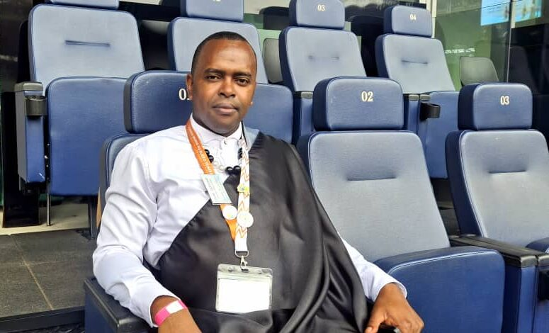
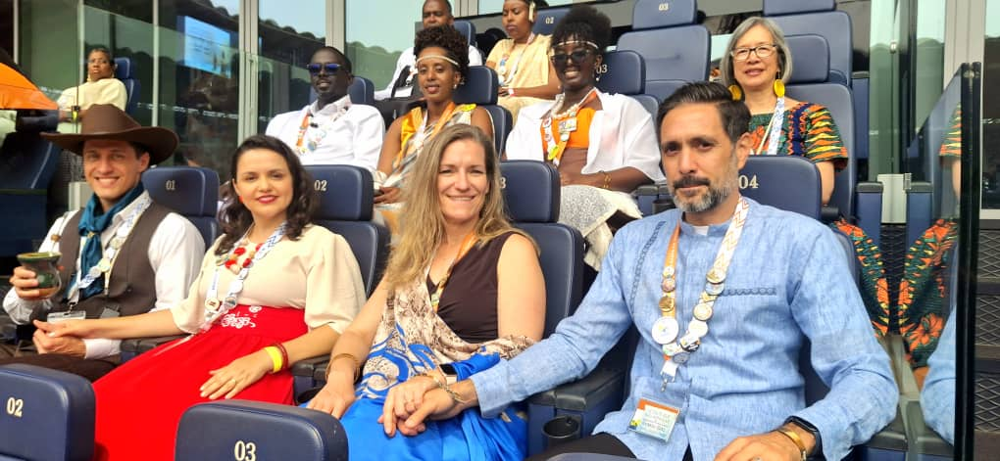
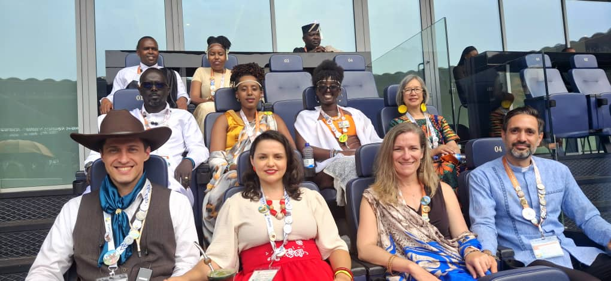
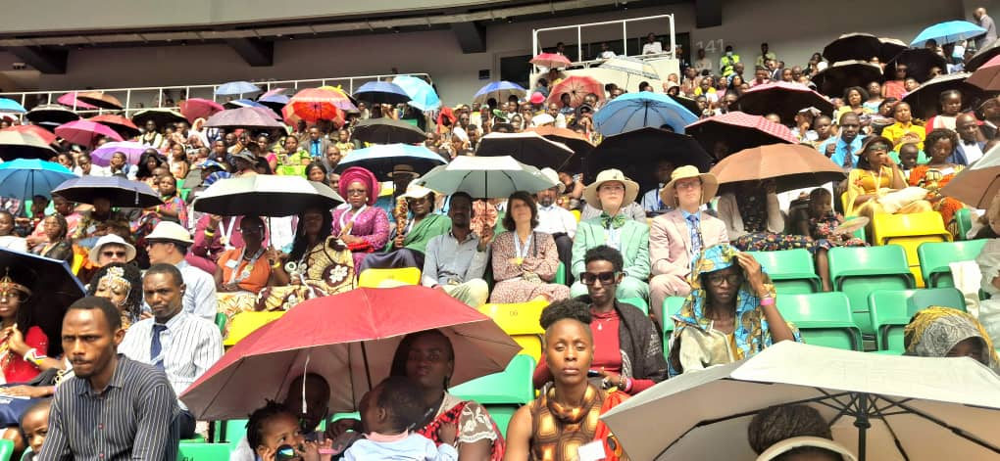
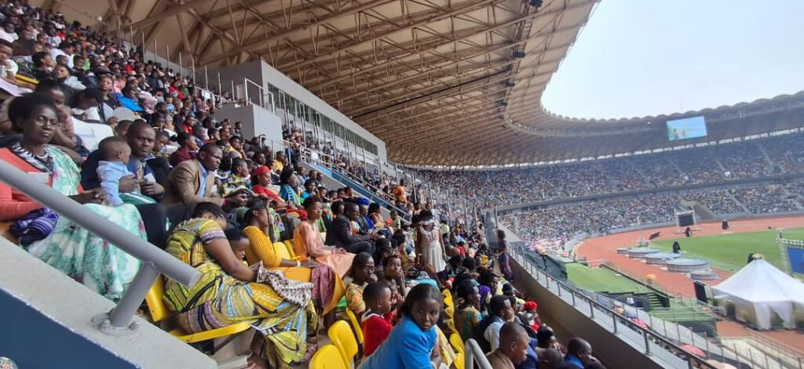
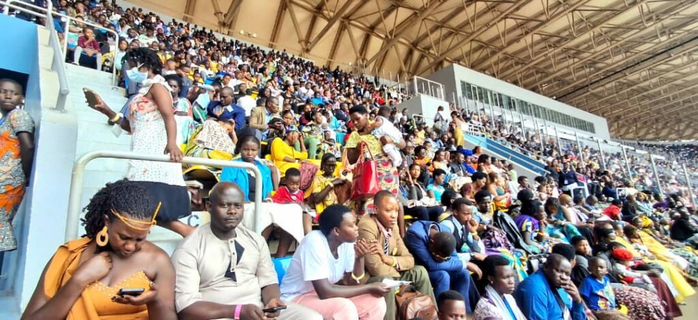
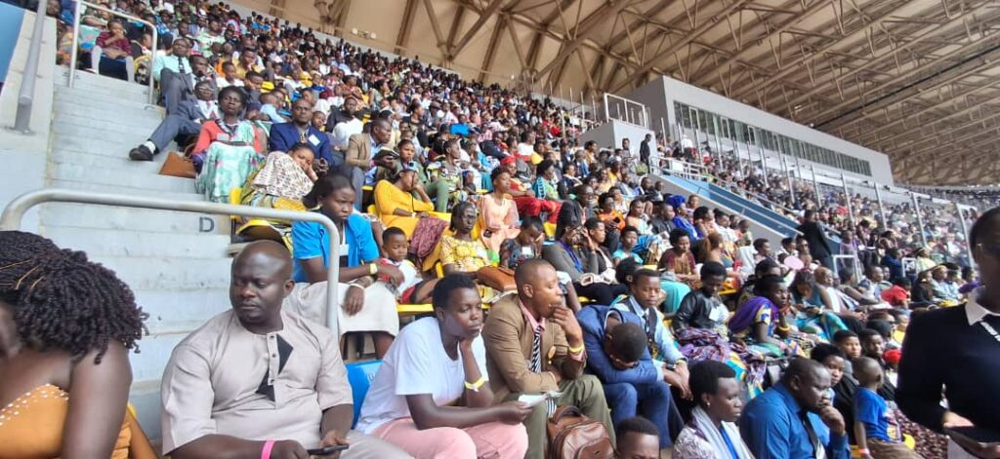
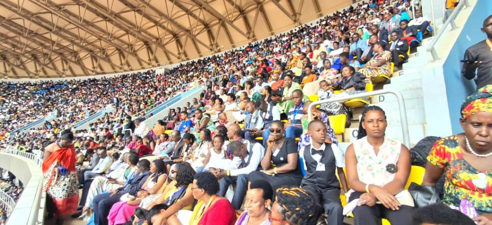

The 2025 Jehovah's Witnesses International Convention, a three-day event held from August 8-10, concluded today at the Amahoro National Stadium. This landmark gathering was a first of that kind in Rwanda. Mr. Migambi François Régis, the spokesperson for Jehovah's Witnesses in Rwanda said: "This International Convention of Jehovah's Witnesses is the first of its kind in Rwanda, and it has been a truly joyful occasion."

The spokesperson highlighted Rwanda's significant achievement in being selected as a host country, "We can stand with our heads high that Rwanda is a country that is safe, Of all the African countries, only three countries have been selected in Africa this year," he noted. He emphasized that countries without a reputation for security "will not ever be considered for this event," adding that this selection has raised Rwanda's high profile.

\[caption id="attachment\_38583" align="alignnone" width="775"\] Mr. Migambi François Régis, the spokesperson for Jehovah's Witnesses in Rwanda\[/caption\]

From an economic perspective, the convention has been a significant boom. With over 3,000 international delegates from over 20 countries, a substantial amount of revenue was generated. The estimation of the minimum economic impact is set to be over 3.5 million US dollars, where attendees were spending money on lodging in premier hotels like Radisson Blue, and Marriott, as well as on local markets and tourist activities. This influx of visitors, he said, shows the potential for faith-based tourism. Delegates, he added, were staying for a minimum of seven days, further boosting the economy.

On the spiritual front, Mr. Migambi underscored the event's core purpose, which is Pure Worship. He said the "biggest highlight is that we believe that those who learn what the Bible teaches and the principles therein can benefit themselves." This knowledge, he added, provides attendees with "hope and the comfort of knowing that there is a good future."

Looking ahead, the spokesperson expressed hope that the convention's success will pave the way for future opportunities. He stated that if the event is considered a success, Rwanda could be considered to host an "international event" with up to 5,000 delegates, which is a larger-scale gathering. This would further cement Rwanda's position as a premier destination for global conferences. The final day saw an attendance of 43,268, showcasing the convention's popularity and the meticulous safety planning that made it all possible.

\[caption id="attachment\_38578" align="alignnone" width="1020"\] The Micomyiza family, originally from Canada and now living in Rwanda, united in faith at the international convention of Jehova's Witnesses\[/caption\]

\[caption id="attachment\_38580" align="alignnone" width="1020"\] couples Shared a wonderful gathering in the convention\[/caption\]

\[caption id="attachment\_38579" align="alignnone" width="1020"\] A beautiful display of inclusivity and unity, with the program translated for deaf attendees.\[/caption\]

   

**African Updates**
