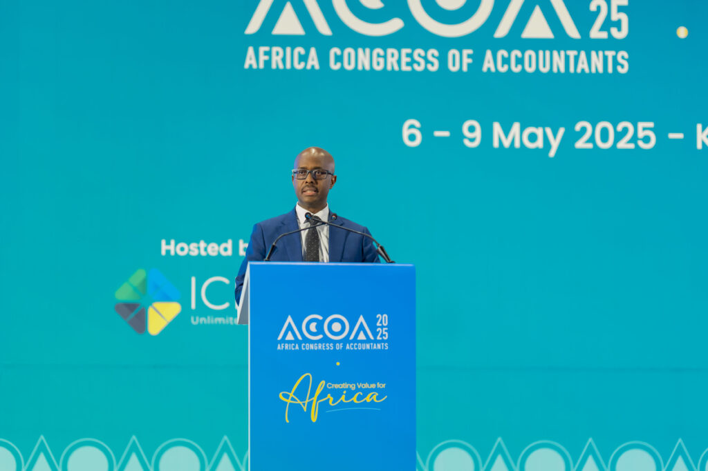
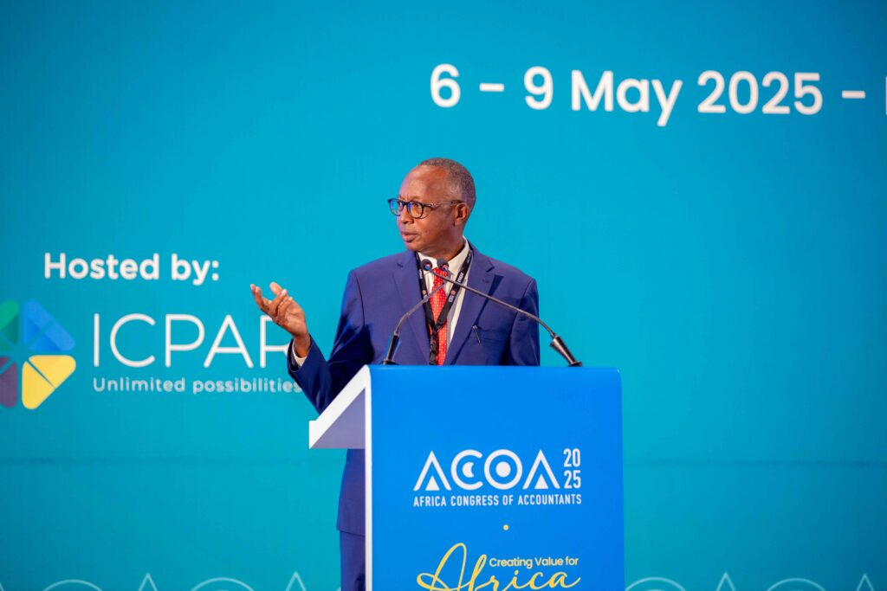
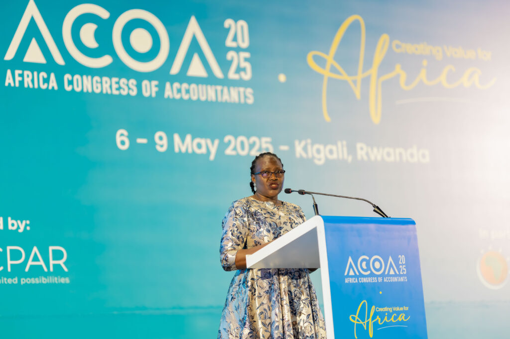
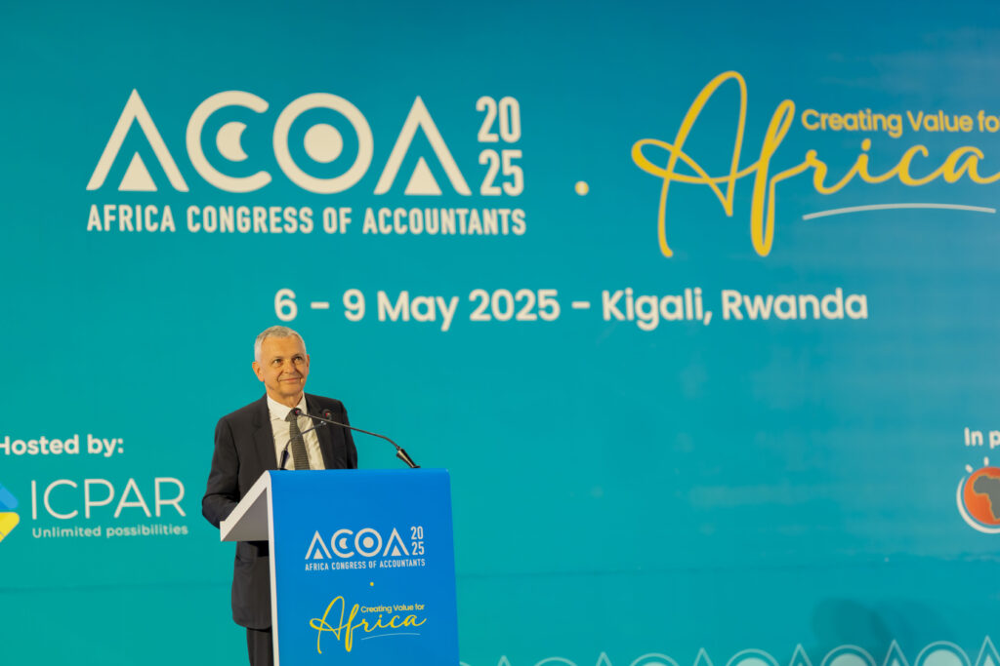
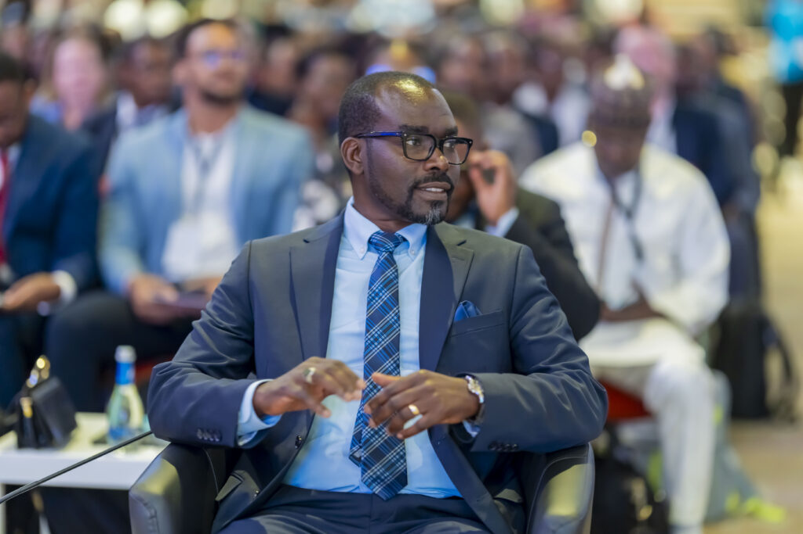
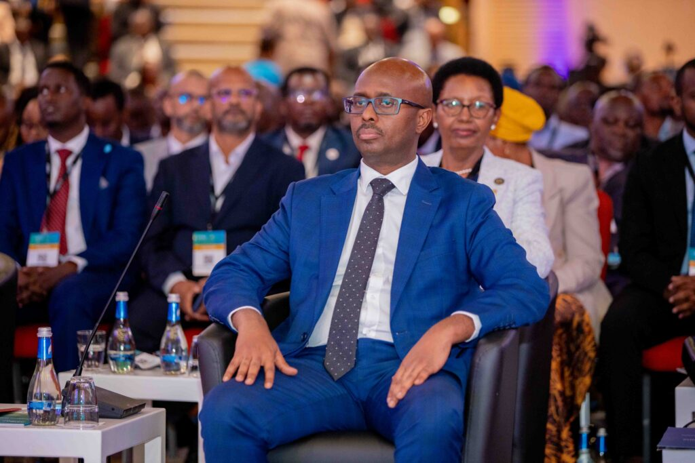
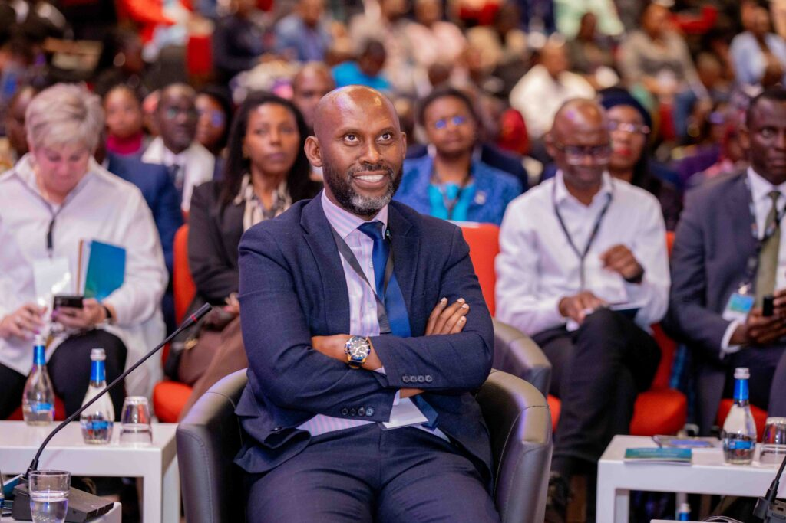
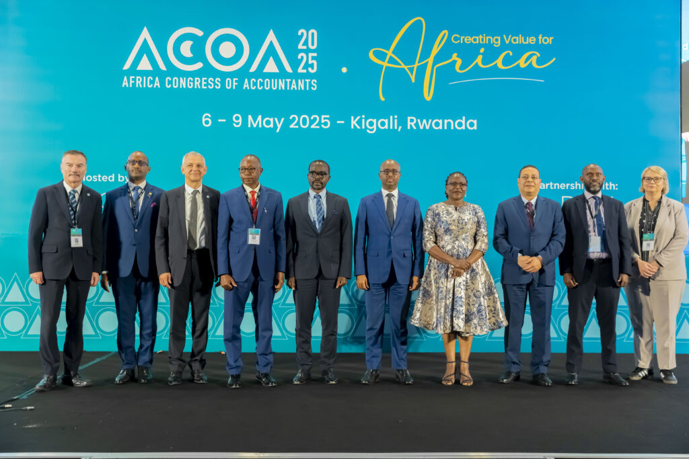
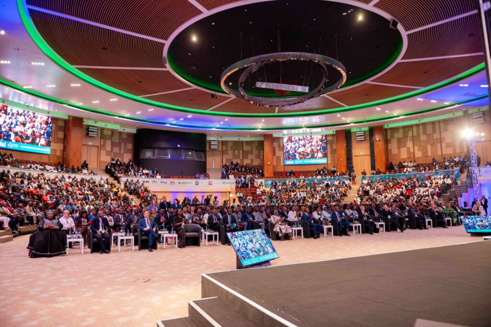
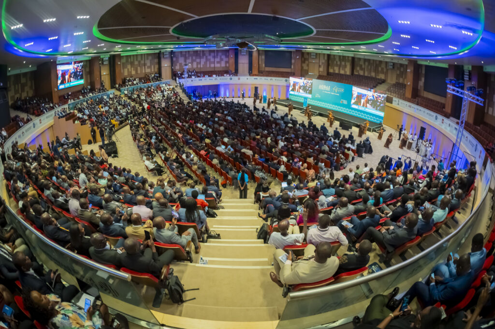

KIGALI, Rwanda Over 2,000 professional accountants and key stakeholders from more than 65 countries have gathered in Kigali for the 8th Africa Congress of Accountants (ACOA). The event, taking place from May 6th to 9th, 2025, at the Kigali Convention Center (KCC), is hosted by the Institute of Certified Public Accountants of Rwanda (ICPAR) in collaboration with the Pan African Federation of Accountants (PAFA). This landmark event is designed to foster connection, learning, and innovation within the accountancy ecosystem.

The congress was officially opened by Hon. Minister Yusuf Murangwa, who emphasized the crucial role of accountants in Africa's sustainable development. "Accountants, auditors, and financial professionals have a unique position to assist Africa in generating, assessing, and safeguarding value," he said. He also highlighted the need for professionals who are not only competent but also capable of leading reforms and providing sound advice.

\[caption id="attachment\_32077" align="alignnone" width="1024"\] Hon. Minister Yusuf Murangwa, Minister of Finance and Economic Planning in Rwanda\[/caption\]

Mr. Obadiah R. Biraro, President of ICPAR, welcomed delegates from across Africa and beyond, including representatives from Nigeria, Uganda, Kenya, Tanzania, Zimbabwe, Ghana, and many other nations. He underscored the importance of accountability, noting, "If you can't account, then you don't count."

\[caption id="attachment\_32064" align="alignnone" width="1024"\] Mr. Obadiah R. Biraro, President of ICPAR\[/caption\]

Ms. Keto N. Kayemba, Outgoing President of PAFA, invited attendees to "reimagine our role as accountants, not simply as technical professionals, but as catalysts for inclusive sustainable development." The congress addresses urgent trends such as climate action, enhanced capital flows, and the African Continental Free Trade Area (AfCFTA).

\[caption id="attachment\_32065" align="alignnone" width="1024"\] Ms. Keto N. Kayemba, Outgoing President of PAFA\[/caption\]

Jean Bouquot, President of the International Federation of Accountants (IFAC), underlined the importance of non-financial information in sustainability. "Financial markets need this information so that investors and lenders can make efficient decisions that align with sustainability targets," he said. He also stressed the need for a consistent global baseline for high-quality sustainability reporting.

\[caption id="attachment\_32066" align="alignnone" width="1024"\] Mr. Jean Bouquot, President of the International Federation of Accountants (IFAC)\[/caption\]

Hon. Minister Sebahizi Prudence, Minister of MINICOM, discussed the transformative vision of the AfCFTA, aiming to bring unity, equity, and shared prosperity to Africa. "The AfCFTA is a game changer, uniting 55 countries into a market of 1.4 billion people," he explained. He detailed Rwanda's efforts to implement this vision, focusing on sectors with a competitive edge and promoting inclusivity.

\[caption id="attachment\_32067" align="alignnone" width="1024"\] Hon. Minister Sebahizi Prudence, Minister for Trade and Industry in Rwanda\[/caption\]

The 8th ACOA promises to be a pivotal event, driving change and fostering collaboration among accounting and finance professionals. With a focus on sustainable development, technological advancements, and the AfCFTA, the congress aims to equip professionals to address Africa's challenges and opportunities effectively. The event continues until May 9th, 2025, in Kigali, Rwanda.

   

**African Updates**
