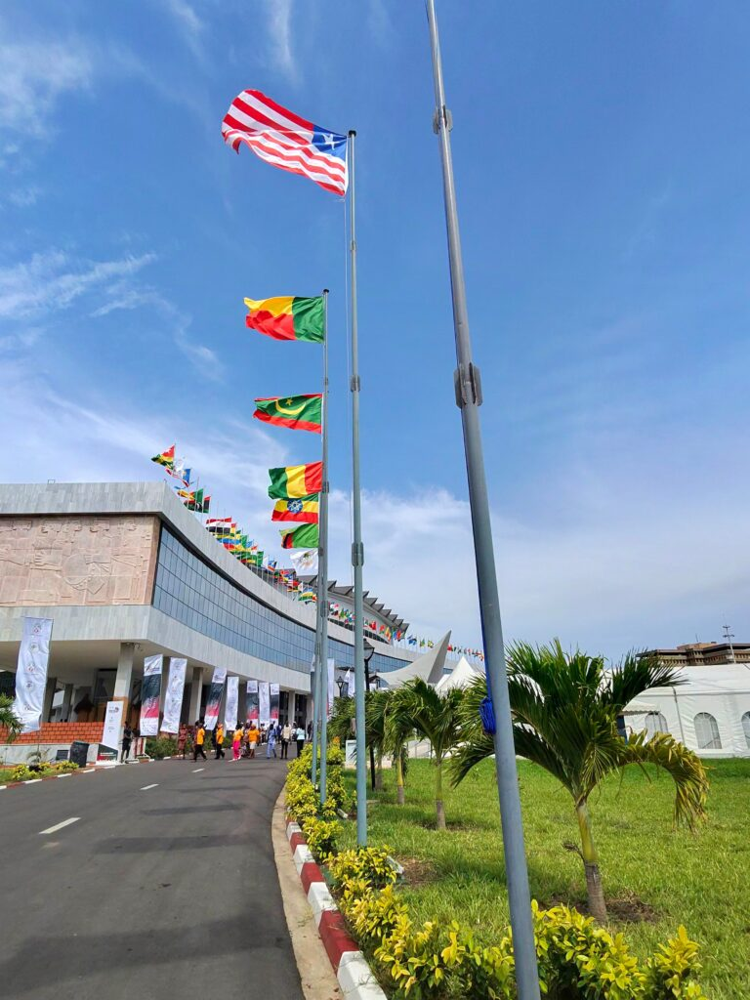
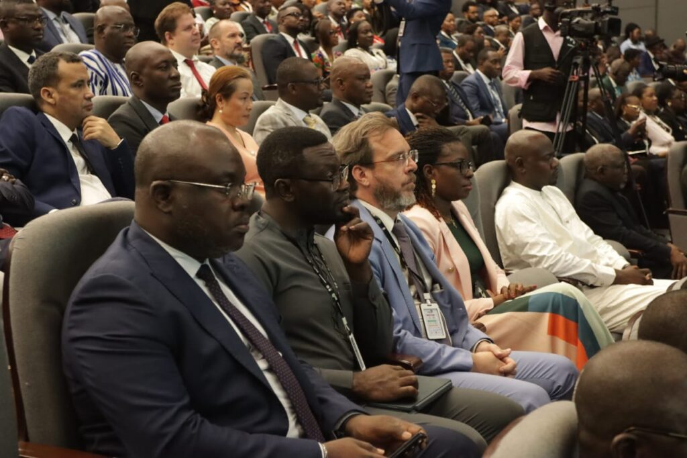
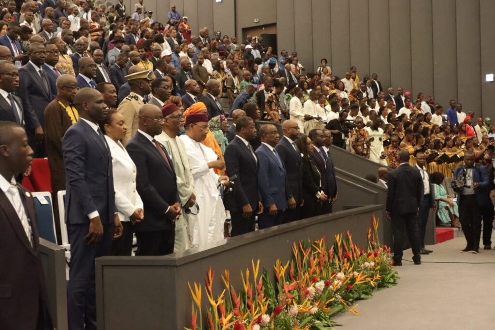
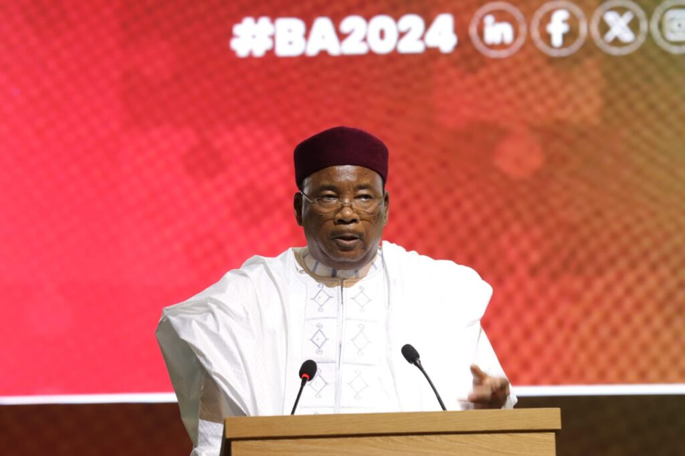
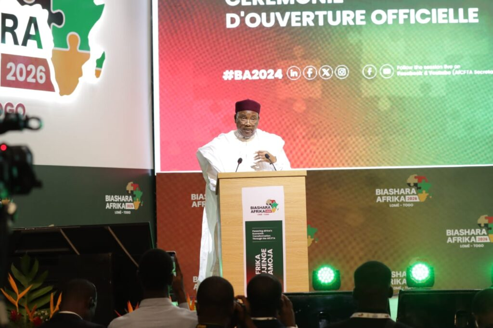

The third edition of Biashara Africa opened on Monday in Lomé, bringing together African leaders, investors, manufacturers and business executives for a three-day conference focused on boosting trade and industrialisation across the continent under the African Continental Free Trade Area.

Among the leaders attending the opening ceremony were H.E. Faure Gnassingbé, H.E. Wamkele Mene and former Niger President H.E. Mahamadou Issoufou, alongside delegates from across Africa, the United States and Dubai.

During his address, H.E. Mene said Africa is witnessing unprecedented political commitment toward implementing the AfCFTA agreement.

“I am pleased to report to you, that through the political will and leadership of our Heads of State, the level of political commitment to ensure that the AfCFTA becomes a reality, is unprecedented,” he said.

H.E. Mene revealed that 50 African countries have now ratified the AfCFTA Agreement, while 26 countries are actively trading under AfCFTA preferential rules after domesticating the agreement into their national systems.

According to figures shared during the forum, intra-African trade reached a record US$220 billion in 2024, representing a 12.5 percent increase compared to the previous year. Trade within Africa is projected to rise further to US$230 billion by 2027.

“This has resulted in a record intra-Africa trade reaching US$220 billion in the year 2024, a 12.5% increase from the year before,” H.E. Mene said while citing the latest Afreximbank Intra-Africa Trade Report.

The conference also heard that Africa is increasingly outperforming global trade growth trends. Estimates from the United Nations Conference on Trade and Development place global trade at approximately US$35 trillion in 2025, with Africa among regions recording stronger performance due to growing regional trade.

H.E. Mene said the AfCFTA Guided Trade Initiative is already proving that continental trade under AfCFTA rules is commercially viable, while the sharp rise in Certificates of Origin issued across Africa reflects increasing confidence among businesses.

The automotive sector was highlighted as one of the industries expected to benefit from stronger regional value chains and industrial development under the free trade area.

“We therefore call on automotive OEMs to play their part to invest in industrial development in Africa,” H.E. Mene told participants during the opening ceremony.

Despite the progress, officials acknowledged that challenges including infrastructure deficits, high logistics costs, border inefficiencies and limited access to trade finance continue to slow intra-African trade.

H.E. Mene stressed that implementation efforts must now focus on improving trade facilitation, transport corridors, infrastructure and support for small businesses across the continent.

He also expressed appreciation to H.E. Faure Gnassingbé and the people of Togo for hosting the event, describing Lomé as an important gateway for advancing Africa’s integration agenda. The AfCFTA Secretariat noted that this is the first time the Biashara Africa forum is being hosted in West Africa.

Several exhibitors attending the conference said they are excited to participate, describing the event as a valuable opportunity to showcase their products, connect with buyers and explore new partnerships across African markets.

 

        

\[caption id="attachment\_44621" align="alignnone" width="1024"\] H.E. Wamkele Mene, Secretary General - AfCFTA\[/caption\]

  
