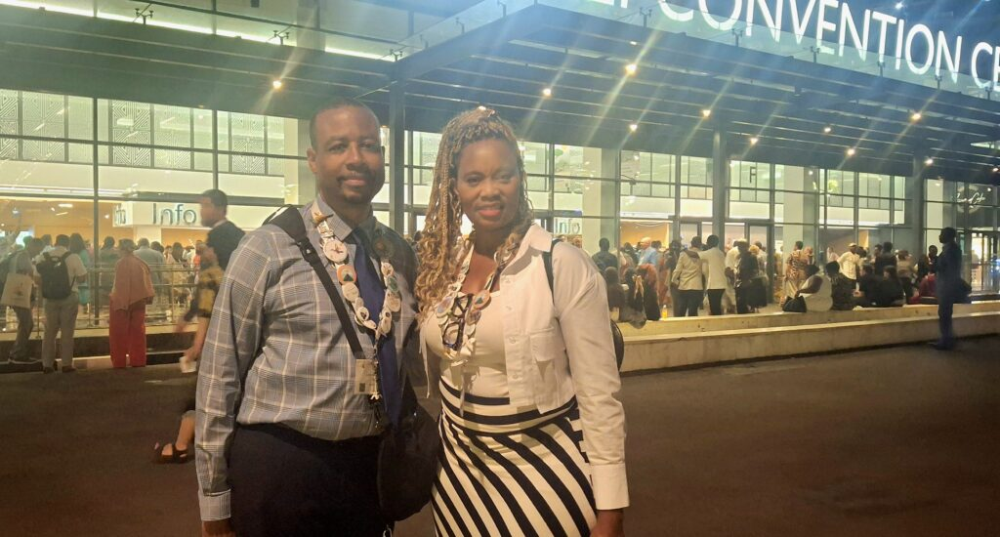
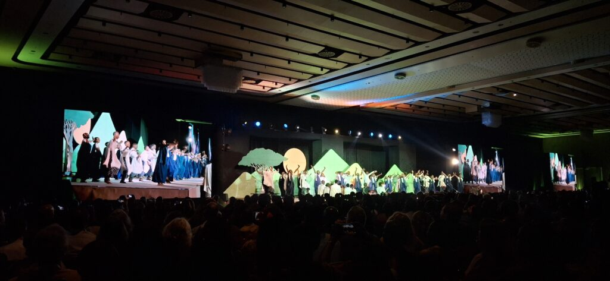

For Danielle and William Michael of Philadelphia, Pennsylvania, the International Convention of Jehovah's Witnesses in Kigali was more than an event; it was a profound spiritual and emotional journey. Their experience as attendees left them with a strong desire for the convention's return. "We hope that it could be even bigger and grander," Danielle shared, confident that a future gathering in Kigali would be "a true reunion with the family we found in a new land."

Their journey began on August 3, the moment their plane landed. They were greeted not by strangers, but by a warm welcome from fellow believers, their brothers and sisters in the faith. William recalled, "Right away we were greeted at the airport and right away we joined them at a congregation meeting." This immediate sense of unity set the tone for their entire visit.

Throughout their stay, they immersed themselves in both the convention and the culture of Rwanda. They attended a beautiful evening gathering at the Kigali Convention Centre, where they enjoyed traditional Rwandan dance and sang songs of praise. Beyond the convention, their itinerary included a visit to a Cultural Heritage Village and a safari. Yet, the heart of their trip was always the connection with people.

\[caption id="attachment\_38756" align="alignnone" width="1024"\] Danielle and William Michael at The Kigali Convention Centre\[/caption\]

Danielle was deeply moved by the local community's humble spirit and love. She spoke of hearing the stories of the faith's small beginnings in Rwanda and the persecution its followers endured. "To actually be on the soil, on the land where they went through all of that is a humbling experience," she reflected. For her, the most significant result of the trip was a strengthened faith.

William summarized his experience in one powerful word which is love. He had long known of the global unity of Jehovah's Witnesses through study and zoom meetings. But to be present in Kigali and feel it, was an entirely new feeling. As an African American, he felt a unique connection to the land, a sense of belonging he described with deep emotion, knowing that his ancestors would be from there.

Now, back in Philadelphia, William and Danielle cherish the memories and the new bonds they formed. "We have many friends here now. We have many family here," Danielle said, a sentiment echoed by their shared hope to one day return to Kigali for another international gathering.

**African Updates**
