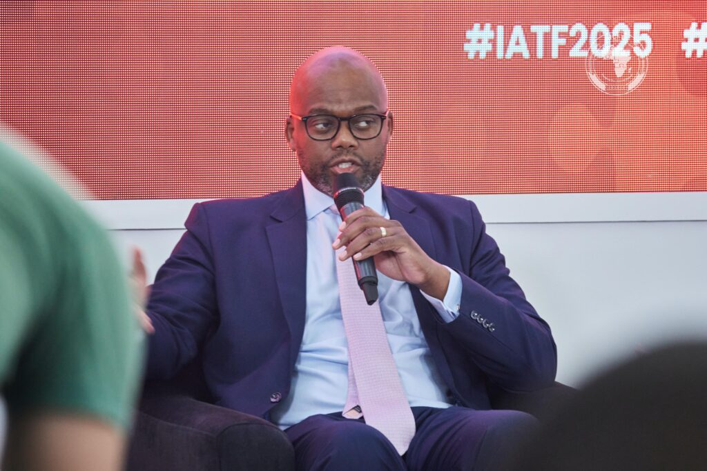
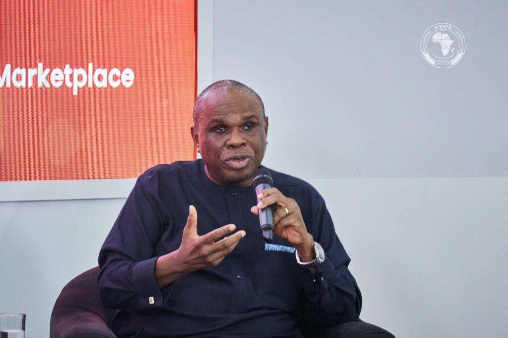
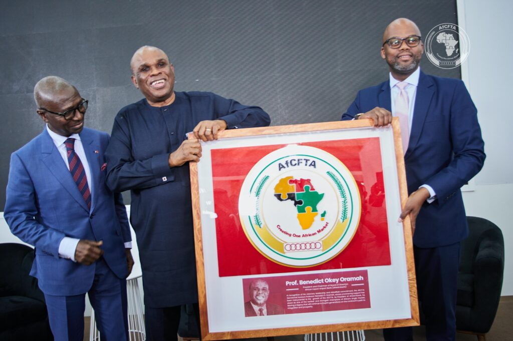
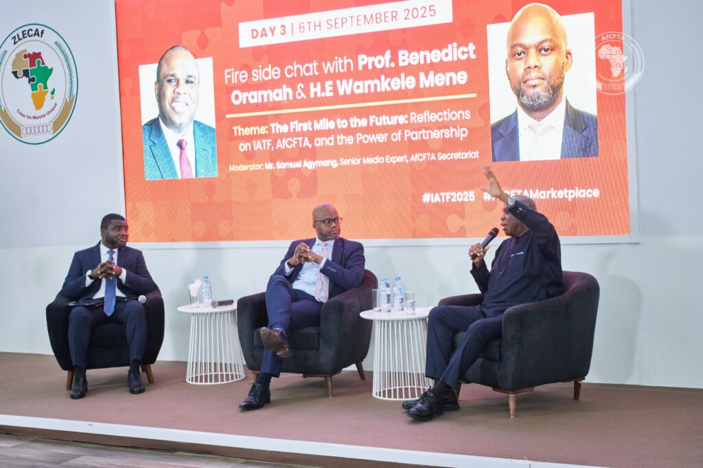
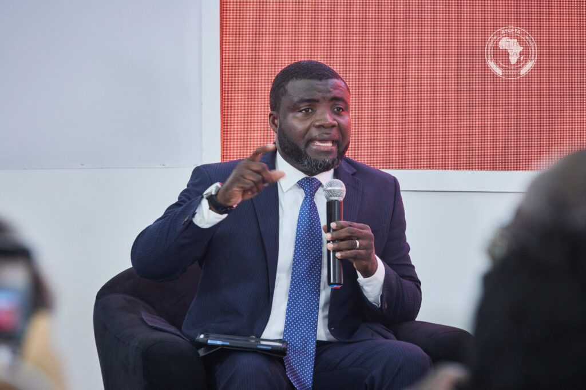
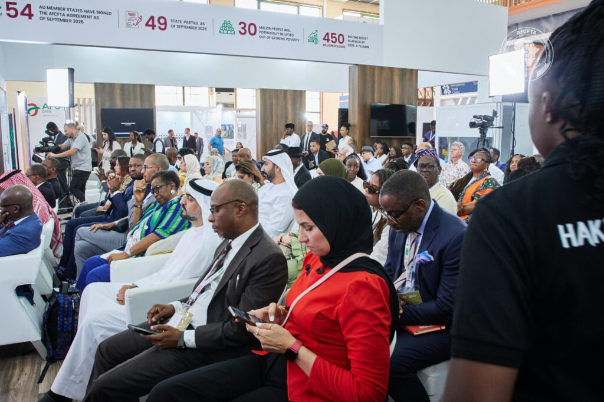
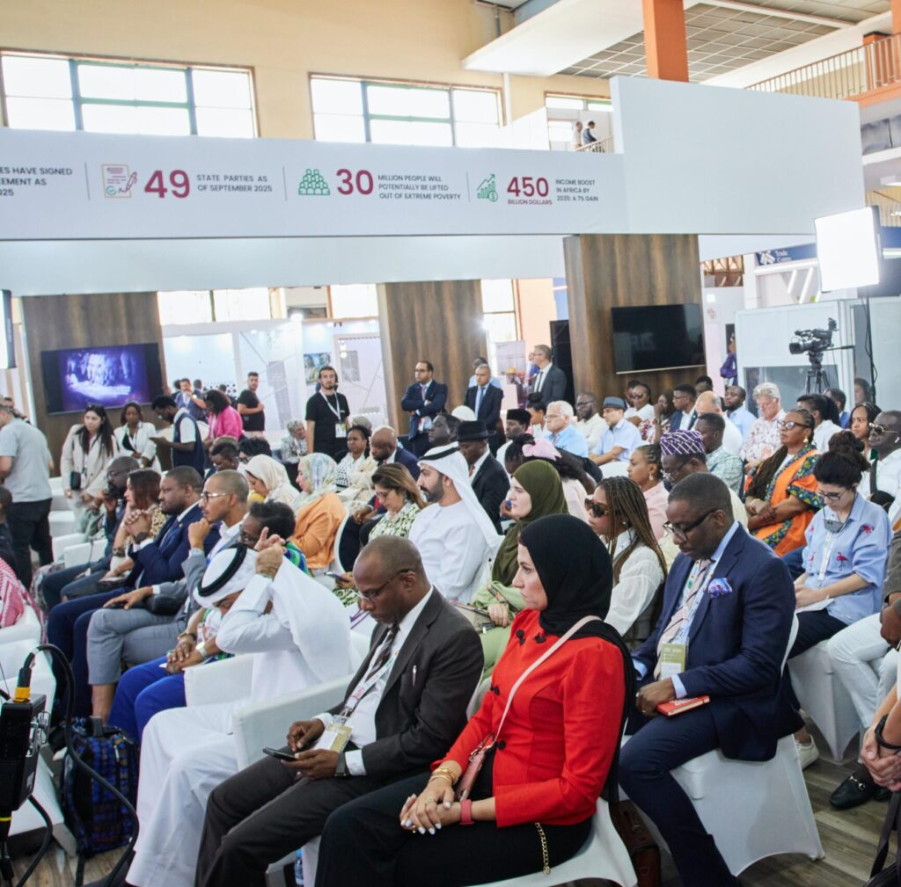

A fireside chat at the Intra-African Trade Fair (IATF2025) on Saturday brought together two leading voices shaping Africa’s trade landscape; H.E. Wamkele Mene, Secretary-General of the AfCFTA Secretariat, and Prof. Benedict Oramah, outgoing President and Chairman of Afreximbank.

The session, held under the theme _“The First Mile to the Future: Reflections on IATF, AfCFTA, and the Power of Partnership,”_ explored how African partnerships, policy, and finance are driving the continent’s trade transformation.

H.E Wamkele Mene underlined the importance of self-reliance in Africa’s development. _“The development of Africa is not going to be financed by others. Our development finance institutions must finance our infrastructure & industrial development, and must invest in those areas that others perceive to be too risky,”_ he said.

He emphasized that AfCFTA is not just a document but a tool already reshaping markets. _“Without Afreximbank, I can assure you, this would be an agreement on paper that is not being implemented today as we speak,”_ H.E Mene noted, stressing the bank’s role in making the trade pact operational.

\[caption id="attachment\_40923" align="alignnone" width="1024"\] H.E. Wamkele Mene, Secretary-General of the AfCFTA Secretariat\[/caption\]

The Secretary-General also pointed to new opportunities for small and medium enterprises. With 49 state parties now part of the AfCFTA, he said businesses in one country can expand across borders, access new markets, and contribute to the continent’s industrial growth.

For Dr. Oramah, who is stepping down as Afreximbank President, the Intra-African Trade Fair’s impact rests on value creation. _“The only way the Trade fair can continue, it’s not because people are emotionally attachment. It is because people continue to see value in it,”_ he told participants.

\[caption id="attachment\_40922" align="alignnone" width="1024"\] Prof. Benedict Oramah, outgoing President and Chairman of Afreximbank\[/caption\]

The discussion also covered efforts to reduce Africa’s reliance on foreign currencies, improve trade finance, and address challenges in moving goods across borders. Both leaders agreed that youth, farmers, and informal traders must remain central to Africa’s economic future.

At the close of the session, the AfCFTA Secretariat presented a token of appreciation to Prof. Oramah, recognizing his leadership and contributions during his tenure at Afreximbank.

The exchange in Algiers captured the urgency and optimism behind Africa’s trade agenda, marking another step in the journey to build a truly integrated continental market.

\[caption id="attachment\_40929" align="alignnone" width="1024"\] The AfCFTA Secretariat honors Prof. Benedict Oramah with a gift, celebrating his leadership and service as President of Afreximbank\[/caption\]

\[caption id="attachment\_40924" align="alignnone" width="1024"\] Mr. Samuel Agyeman, Senior Media Expert - AfCFTA Secretariat\[/caption\]

 

**African Updates**
