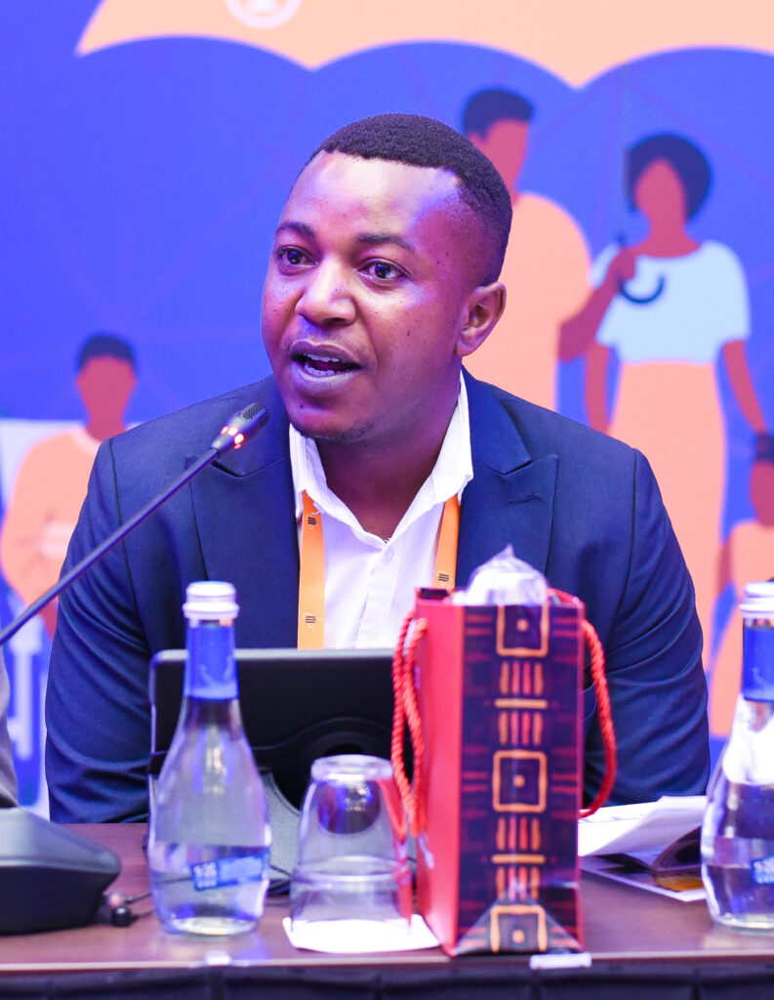
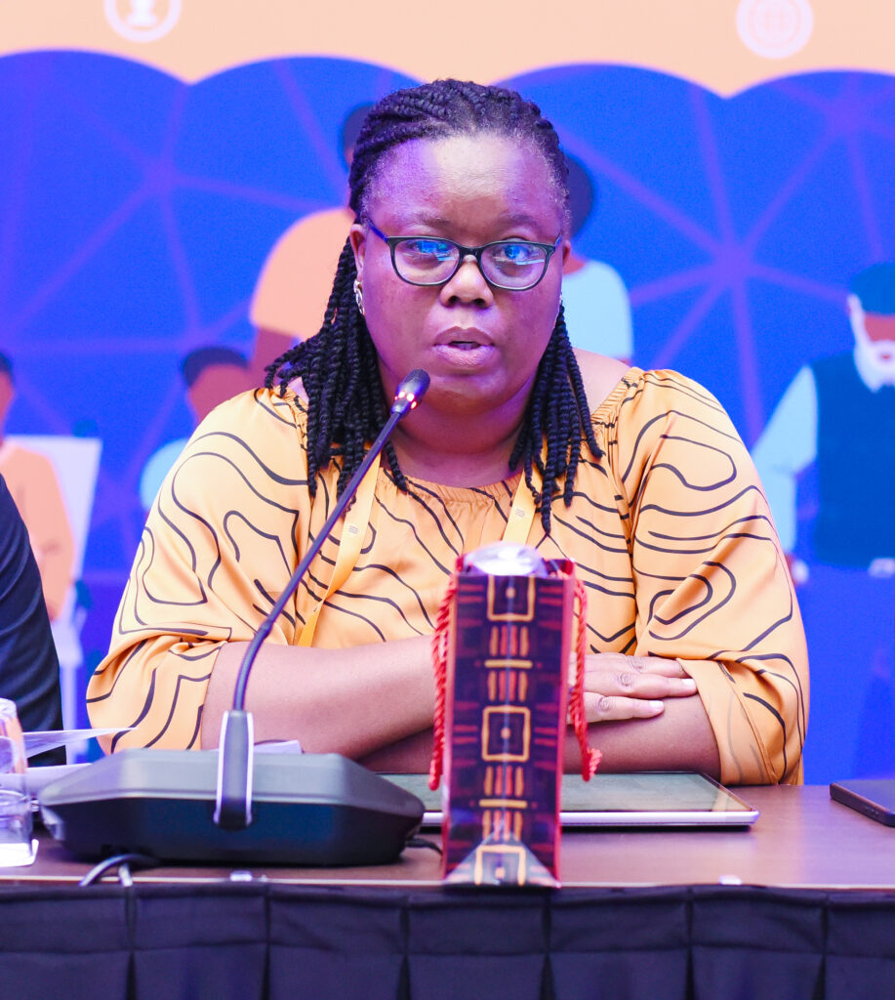
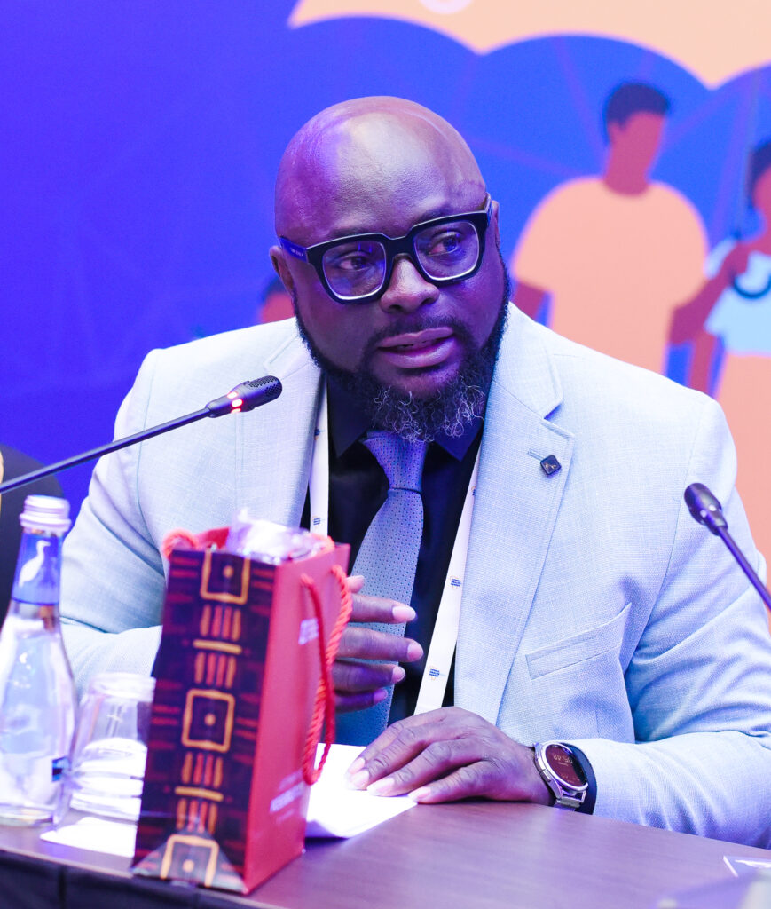
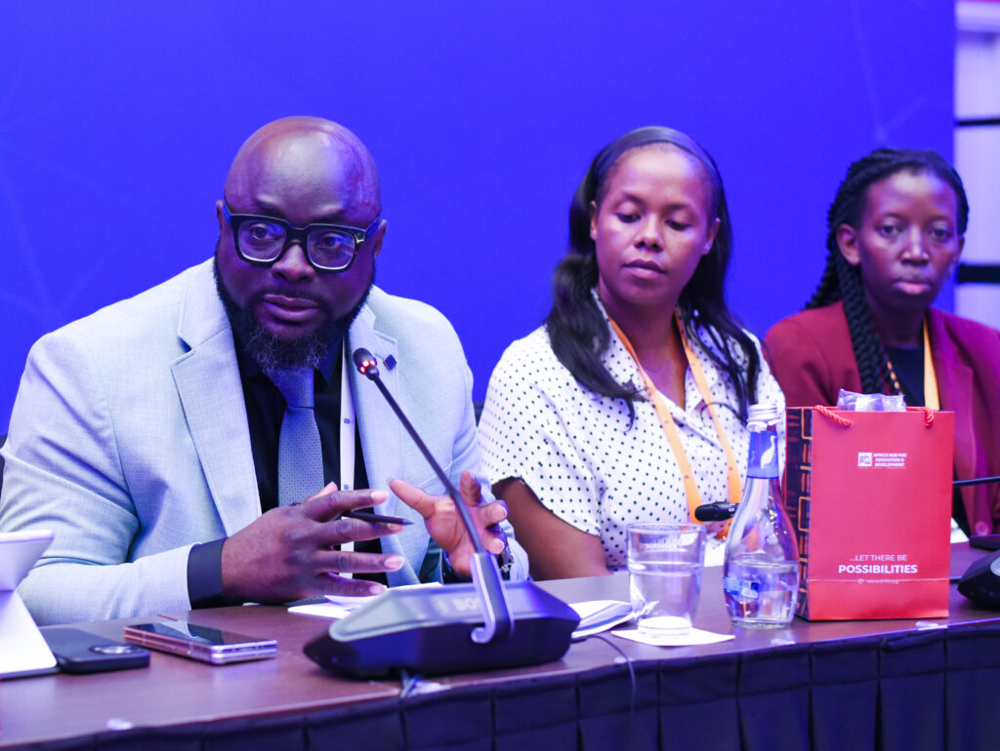
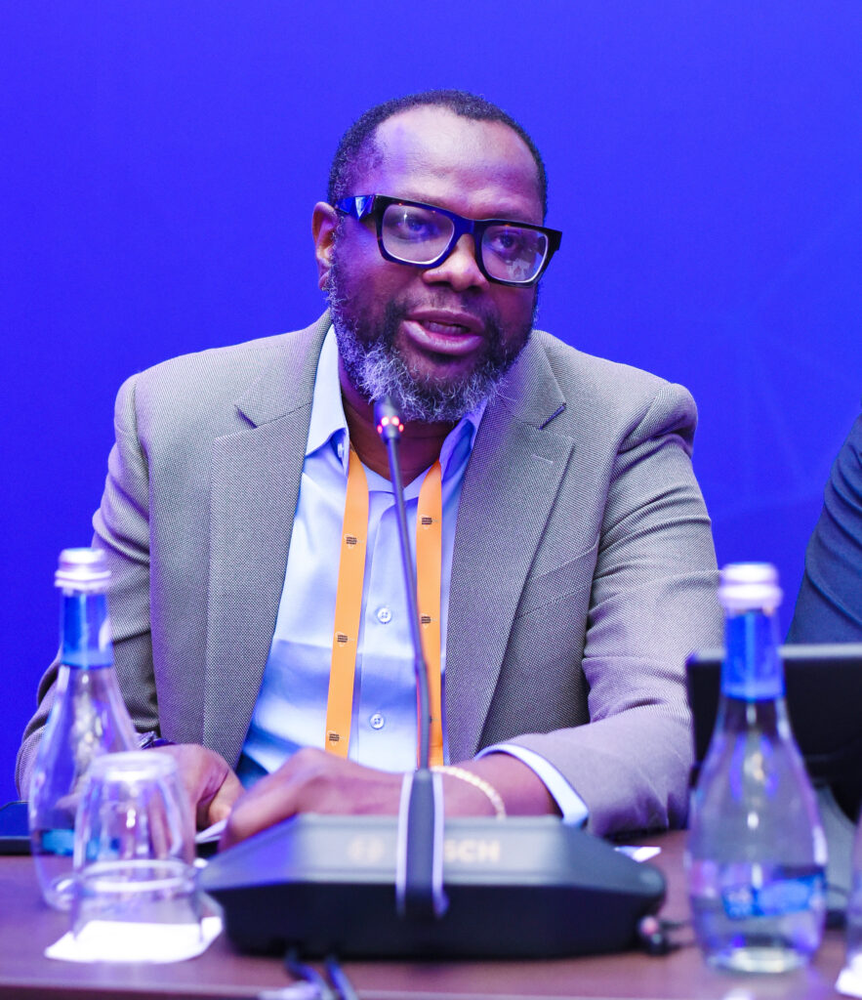
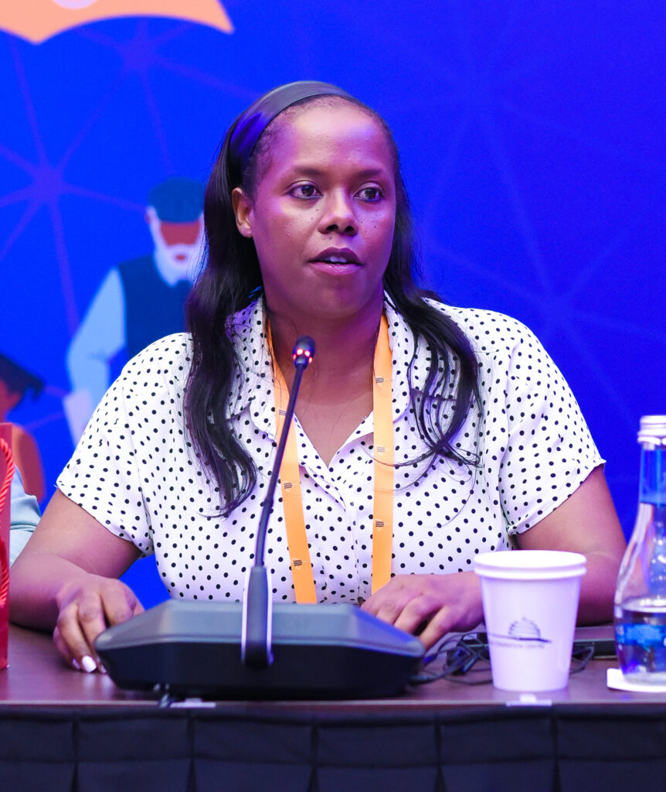
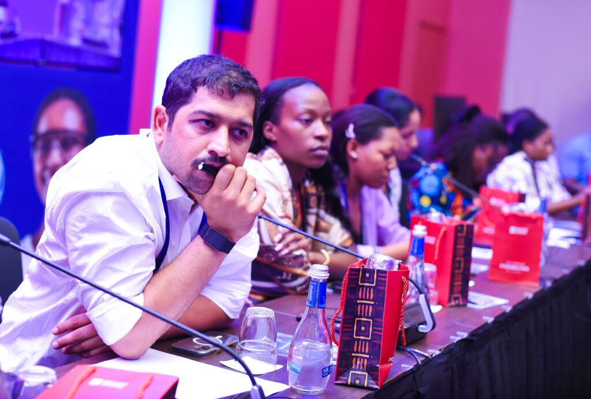
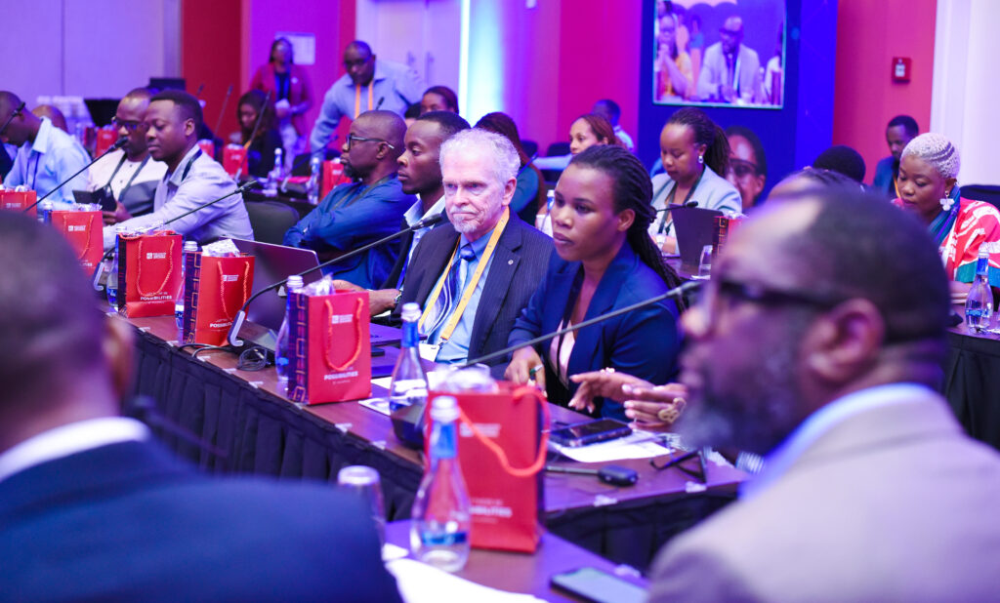
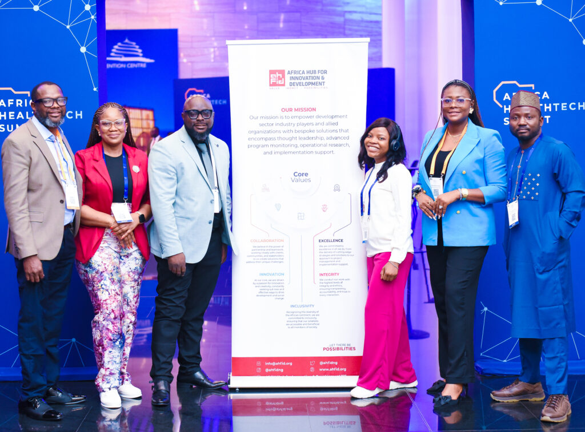

At a roundtable held on the sidelines of the Africa HealthTech Summit 2025 in Kigali, innovators, policymakers and development leaders came together to discuss one urgent question. How can technology secure Africa’s food and nutrition Future. The session, organized by the Africa Hub for Innovation and Development, brought practical solutions, bold ideas and a call for stronger integration across sectors.

Jean Claude Akarikumutima, CEO and founder of Faminga Ltd, emphasized that Africa does not lack innovation it lacks integration.

He explained how giving farmers access to accurate soil data, the right fertilizers, climate information and real-time market trends can reduce post-harvest losses and improve food planning before seeds even hit the ground.

“If farmers, markets and ministries can access one shared dashboard with data on soil, weather and prices, we can secure food before we even harvest,” he said.

He pointed to Rwanda’s success with maize, where smart drying, better storage and monitoring systems reduced crop losses from 31% to 9%. For him, the continent already has what it needs: policies, platforms and people. What’s missing is connection.

\[caption id="attachment\_42563" align="alignnone" width="793"\] Jean Claude Akarikumutima, CEO and founder of Faminga Ltd\[/caption\]

Solange Uwituze, Acting Director General of the Rwanda Agriculture Board, highlighted the region’s progress and persistent challenges. While Africa’s agriculture sector contributes roughly 30% of GDP in many countries, over 280 million Africans still face chronic hunger and micronutrient deficiencies.

“We cannot talk about health when children are stunted and women are anemic,” she said. She stressed that nutrition security must move from policy to households, not just farms.

\[caption id="attachment\_42565" align="alignnone" width="917"\] Solange Uwituze, Acting Director General of the Rwanda Agriculture Board\[/caption\]

The roundtable was organized by the Africa Hub for Innovation and Development, led by Dr. Kunle Kakanfo, a public health specialist with a background in digital transformation, big data and AI.

In an exclusive interview, he explained that their goal is not just to talk about innovation, but to connect it to action, policy and impact.

“We brought innovators, policymakers and development partners into one room to discuss how technology is solving food and nutrition challenges from AI that advises farmers to digital systems that connect data across sectors,” Dr. Kunle said.

\[caption id="attachment\_42562" align="alignnone" width="869"\] Dr Kunle Kakanfo, Lead, Influence & Strategy | Founder Artificial Intelligence for social Impact & Development\[/caption\]

The Africa Hub acts as a facilitator, helping organizations integrate digital tools in health, agriculture and social protection.

Dr. Kunle also addressed the digital divide, noting that solutions don’t always require smartphones or expensive devices.

“Technology can be as simple as USSD codes on basic phones. Farmers can use them to get climate updates, seed advice and market information,” he said. Many of the innovations discussed are designed by local entrepreneurs and targeted at rural communities in low and middle-income countries.

Looking ahead, Dr. Kunle says Africa must move beyond just putting food on the table.

“Food on the table is not enough. It must be nutritious, locally sourced and accessible. Technology can bridge the gap in farming, distribution, preparation and planning,” he explained.

He envisions a continent where Africans are not importing what they can grow, and where digital tools help plan, harvest and store food efficiently.

From the soil to the school plate, the message was clear, Africa has the people, ideas and platforms. What it needs now is coordination.

The roundtable showed that Africa’s path to food and nutrition security is not theoretical it’s already being built by innovators, policymakers and organizations like the Africa Hub for Innovation and Development.

If the conversations turn into collaboration, the continent could shift from food shortage to food intelligence in just a few years.

\[caption id="attachment\_42560" align="alignnone" width="883"\] Akinyemi Atobatele, Strategic information & Digital Innovation Leader/Principal Partner at Africa Hub for Innovation & Development\[/caption\]

\[caption id="attachment\_42564" align="alignnone" width="862"\] Kamariza Isabel the Founder and president of Solid’africa\[/caption\]

**African Updates**
