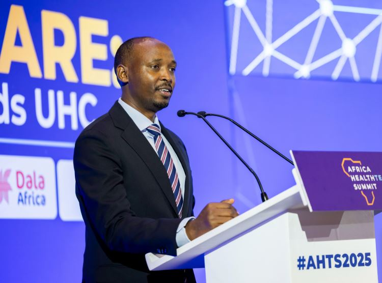
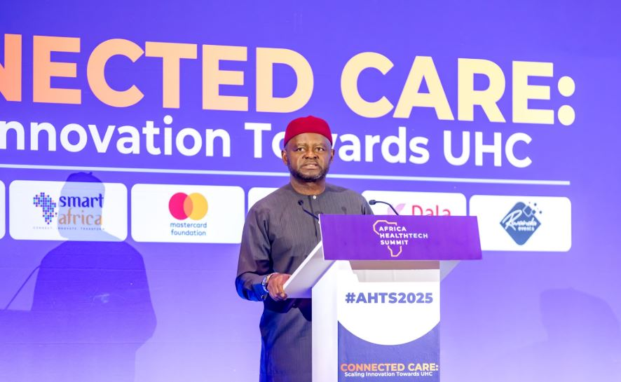
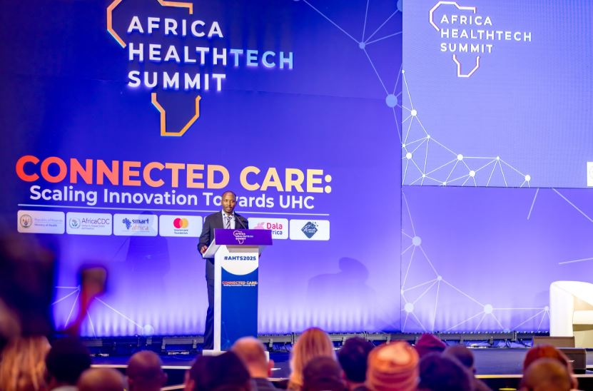
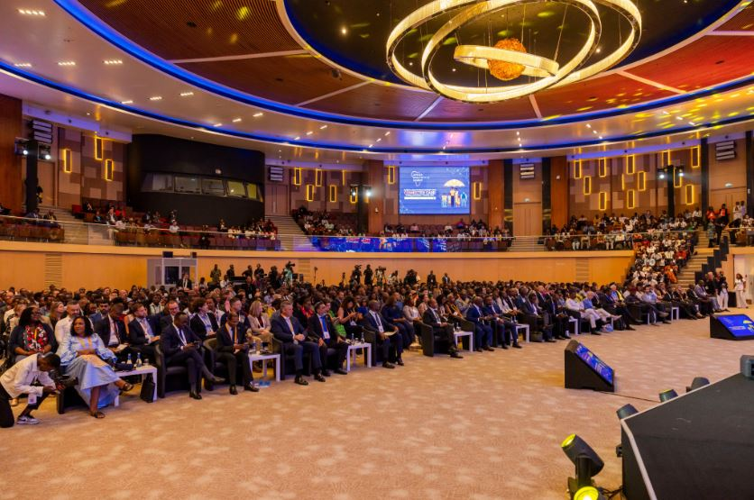
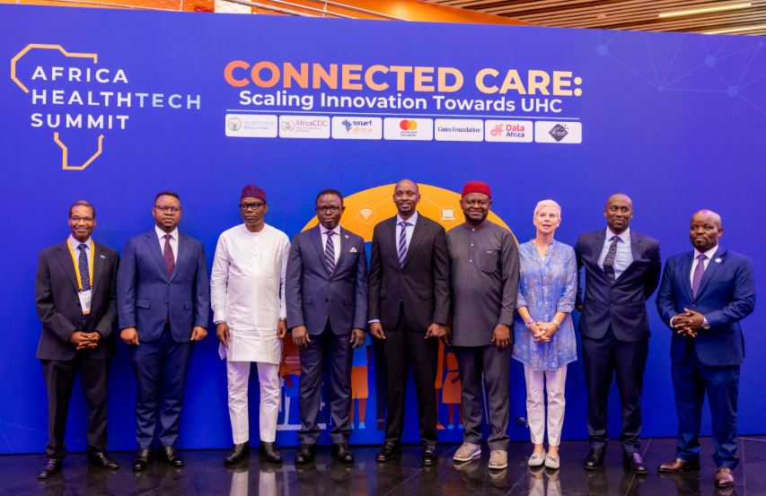

Kigali, Rwanda is hosting a huge meeting, the Africa Healthtech Summit, from October 13th to 15th, 2025. The main idea is Connecting Care using smart tech so everyone gets good healthcare.

The focus of the summit is not just treating the sick, but stopping sickness before it starts.

Dr. Sabin Nsanzimana, Minister of Health in Rwanda, delivered a powerful opening. He called the rise of digital health the third major revolution in medicine. He placed this moment alongside breakthroughs like the first vaccine 200 years ago.

Minister Sabin said Africa must seize this chance to catch up quickly, pointing to tools like smartwatches, phones, and apps being created across the continent. "It means that you’re going to catch up. We’re going to do better, more efficient, precisely, if we address technology quickly."

Minister Sabin stressed that technology must rapidly change how Africa detects, prevents, and monitors diseases. This includes using AI to predict health crises, allowing doctors to detect a heart attack before it happens or spot a cancer in its earliest stage.

\[caption id="attachment\_42528" align="alignnone" width="750"\] Dr. Sabin Nsanzimana, Minister of Health in Rwanda\[/caption\]

Africa carries a massive disease burden but suffers from a severe shortage of health workers. Technology must help the few doctors and nurses do much more.

While the tech is exciting, the UN reminded leaders that the fight must be about equity (fairness).

Prof. Ozonia Ojielo, UN Resident Coordinator in Rwanda, emphasized that technology must ensure people get care without financial hardship. he shared a sobering fact where in 2022, Africans still paid an average of 35% of their health costs out of their own pockets. This high cost forces many poor families to skip essential care.

Prof. Ozonia added that many communities still lack simple digital tools like telemedicine (seeing a doctor by video call) and Electronic Medical Records (EHRs). He emphasised that Closing this digital gap is essential for fairness.

\[caption id="attachment\_42530" align="alignnone" width="886"\] Prof. Ozonia Ojielo, UN Resident Coordinator in Rwanda\[/caption\]

To make connected care a reality, leaders agreed on two key solutions; Putting tech tools directly into local primary health centers. This makes care easier to get and cheaper because people don't have to travel far. And Building secure systems that use AI and Big Data.

Minister Nsanzimana noted this means a policymaker in Kigali could see if a mother is bleeding in a far-off hospital or if a new disease outbreak is starting. This immediate, live information is the key to shifting healthcare from fixing problems to preventing them.

The summit's promise is that Connected Care will use smart technology to make sure that the goal of Universal Health Coverage is finally reached across Africa.

**African Updates**
