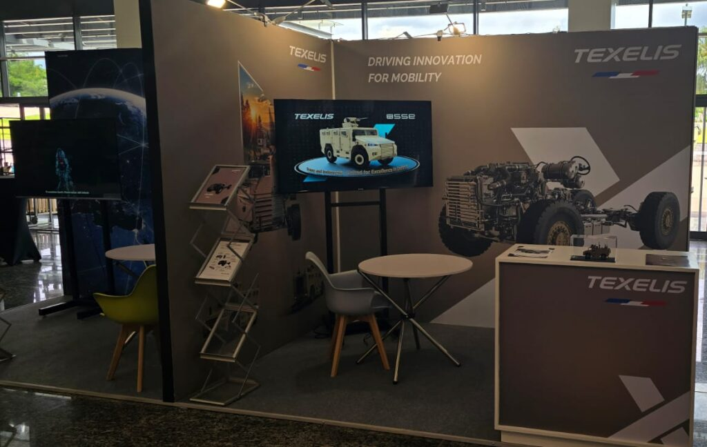
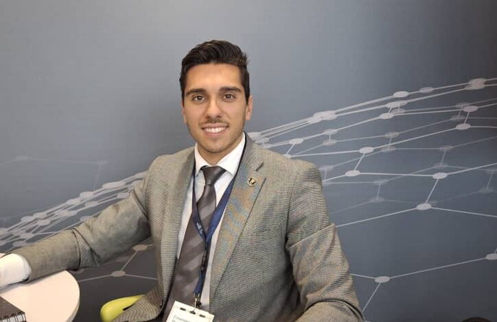
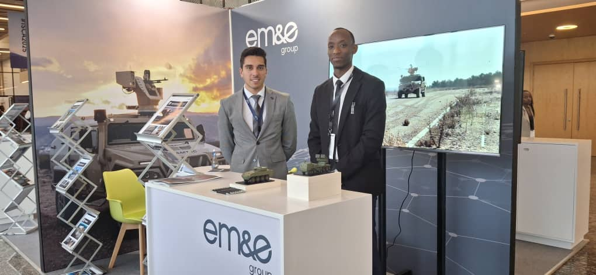
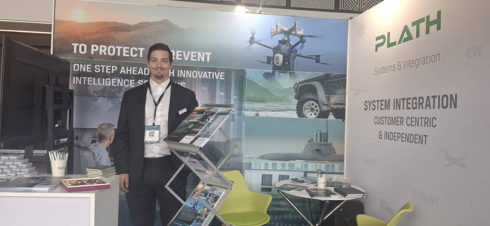
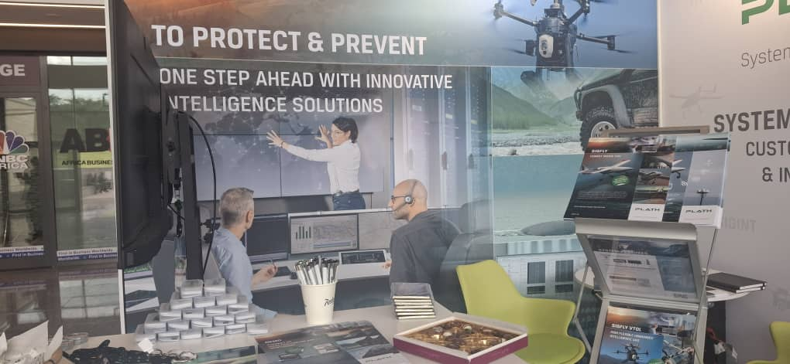
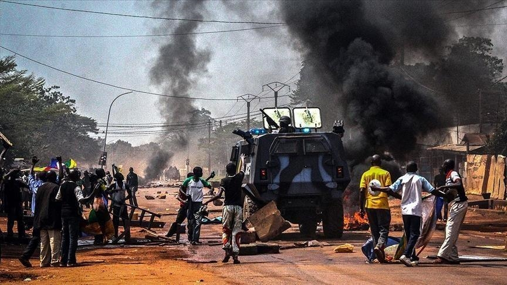

Kigali, Rwanda from 19th - 20th May 2025, leaders and companies focused on safety met in Kigali. _AfricanUpdates_ talked to some of them. Everyone agreed: for Africa to be safer, countries need to make more of their own security gear. They also need to use new tools and work together better.

Africa faces many tough challenges. Today, over 37 million people in Africa have fled their homes because of fighting. Millions more are displaced inside their own countries. Sudan, Congo, and the Sahel region still see lots of trouble. This shows how much more security is needed. Still, some places are quite safe. Rwanda, for example, has made big strides since its past troubles. Countries like Ghana and Botswana are also known for being peaceful.

Companies at the meeting said they help African nations get the right tools and knowledge. This helps countries build their own strong defense. Mr. Sébastien Guillaume, from Texelis, a French company that makes parts for armored vehicles, spoke about giving power to local makers. "Our idea is to let countries build their own armored vehicles," Guillaume said. "We bring technology parts to help them make their own vehicles for the future. This means they can do projects they want and also have control over their defense."

\[caption id="attachment\_32135" align="alignnone" width="857"\] Mr. Sébastien Guillaume, Sales Director of Texelis, a French company that makes parts for armored vehicles\[/caption\]

Mr. Eric Ferrando, from EME Group, a top Spanish defense company, shared this view. He stressed that safety and defense are the foundation for any country. "For a society, safety and defense are key to a strong country," he explained. "When a government can protect itself and its people, it can build schools, roads, and hospitals." EME Group showed off new tools like anti-drone systems, special cameras, remote-controlled weapons, and guided missiles.

The fast rise of new dangers, especially drones, was a big topic. Ferrando said security products need to be smart and quick. "Things are changing fast. New tech is very involved in systems, and we need products that can quickly handle new threats," he added. He talked about systems that can shoot and move fast, plus smart cameras to see what's happening.

\[caption id="attachment\_32143" align="alignnone" width="724"\] Mr. Eric Ferrando, Business Development Manager at EM&E Group, a top Spanish defense company\[/caption\]

Mr. Robin Schumacher from Plath System and Integration, a Swiss company working on signal intelligence, showed how they help people see more clearly. "We help African security groups get a better look at their area," Schumacher explained. This means giving them more facts to plan better and protect their teams. They can even find terrorists by tracking their radio signals.

\[caption id="attachment\_32138" align="alignnone" width="1020"\] Mr. Robin Schumacher from Plath System and Integration, a Swiss company working on signal intelligence\[/caption\]

A main point kept coming up, African countries must take charge of their own safety. Mr. Guillaume put it simply, repeating a key message from the meeting: "Our president said we should not let others handle our security." Working with companies from other countries is good for learning and getting new tech. But the real goal is for African nations to make their own defense gear. This builds true control and lasting safety.

The leaders at the conference agreed a safer Africa will come from smart tech, local making, and a strong will to be independent. This team effort, as seen in Kigali, offers a hopeful path to a more stable and successful future for Africa.

 

**African Updates**
