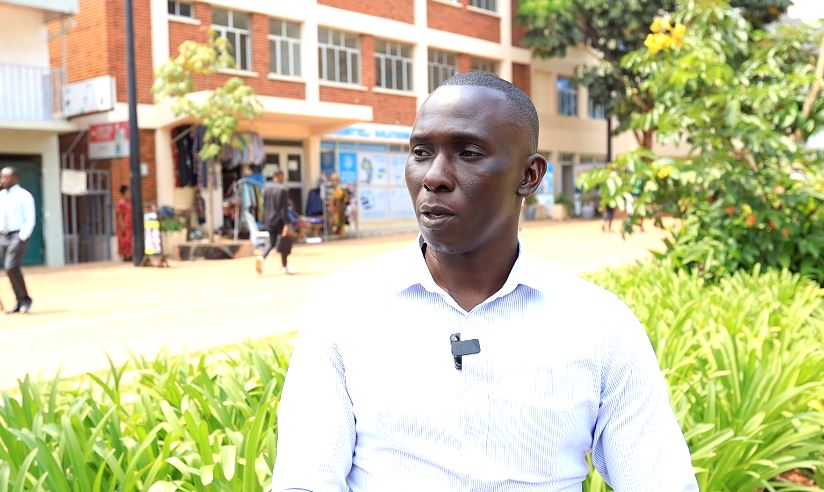
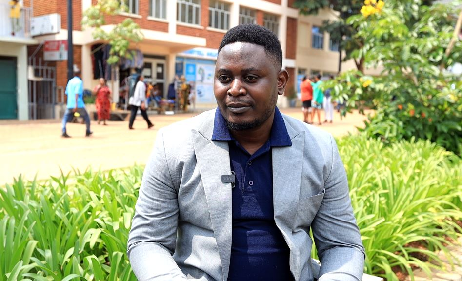
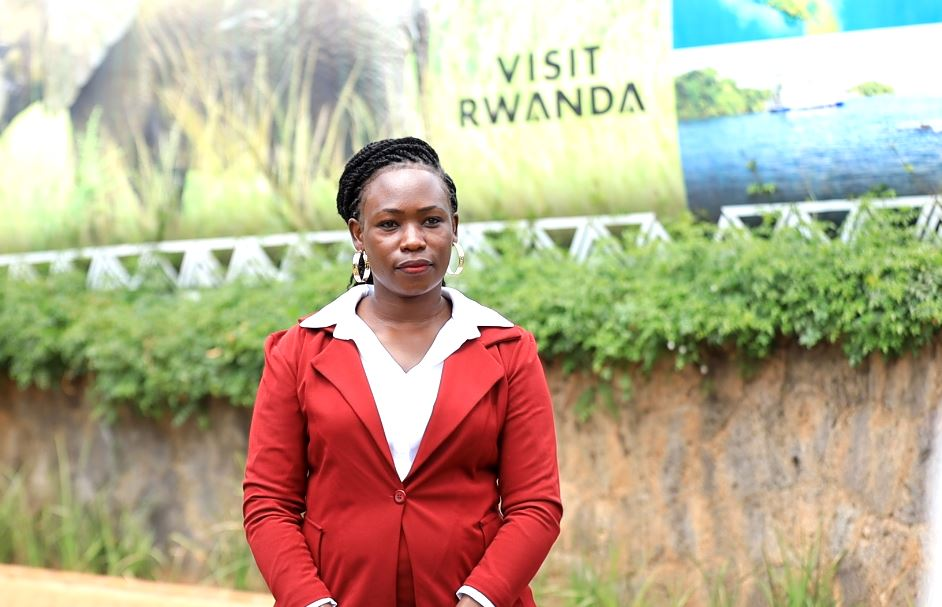
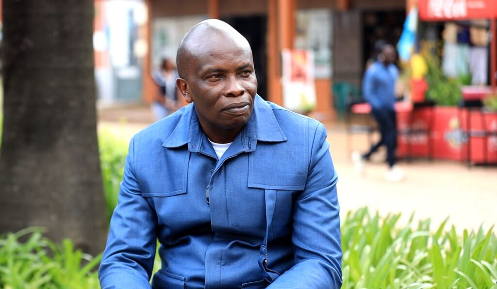
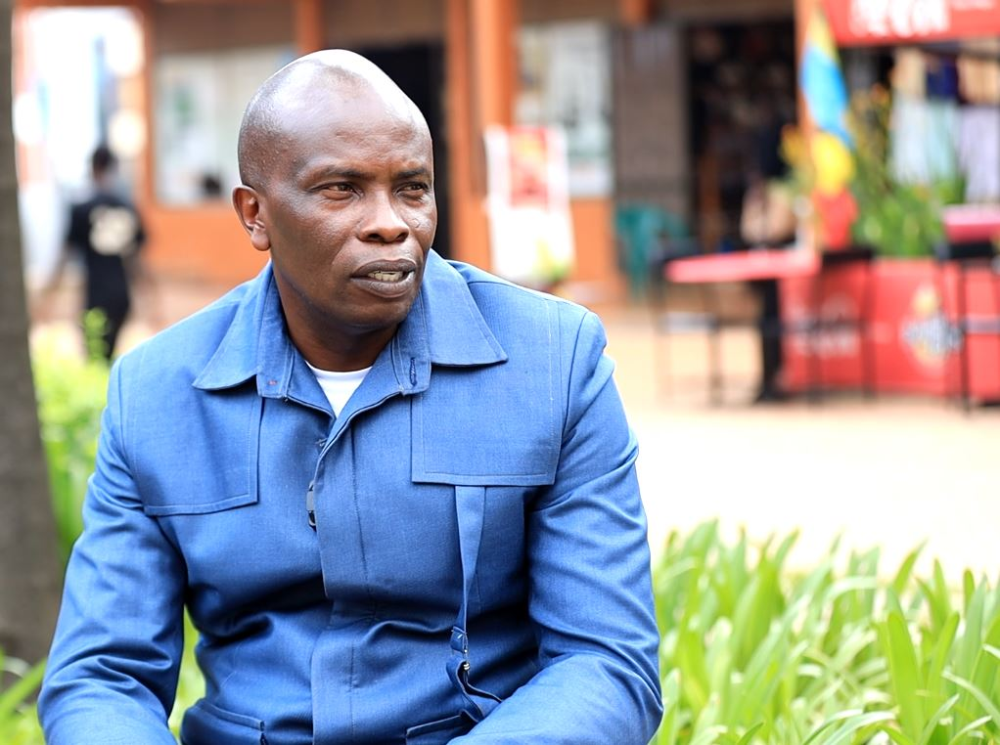
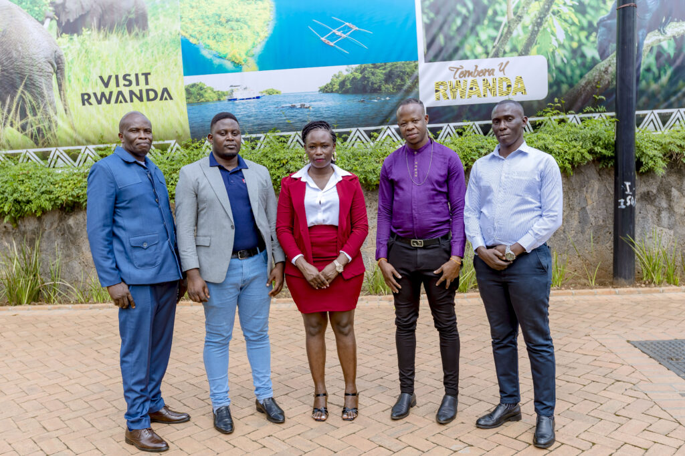
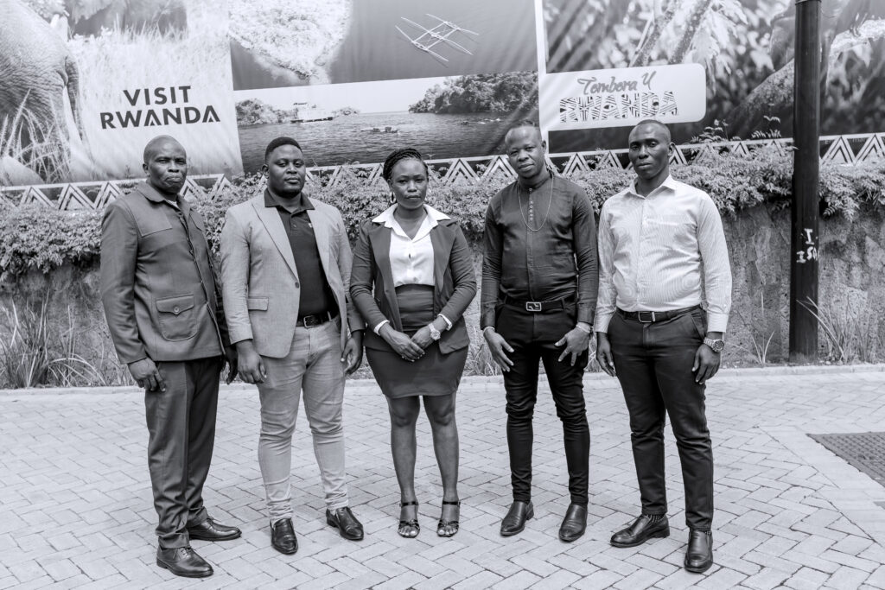
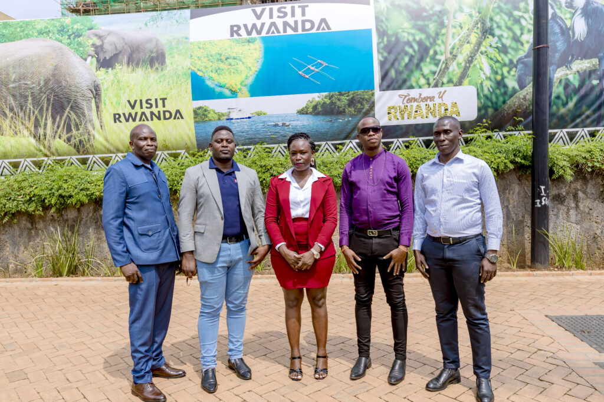

On a mission to promote peace and unity across Africa, the Africa Peace Run initiative has gained significant momentum under the leadership of the Global Election Observation Mission (GEOM). This initiative seeks to bridge divides and address the underlying issues of violence and political unrest by engaging the continent’s most valuable resource, its youth.

The idea behind the Africa Peace Run was born from the understanding of Africa’s history and the challenges it continues to face. Kaikare Ronald, the Head of Programs at GEOM and Director of Africa Peace Run, shared his thoughts on why this initiative is so crucial for the continent.

“The main reason for coming up with the Africa Peace Run is rooted in the experiences of African countries, most of which have been torn apart by civil wars. These wars, in many cases, are a consequence of political and economic failures by governments, and at times, by citizens as well,” Kaikare explained.

Drawing from his own background in sports, he emphasized that sport is a unifying force, transcending language, politics, and societal divides. "Sport doesn't discriminate between politicians, musicians, or anyone else. Running, specifically, is an easy sport that anyone can participate in, making it a perfect medium for promoting peace," he continued.

The Africa Peace Run is not an isolated initiative within GEOM. The organization operates through various departments that focus on youth and women's empowerment, with this particular initiative falling under those broader goals. Kaikare highlighted that the project's core intention is to encourage active participation and to unite people for a common cause of peace.

\[caption id="attachment\_31773" align="alignnone" width="824"\] Kaikare Ronald, the Head of Programs at GEOM and Director of Africa Peace Run\[/caption\]

**Youth as a Catalyst for Change**

Nkata Coprium, Head of the Youth Department at GEOM, further expanded on the significance of youth participation in the Africa Peace Run. He discussed how, as the youngest continent in the world, Africa's youth play a critical role in shaping its future. However, the continent’s youth have also been the victims of violence, often exploited by political forces to further agendas of unrest and division.

"We must ask ourselves why youth are so important in this initiative. Africa has the youngest population globally, but youth are often the victims of violence and unrest. They are manipulated and used for violence, yet they are the biggest population and the leaders of tomorrow," Coprium noted. His passion for the initiative was evident as he explained how the Peace Run could empower young people to take a stand for peace. "The youth are the majority, and they have the power to take part in shaping decisions that affect the future. If they get involved in the Africa Peace Run, their voices will resonate globally and serve as a beacon for future generations," he added.

This youth-centered approach resonates strongly with the goals of the Peace Run, as it seeks to give a platform to young people to voice their desires for a peaceful and prosperous Africa. "Africa is our home, and there is no better place to start than here," Coprium concluded.

\[caption id="attachment\_31772" align="alignnone" width="947"\] Nkata Coprium, Head of the Youth Department at GEOM\[/caption\]

**A Call to Action for All Africans**

Namigadde Joanita, the Youth Engagement Manager at GEOM, also voiced her commitment to spreading the message of peace across the continent. “We are calling on the youth to join the Africa Peace Run because we want to see a peaceful Africa,” she said.

Joanita stressed the importance of inclusivity, urging both young men and women to come together for this critical cause. “When talking about peace, we are not just calling on men, but women too. I stand here as a woman to call everyone to engage, as peace doesn’t have a gender. Our goal is peace, and it doesn’t matter whether you are a girl, boy, or anything else,” she said passionately.

However, she acknowledged the challenge of overcoming the perception that peace initiatives are politically motivated. “Some youth believe that these initiatives are political, but we are here to make it clear that this is not a political matter. It’s about national pride and loving our nations,” she explained.

\[caption id="attachment\_31771" align="alignnone" width="942"\] Namigadde Joanita, the Youth Engagement Manager at GEOM\[/caption\]

**Expanding the Reach of the Africa Peace Run**

Dr. Mboni Abel Lubega, the CEO of GEOM and Chair of the MAL Group, elaborated on the organization’s comprehensive approach to peace-building, with the Africa Peace Run serving as a central piece of this broader effort. "GEOM is an organization that oversees elections and ensures transparency in the electoral process, but we are also ambassadors of peace. Our goal is to see Africa united," Dr. Mboni shared.

The Africa Peace Run is designed to cover the entire continent, taking place simultaneously in countries with upcoming elections, with Uganda being the first host due to its 2026 elections. However, the event is not limited to Uganda alone. Dr. Mboni explained that if two countries hold elections in the same year, the GEOM team will assess where peace efforts are needed most and select a host country accordingly. "The Peace Run will move across the continent, depending on where elections are held, to encourage peace before, during, and after elections," he said.

This initiative also includes pre-events like debates in schools and concerts featuring local artists to spread awareness about the Africa Peace Run and its importance. “The theme will focus on celebrating diversity, embracing unity, and saying no to violence,” Dr. Mboni added. He highlighted the unfortunate trend in Africa where violence often follows elections, particularly post-election violence. The Africa Peace Run aims to disrupt this cycle by promoting unity and peace in the lead-up to elections.

Participants who cannot physically run will also have the opportunity to engage in the event. “If you cannot run, you can still participate. Just wear something white or wave a white handkerchief. Those who are sick or bedridden can also take part by posting videos about peace on social media,” Dr. Mboni explained. The inclusivity of the event ensures that no one is left out, and it’s an opportunity for the entire African diaspora to show solidarity.

\[caption id="attachment\_31770" align="alignnone" width="1024"\] Dr. Mboni Abel Lubega, the CEO of GEOM\[/caption\]

**The Importance of Prevention**

When asked why GEOM focuses on countries with elections, Dr. Mboni explained that the tendency for violence to follow elections is a critical issue that the Peace Run seeks to address. "Every time there is an election in Africa, violence often follows. That is not peace, and we are here to prevent that," he said firmly. He also emphasized that GEOM’s work goes beyond election monitoring, as they engage with the electoral process before, during, and after elections to ensure peace is maintained.

Dr. Mboni’s message to Africans across the world was clear: "On September 21, 2025, let everyone wake up no matter where you are whether sick, at church, or abroad. Let’s show our solidarity, celebrate diversity, embrace unity, and say no to violence. Africa must unite under the spirit of Pan-Africanism."

\[caption id="attachment\_31769" align="alignnone" width="1022"\] Dr. Mboni Abel Lubega, the CEO of GEOM\[/caption\]

The Africa Peace Run, organized by GEOM, represents a collective effort to foster peace, unity, and solidarity across Africa. Through the participation of young people, the use of sports, and the involvement of communities from all walks of life, this initiative seeks to bring about a more peaceful future for the continent. It’s a reminder that, no matter the challenges, unity is the path forward, and it is up to every African to take part in the journey toward lasting peace.

**African Updates**
