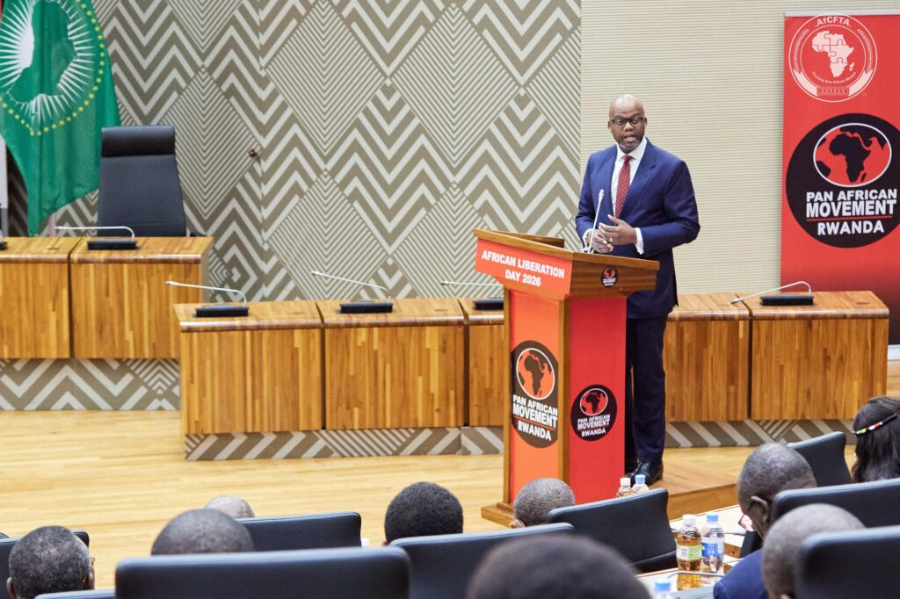
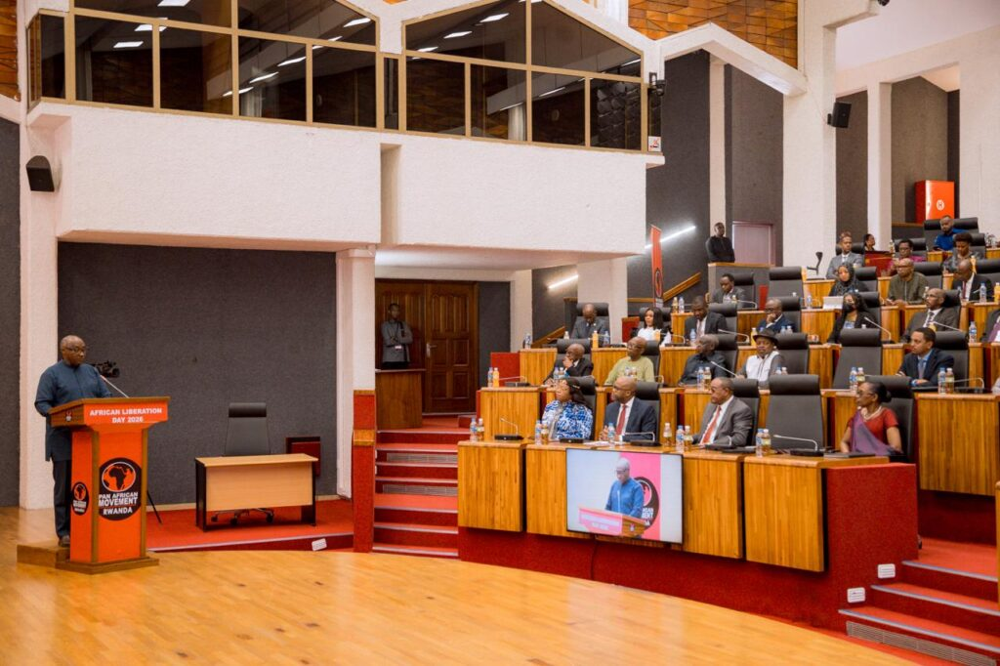
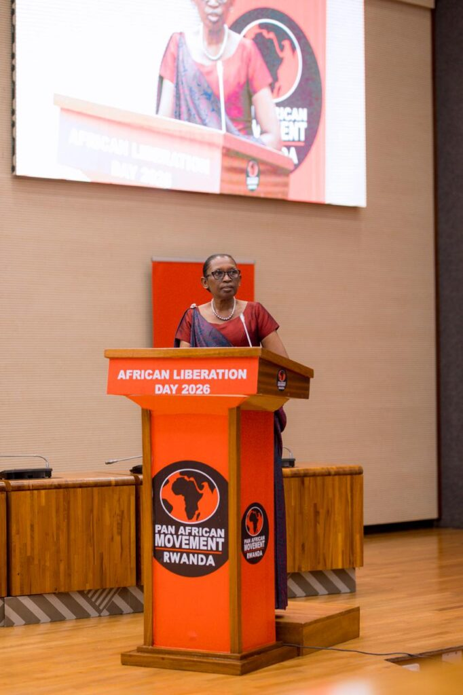
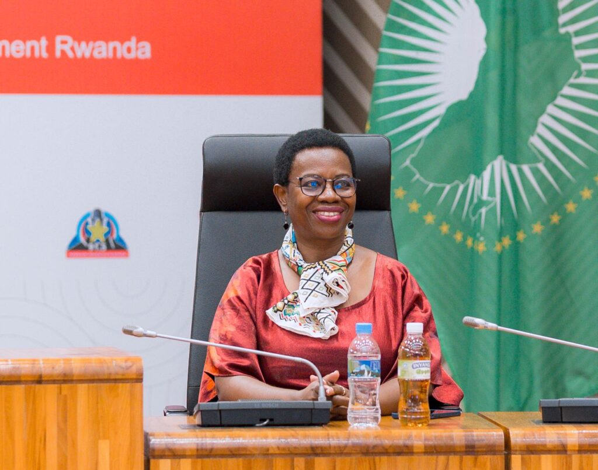
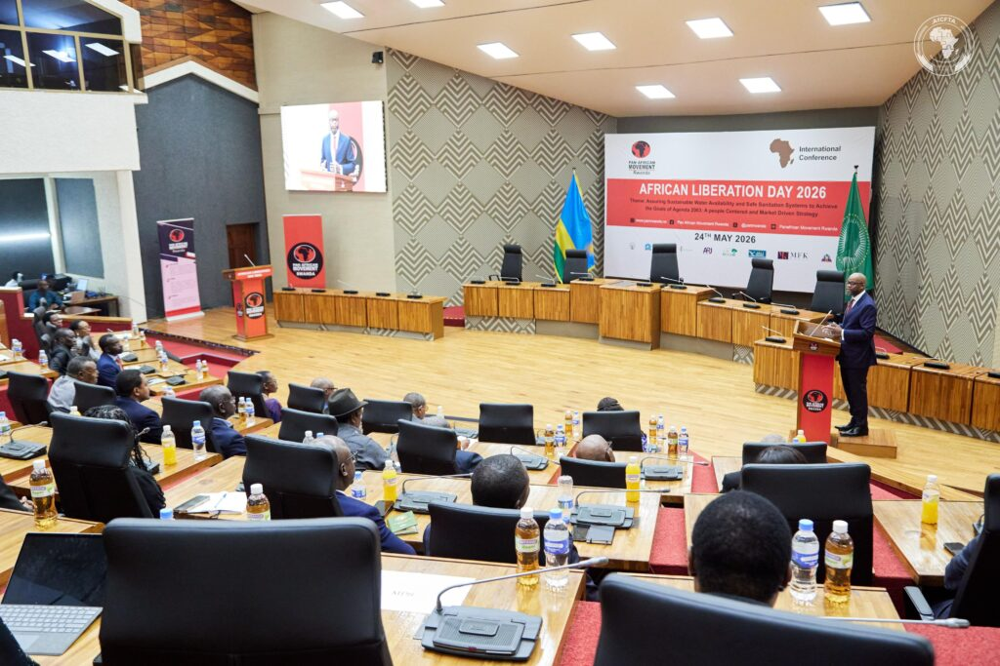
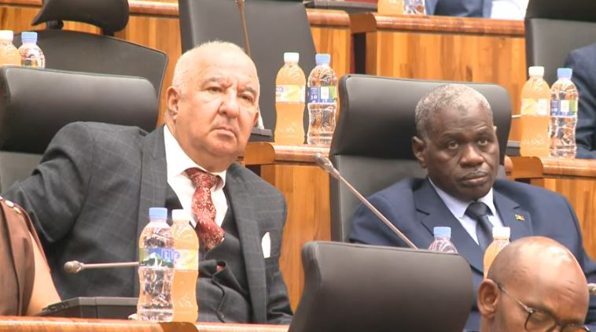
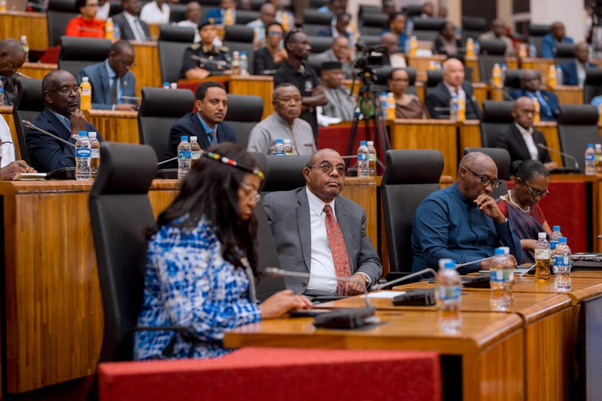
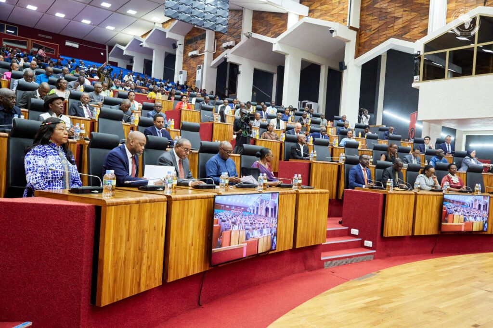
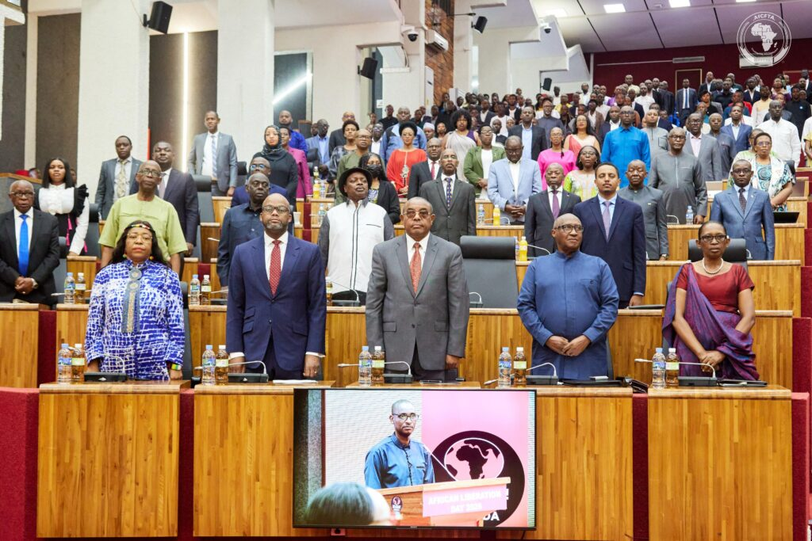

African leaders and policymakers gathering in Kigali to mark Africa Day said the continent must now focus on economic sovereignty and regional integration more than six decades after political liberation movements swept across Africa.

The Africa Liberation Day celebrations, organized by the Pan African Movement Rwanda Chapter on Sunday, brought together senior officials, diplomats and Pan-African leaders under this year’s theme on sustainable water access and sanitation as part of the African Union’s Agenda 2063 vision.

Among those attending the General Assembly were former Ethiopian Prime Minister Hailemariam Desalegn, former Deputy Chairperson of the African Union Commission Monique Nsanzabaganwa, alongside other regional leaders and policymakers.

Speaking at the event, Wamkele Mene, Secretary-General of the African Continental Free Trade Area Secretariat, said Africa’s political independence remains incomplete without economic freedom.

“After six decades of our continent being free, there’s a central question that must now occupy us, and that is economic freedom and the economic sovereignty of our continent,” Mene said.

He described the African Continental Free Trade Area as Africa’s main tool for economic transformation, saying the agreement aims to integrate a market of 1.4 billion people with a combined GDP of $3.4 trillion.

Mene said 50 African Union member states have ratified the agreement, while intra-African trade rose by 12.4% in 2024 to more than $220 billion, according to figures from African Export-Import Bank.

He said Africa must reduce dependence on raw commodity exports and strengthen regional value chains, industrialization and free movement of goods and people.

\[caption id="attachment\_44673" align="alignnone" width="1024"\] H.E. Wamkele Mene, Secretary-General of the African Continental Free Trade Area Secretariat\[/caption\]

At the same event, Hon. Protais Musoni, Chairperson of the Pan African Movement Rwanda Chapter, said this year’s Africa Day theme reflected the daily realities facing millions across the continent.

“Far too many communities still wake up without access to safe drinking water or adequate sanitation,” Musoni said, calling access to clean water and sanitation a fundamental right under the African Union’s Agenda 2063 blueprint.

Musoni said African governments, investors and entrepreneurs should work together to build sustainable water and sanitation systems capable of supporting communities across borders.

\[caption id="attachment\_44664" align="alignnone" width="1024"\] Hon. Protais Musoni Chairperson of the Pan African Movement (PAM – Rwanda)\[/caption\]

Meanwhile, Hon. Dr. Gertrude Kazarwa, Speaker of Rwanda’s Chamber of Deputies, said stronger regional integration would help create jobs, expand trade and accelerate industrialization across Africa.

“Regional integration is not an option, it’s necessity,” Kazarwa said, highlighting Rwanda’s visa-on-arrival policy for Africans as part of efforts to strengthen continental mobility and intra-African trade.

She also said investment in water infrastructure and sanitation remained essential for public health, dignity and economic growth as African countries continue to urbanize.

\[caption id="attachment\_44667" align="alignnone" width="682"\] Rt. Hon. Dr. Gertrude Kazarwa, Speaker of the Chamber of Deputies of the Parliament of Rwanda\[/caption\]

The gathering in Kigali took place ahead of Africa Day celebrations held annually on May 25 to commemorate the founding of the Organization of African Unity in 1963, now the African Union.

For many speakers at the event, the message was clear: Africa’s future liberation will depend less on political independence and more on whether the continent can build integrated economies capable of creating prosperity for its growing population.

                Dr. Monique Nsanzabaganwa during Africa Liberation Day celebrations in Kigali, Rwanda, on May 24, 2026.

          The Algerian Ambassador to Rwanda attends Africa Liberation Day celebrations in Kigali, Rwanda, on May 24, 2026.

 

**African Updates**
