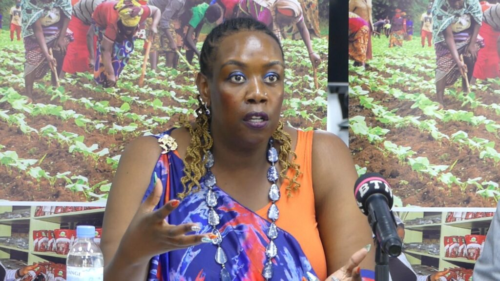
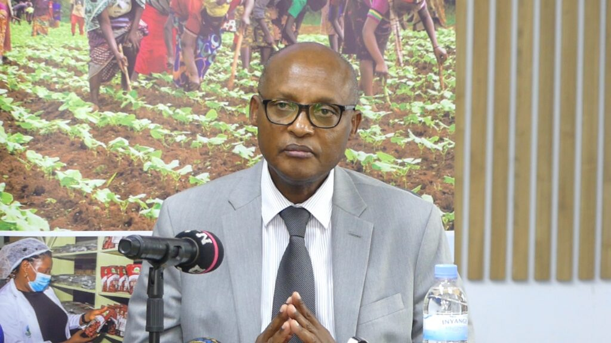
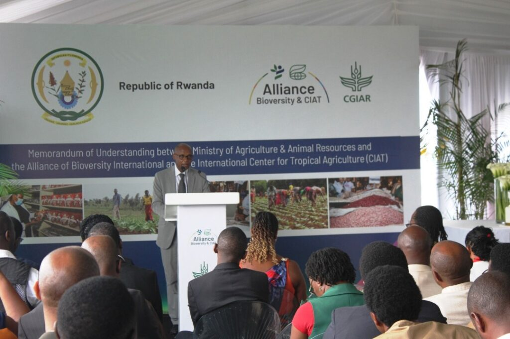
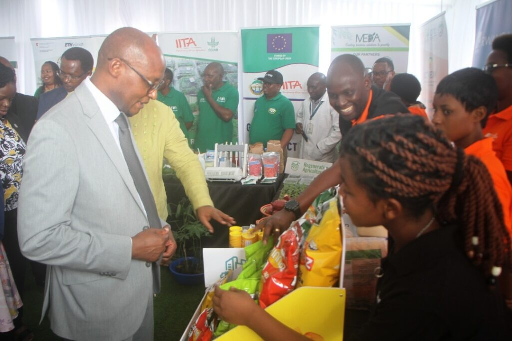
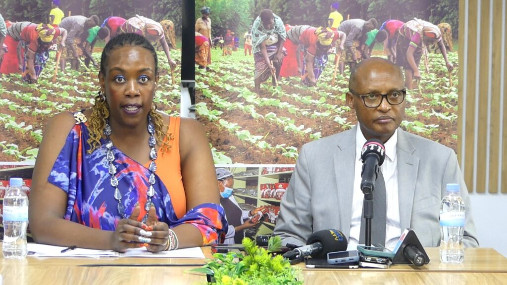
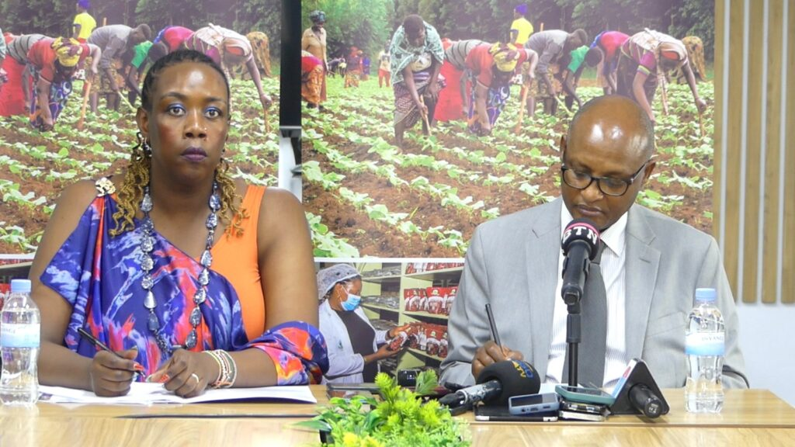

In a significant step towards achieving Africa's development goals, Alliance Bioversity International and the Government of Rwanda have strengthened their partnership through a Memorandum of Understanding (MoU) signed on August 14, 2025, in Kigali. This collaboration aims to drive progress towards the African Union's Agenda 2063, a comprehensive plan for the continent's socio-economic transformation.

According to Dr. Wanjiru Kamau-Rutenberg, Managing Director of of Alliance Bioversity Africa, the alliance's work is deeply aligned with Agenda 2063 and other key African priorities, such as the Comprehensive Africa Agriculture Development Programme (CAADP).

With climate finance in Africa surging 48% from $29.5 billion in 2019/20 to $43.7 billion in 2021/22, the partnership seeks to tap into this growing investment.

\[caption id="attachment\_38926" align="alignnone" width="1024"\] Dr. Wanjiru Kamau-Rutenberg, Managing Director of of Alliance Bioversity Africa\[/caption\]

The Alliance is working on several initiatives to address pressing challenges in African agriculture. One key area is climate-smart agriculture, where they are collaborating with the African Development Bank to explore climate finance facilities. For instance, the ADAPTA Climate Finance Facility has been established with a $50 million debt facility to support smallholder farmers in Sub-Saharan Africa.

This facility uses a proprietary climate risk management software to reduce lending risks and promote regenerative agricultural practices.²

Additionally, the Alliance is working on nutrition-related projects, such as mapping food environments in urban areas. By understanding what nutritious food options are available to city dwellers, they can develop targeted interventions to promote healthy eating habits.

Rwanda's Minister of Agriculture, Dr. Mark Cyubahiro Bagabe, highlighted the importance of technology transfer in achieving agricultural transformation. "The government has been working with CGIAR organizations for over 40 years, and the Alliance Bioversity is a key partner in this journey," he said.

The MoU signed between the Alliance and the Government of Rwanda will further strengthen this collaboration.

\[caption id="attachment\_38927" align="alignnone" width="1024"\] Hon. Dr. Mark Cyubahiro Bagabe, Minister of Agriculture and Animal Resources for Rwanda\[/caption\]

As Africa continues to urbanize and face the challenges of climate change, partnerships like the one between Alliance Bioversity and the Government of Rwanda will be crucial in driving progress towards Agenda 2063. With climate finance flows needing to at least quadruple annually until 2030 to meet Africa's investment needs, collaborative efforts like these will be essential in achieving a more food-secure future for the continent.

 

 

**African Updates**
