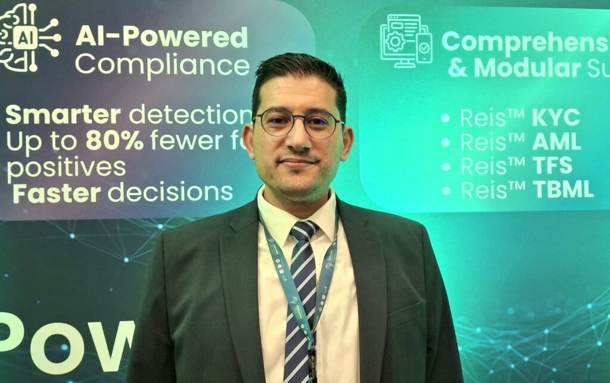
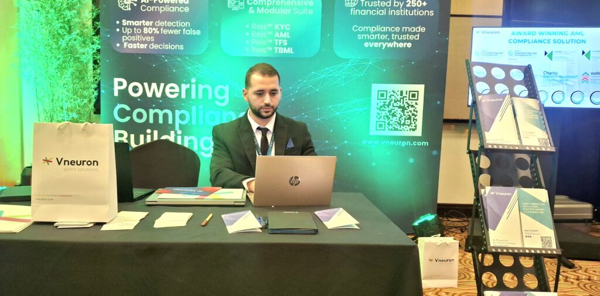
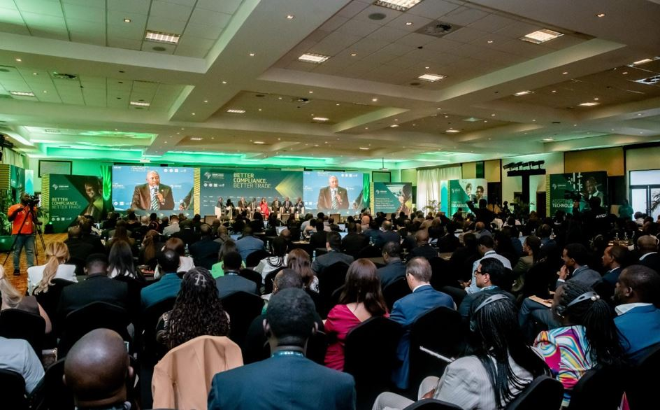
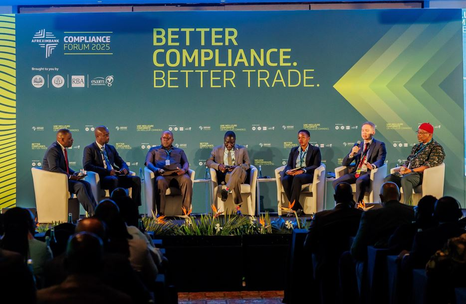
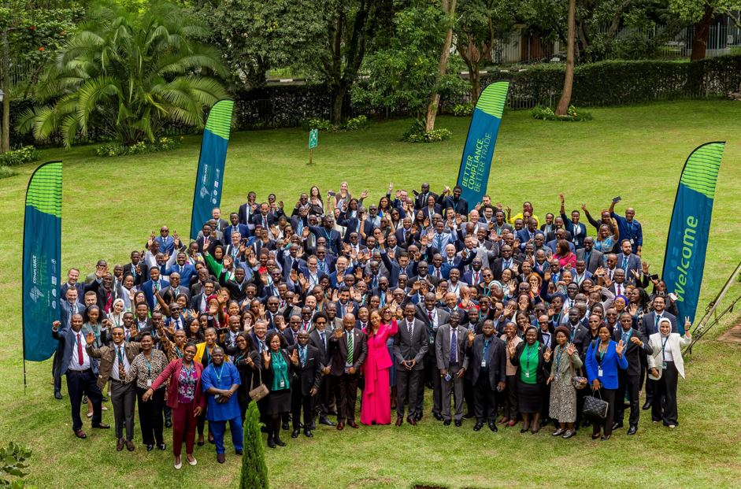

As the Afreximbank Compliance Forum 2025 is currently underway in Kigali, Rwanda, the continent’s plan to combat illicit financial flows became clear. Artificial Intelligence (AI) is now Africa’s best defense against dirty money.

The forum brought together experts to tackle financial crime, a severe problem that’s far more damaging than just complex schemes.

Mahmoud Mhiri, an Executive Partner at Vneuron, explained that financial crime, particularly Anti-Money Laundering (AML), harms the entire economy. AML is the process where criminals hide funds generated from illegal acts like corruption or fraud by cycling them through the legal financial system.

Mr. Mhiri stressed that strengthening controls against AML is essential. By limiting how criminals can wash their money through banks, authorities build a powerful shield for the financial system, which helps reduce overall crime.

However, these necessary controls often hurt legitimate businesses. Banks must perform strict, time consuming checks known as Know Your Customer (KYC). These lengthy procedures often slow down transactions and, crucially, make it harder for Small and Medium Enterprises (SMEs) and entrepreneurs to access essential banking services. Unlike big corporations, small businesses lack the resources to handle complex paperwork, limiting their ability to trade across borders and slowing down Africa’s economic growth.

This is where AI steps in. Vneuron focuses on using AI to automatically handle these compliance tasks, acting as a smart guard for the banking sector.

Mr. Mhiri highlighted that their AI makes AML checks faster and much cheaper. The technology is also more tolerant of incomplete data, a common issue for smaller businesses in Africa. By accelerating KYC, AI directly boosts financial inclusion, ensuring that vital banking services are available to entrepreneurs who need them most.

Vneuron’s AI, however, quickly learns the normal trend for every specific business. If a business suddenly has a huge spike in transactions that does not match its past history even if the overall market is busy the AI instantly flags it as suspicious. This precision is vital for accurately catching illicit activity and keeping the financial system secure.

"AI will make the process easier, faster and tolerant, also to maybe the lack of data and information, which will allow to onboard this type of customers and enhance financial inclusion," Mhiri stated.

\[caption id="attachment\_42775" align="alignnone" width="1024"\] Mahmoud Mhiri, Executive Partner at Vneuron Risk & Compliance\[/caption\]

\[caption id="attachment\_42776" align="alignnone" width="1024"\] Ahmed Jerbi, Account Manager at Vneuron Risk & Compliance at their booth, ready to discuss how AI is shaping the future of secure trade in Africa\[/caption\]

Vneuron’s strong presence at the Afreximbank Forum in Kigali was no accident. Mr. Mhiri noted that the forum is the most important platform for African compliance professionals to meet and discuss challenges.

By attending, companies like Vneuron can hear directly from users and experts, ensuring the technology they develop is specifically shaped to solve Africa's unique financial integrity issues. The ultimate goal, he affirmed, is to create a cleaner, safer financial system that actively supports legitimate African trade and accelerates the continent's economic future.

Africa lose a staggering $50 billion to $80 billion annually in illicit financial flows, the fight is crucial, as this loss often outweighs foreign aid.

  

**African Updates**
