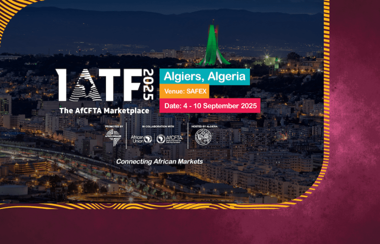

ALGIERS - From September 4 to 10, 2025, Algiers is transforming into the central hub of African commerce, hosting the 4th Intra-African Trade Fair (IATF2025). This landmark gathering, more than just a trade event, signals Algeria’s renewed commitment to leading the continent's economic future. It's a statement of purpose, a bold move to leverage its historical role in Pan-Africanism to forge new economic bonds across Africa.

While the IATF 2025 spotlights Algeria's continental ambitions, it also provides a unique stage for powerful bilateral collaborations. A prime example is the budding partnership between Algeria and Rwanda. Though separated by thousands of kilometers, these two nations are finding common ground in their shared vision for an economically integrated Africa.

Rwanda, a country that has risen from the ashes with remarkable speed, has become an African leader in technology and innovation. Algeria, with its rich history of supporting African liberation movements, is now repositioning itself as an economic powerhouse. Both countries have long-standing diplomatic relations, and recent high-level visits have laid the groundwork for a new era of cooperation.

June 2025, Algerian President Abdelmadjid Tebboune and Rwandan President Paul Kagame signed a dozen new agreements, ranging from visa exemptions and air services to cooperation in agriculture, pharmaceuticals, and education. This historic move, which included Rwanda's announcement of a new embassy in Algiers, is a testament to the strong political will to transform their relationship from a friendly one to a mutually beneficial economic alliance.

The IATF 2025 is the perfect setting to turn these diplomatic agreements into tangible business results. Rwandan delegates, including entrepreneurs and tech innovators, are actively seeking opportunities to partner with Algerian firms. The potential is immense in Technology & Innovation, Agriculture & Processing and Manufacturing.

This collaboration is a living example of the AfCFTA in action. It shows that by working together, African nations can overcome geographical challenges and create a dynamic, self-sufficient economic ecosystem. The story of Rwanda and Algeria at the IATF 2025 is a narrative of a continent no longer looking outward for solutions, but rather, inward. It's a story of shared ambition, where history and progress meet to build a new bridge to Africa's future.

**African Updates**
