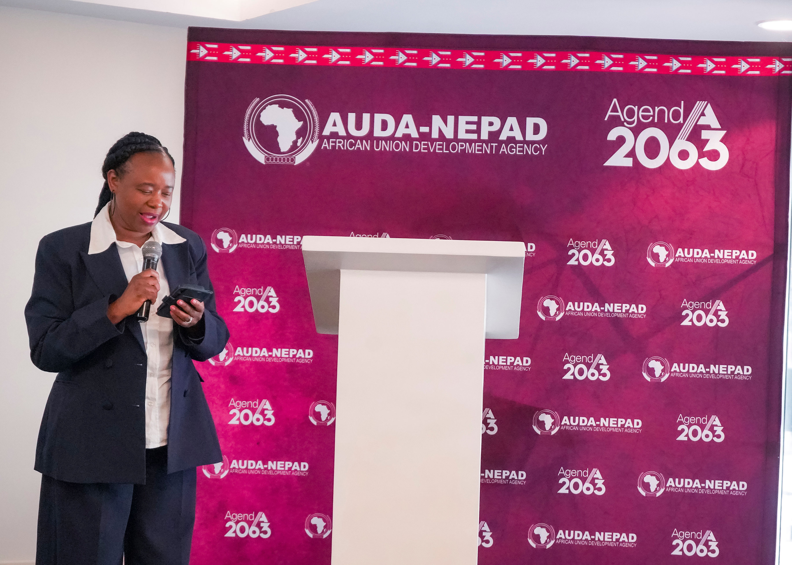
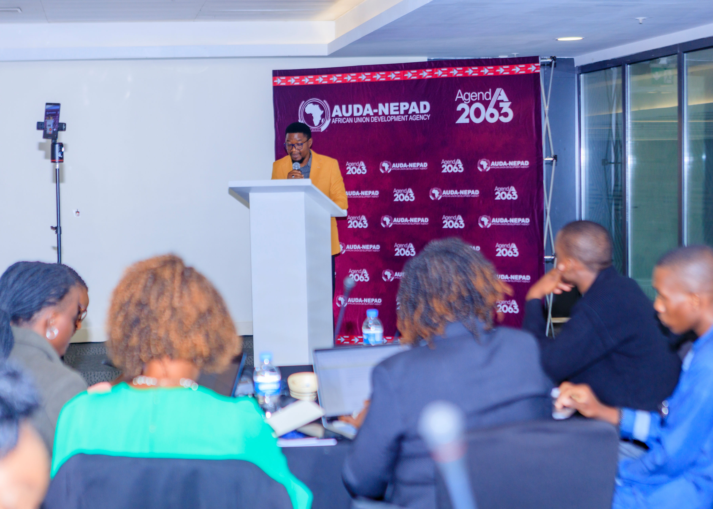
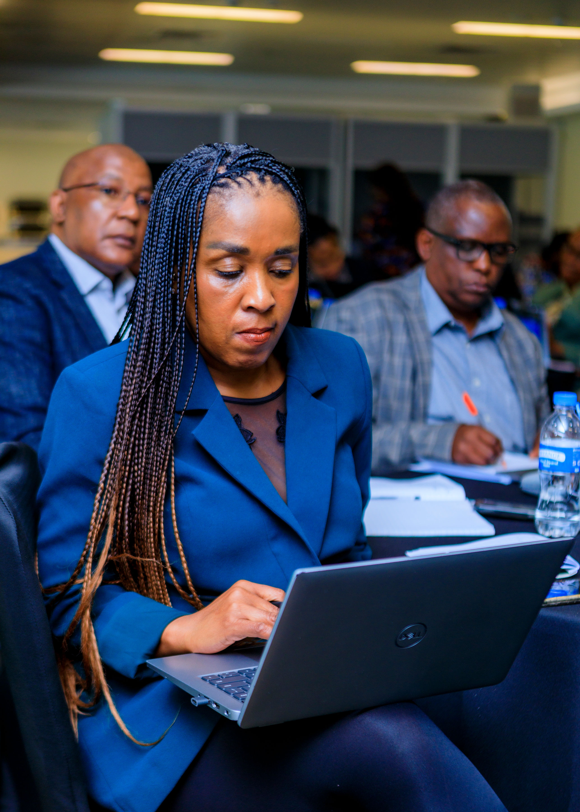
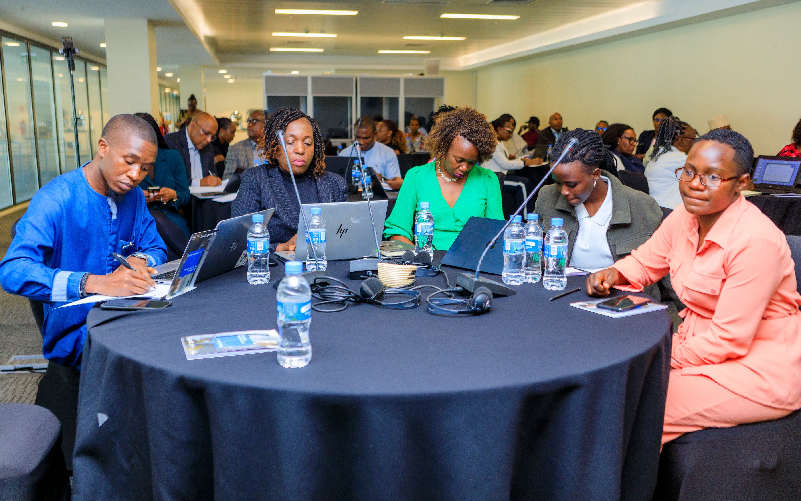
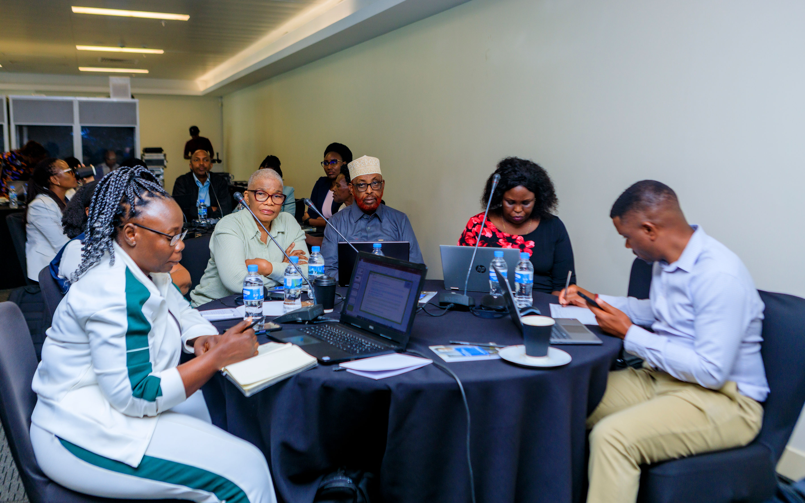
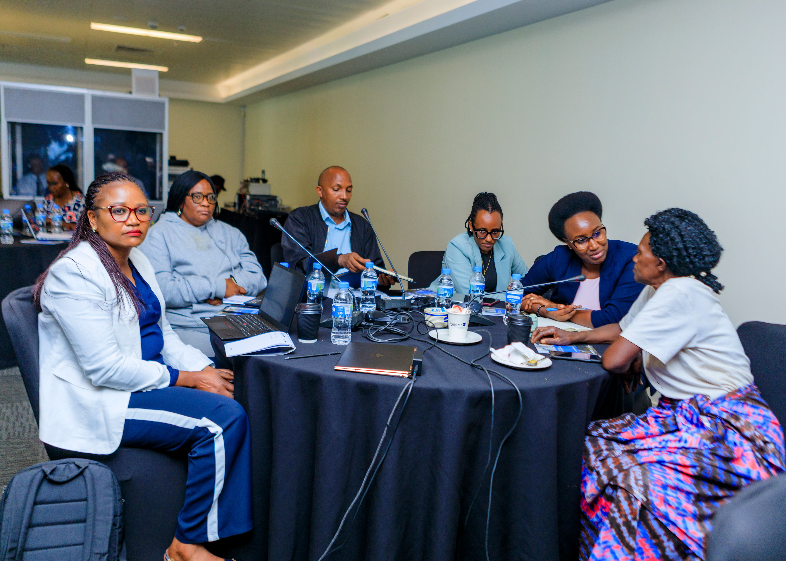
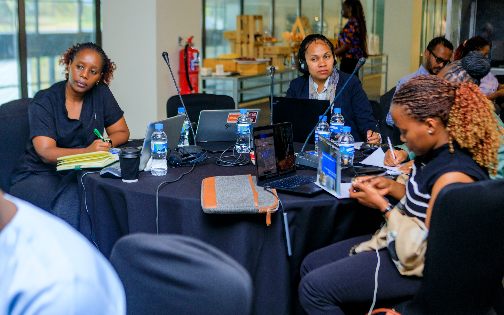
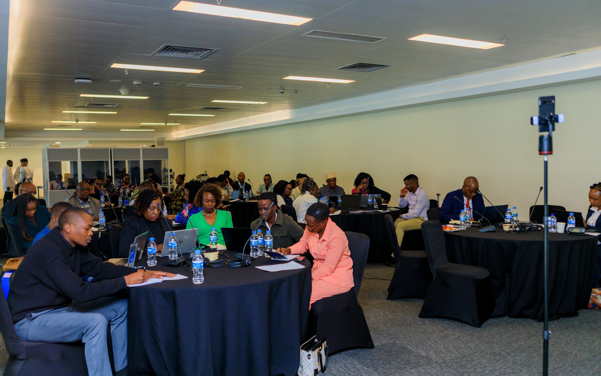

African countries must turn climate-smart agriculture from policy discussions into practical solutions that help women farmers increase productivity, withstand climate shocks and improve their incomes, the African Union Development Agency (AUDA-NEPAD) has said.

Speaking at the opening of a three-day workshop in Kigali on August 26, AUDA-NEPAD Programme Officer Edna Chidule Kalima said the initiative is designed to strengthen the ability of women smallholder farmers and women-led groups to adopt climate-smart and soil-health practices.

“This workshop has been designed as a practical learning and action-oriented platform,” Kalima said, as farmers, government institutions, researchers, extension officers, private-sector actors and development partners gathered to exchange experiences and develop solutions that can be scaled in communities.

The workshop, focuses on closing gender gaps in agricultural productivity while helping farmers respond to unpredictable rainfall, droughts, floods, pests and declining soil fertility.

Kalima said women remain central to food production and rural livelihoods but continue to face unequal access to land, finance, technology, markets, agricultural services and climate information.

She called for women to be recognised not only as beneficiaries of agricultural programmes, but also as “innovators, knowledge holders, entrepreneurs and agents of change.”

Director General of Gender Promotion and Women Empowerment at the Ministry of Gender and Family Promotion in Rwanda , Silas Ngayaboshya, said agricultural transformation cannot succeed without women’s full participation.

“Agriculture cannot become fully productive, inclusive and resilient while the women who sustain it lack equal power, voice and opportunity across agri-food systems,” Ngayaboshya said.

Rwanda’s 2024 gender statistics show that 94.8% of women farmers have access to land, compared with 93.7% of men. Ngayaboshya said the focus must now go beyond access to ensure women have control over land, finance, technology, markets and agricultural decisions.

The role of the media was also highlighted during the workshop. Millicent Kgeledi, from AUDA-NEPAD’s Communications and Advocacy Unit, said journalists can help farmers understand climate change by translating technical information into simple and practical language.

“Technocrats speak from a level of technocrats,” Kgeledi said stressing that the media can bridge the gap between experts and smallholder farmers, particularly women.

She said AUDA-NEPAD is also looking at establishing a network of journalists specialising in climate action to strengthen climate reporting and advocacy across Africa.

As the workshop continues, participants are expected to develop practical action plans for women’s groups, with a focus on climate-smart farming, soil health and solutions that can be scaled within communities.

The discussions put a clear message at the centre of Africa’s climate and agriculture agenda: women must have the tools, resources and voice to help shape more resilient food systems.

**African Updates**
