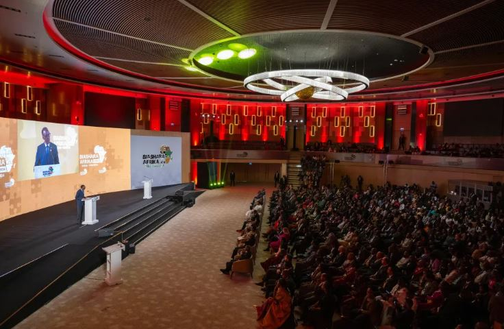
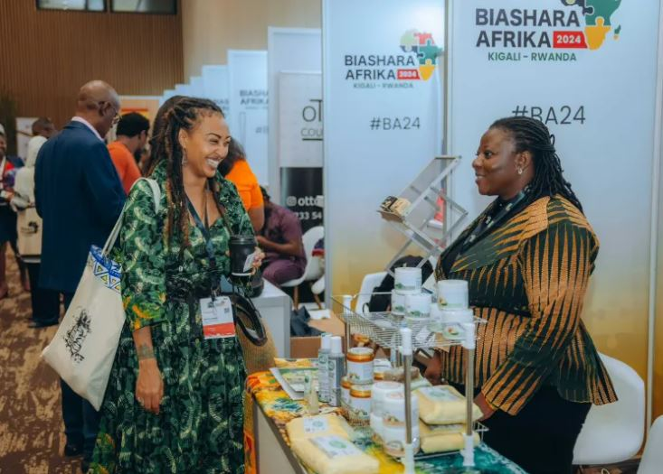
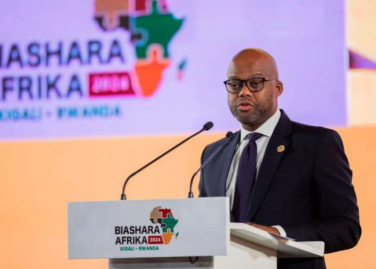
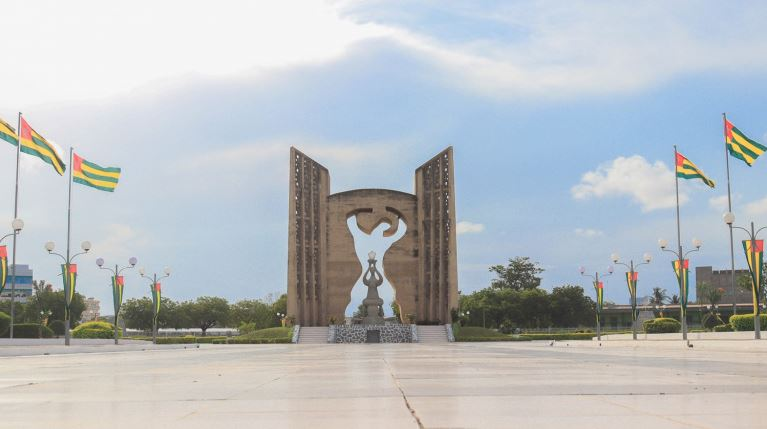

The next chapter of Africa’s trade story will unfold from May 18 to May 20, 2026 in Lomé, as leaders, businesses, and innovators gather for Biashara Africa under the framework of the African Continental Free Trade Area.

This edition comes at a decisive moment. AfCFTA is no longer just a vision on paper. It is a system in motion, with real expectations from governments, private sector players, and millions of Africans whose livelihoods depend on trade.

At its core, Biashara Africa 2026 will focus on one clear objective of making trade within Africa simpler, faster, and more inclusive.

Across the continent, intra-African trade remains below its potential, accounting for roughly 15–18% of total trade flows. This gap represents both a challenge and an opportunity. With a combined market of over 1.3 billion people and a GDP exceeding $3 trillion, AfCFTA is positioned to become one of the largest free trade areas in the world.

In Lomé, attention is expected to center on practical progress. Key discussions will likely address the removal of persistent non-tariff barriers, which continue to slow down the movement of goods despite tariff reductions. Delays at borders, inconsistent regulations, and high transport costs remain critical issues for businesses trading across African markets.

Another major focus will be on financial systems supporting trade. The expansion of the Pan-African Payment and Settlement System (PAPSS) is expected to feature prominently, with stakeholders examining how local currency transactions can reduce dependency on foreign exchange and lower transaction costs for businesses.

Small and medium-sized enterprises (SMEs) are also expected to take center stage. Representing more than 80% of employment across Africa, SMEs are vital to the success of AfCFTA. However, many still face barriers such as limited access to finance, lack of market information, and regulatory complexity. Discussions in Lomé are likely to explore practical solutions to better integrate these businesses into continental trade.

Industrialization will remain a central theme. Africa continues to export largely raw materials while importing finished goods. Strengthening regional value chains where products are processed and manufactured within Africa is seen as essential for long-term economic growth and job creation.

Digital trade is another area gaining momentum. With the rapid rise of e-commerce and digital platforms, there is increasing demand for harmonized digital regulations, improved infrastructure, and cross-border data frameworks that support seamless online trade across African countries.

The event is also expected to highlight emerging partnerships, investment opportunities, and policy updates that can accelerate implementation of AfCFTA agreements. More emphasis is being placed on measurable outcomes, timelines, and accountability.

Biashara Africa 2026 is not only a meeting point for policymakers. It is a platform for entrepreneurs, investors, and innovators to connect, exchange ideas, and build practical solutions that can shape the future of African trade.

For those involved in business, trade, or economic development, this gathering offers valuable insight into where the continent is heading. It is also an opportunity to be part of conversations that are defining Africa’s economic transformation.

As Lomé prepares to host this important event, the message is clear that Africa is building its own market, and the process is actively underway.

Participants and observers alike are encouraged to engage whether by attending in person or following the discussions through official channels. The outcomes from these conversations will influence policies, investments, and trade flows across the continent in the years ahead.  

**African Updates**
