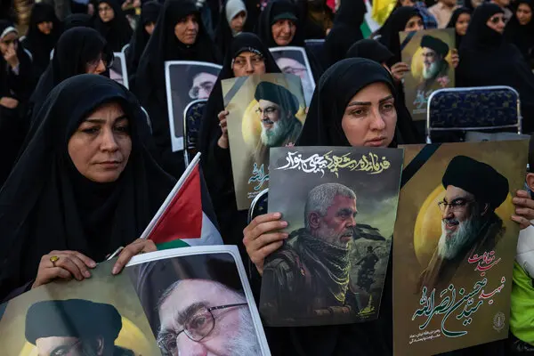
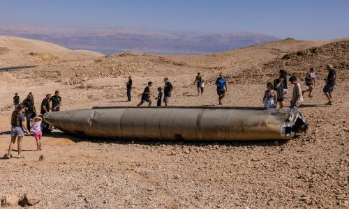

The long-simmering Middle East conflict between Israel and Iran dramatically escalated today, as a series of Israeli airstrikes targeting Iranian nuclear and military assets was swiftly followed by a significant drone attack from Tehran. This rapid exchange underscores the deepening regional tensions and international concerns over Iran's nuclear program.

In a pre-dawn operation dubbed "Rising Lion" on Friday, Israel launched extensive airstrikes across Iran. Israeli statements indicate approximately 200 fighter jets participated, deploying over 330 munitions against more than 100 targets.

Key sites reportedly hit include Iranian nuclear facilities, raising international alarms, Numerous military bases and missile sites, weakening Iran's defense infrastructure Locations associated with senior military commanders and nuclear scientists.

Iranian state media and other confirmed reports indicate significant casualties among Tehran's leadership. Among those reportedly killed in the Israeli strikes are Mohammad Bagheri, Chief of Staff of the Iranian Armed Forces, and Hossein Salami, Commander of the Revolutionary Guards, alongside other high-ranking military figures and nuclear scientists. Iran has vehemently condemned the strikes, with some officials characterizing them as a "declaration of war."

Hours after the Israeli offensive, Iran launched a substantial retaliatory wave, dispatching over 100 drones toward Israel. These unmanned aerial vehicles (UAVs) were expected to traverse a considerable distance, taking several hours to reach Israeli airspace.

The Israel Defense Forces (IDF) confirmed their air defense systems were actively engaged in intercepting these Iranian drones, with most interceptions reportedly occurring outside Israeli territory. While a full assessment of the impact is ongoing, Israel has reported a high success rate in mitigating the aerial threats.

The immediate aftermath of these direct exchanges has prompted urgent calls for de-escalation from international bodies and numerous nations. Concerns are mounting that this direct confrontation could trigger a broader regional war.

**African Updates**
