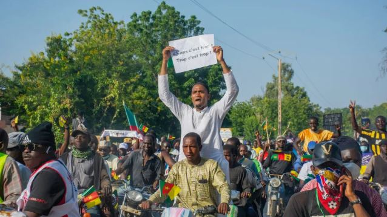

For the second consecutive day, residents of Cameroon’s economic capital, Douala, have taken to the streets in protest following the announcement that President Paul Biya has secured a controversial eighth term in office.

Security forces have been heavily deployed across multiple neighborhoods, as demonstrations turned violent amid growing anger over the 92-year-old leader’s re-election.

Reports from the city describe barricades, burning tires, and live gunfire, as clashes broke out between protesters and police. Public transport has been halted, and many businesses remain closed as residents fear further escalation.

The Constitutional Council officially declared Biya the winner on Monday, granting him another seven-year mandate after receiving 53.7% of the vote, compared to 35.2% for opposition leader Issa Tchiroma Bakary. The opposition immediately rejected the results, alleging massive irregularities and voter intimidation.

Biya, who has ruled Cameroon since 1982, is now the world’s oldest serving head of state and Africa’s second-longest ruler, after Equatorial Guinea’s Teodoro Obiang Nguema. His re-election has intensified public frustration over decades of economic stagnation, corruption, and political repression.

Speaking amid the protests, Max Ndongmo, a resident of Douala, expressed what many Cameroonians feel is a sense of hopelessness.

“When I heard the results, I was heartbroken. It was so shocking I almost broke my TV. What this government is doing is pure hypocrisy. I’m sorry, but they need to stop,” he said.

His reaction mirrors growing outrage among citizens, particularly among young Cameroonians, 70% of whom are under 35 and face unemployment rates estimated at 40%. Many see Biya’s continued rule as a symbol of a system resistant to change.

As of Tuesday morning, armed forces remain stationed in key districts, including Bonaberi, Akwa, and Bepanda, to prevent further unrest. Human rights organizations have raised concerns about the use of excessive force and arbitrary arrests.

Similar protests have been reported in Bamenda, Yaoundé, and Bafoussam, with sporadic gunfire and reports of at least four people killed since Sunday. Internet connectivity in some regions has also been disrupted, reminiscent of previous post-election crackdowns.

Analysts say the unrest highlights deep divisions in Cameroon, where Biya’s government faces ongoing challenges such as the Anglophone separatist conflict, economic inequality, and growing youth discontent.

 

**African Updates**
