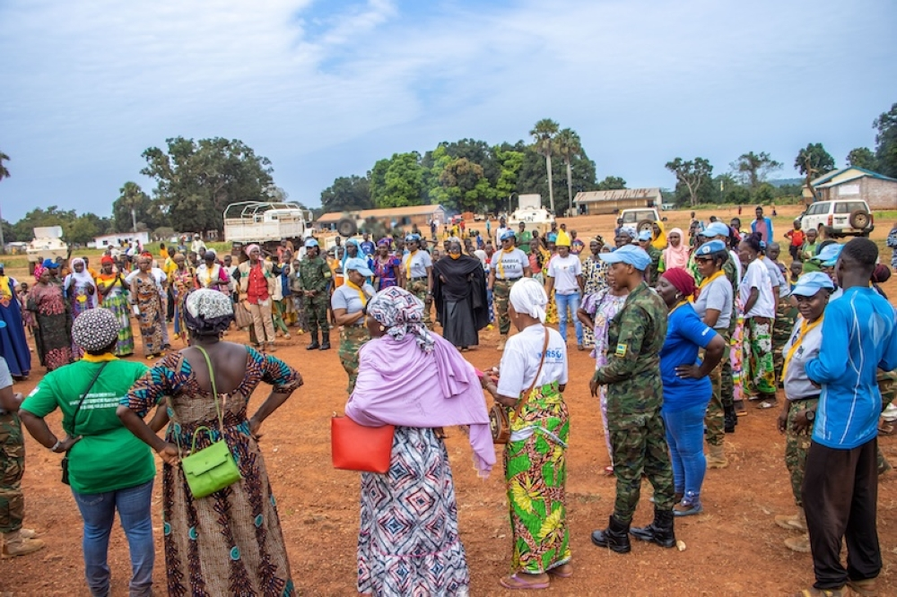
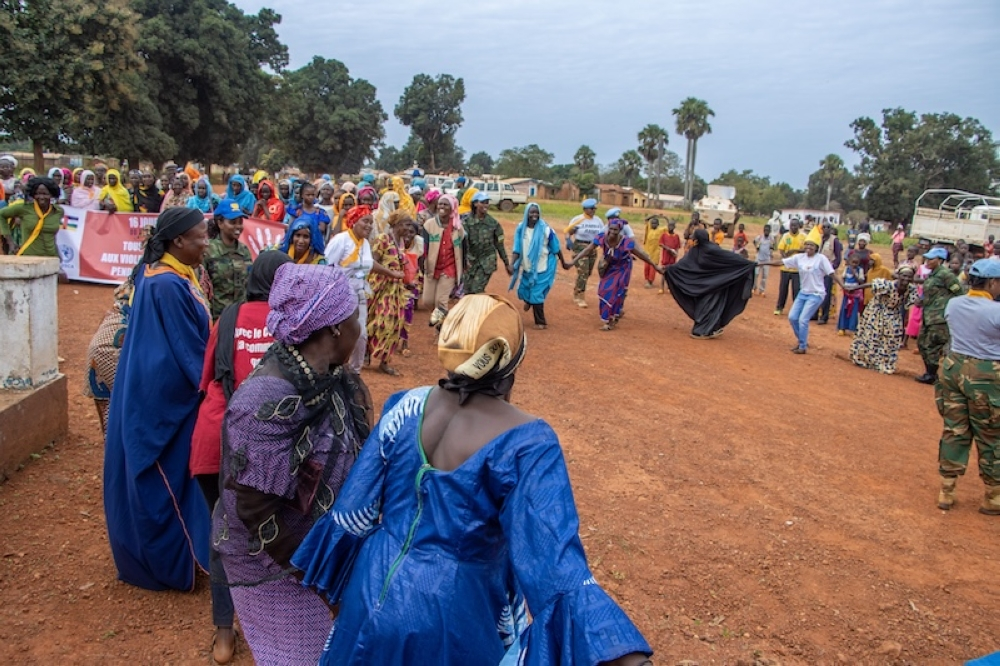

The Female Engagement Team of Rwanda Battle Group VI, serving under the United Nations Multidimensional Integrated Stabilization Mission in the Central African Republic (MINUSCA), launched a 16-day campaign against gender-based violence (GBV) in Bria, Haute-Kotto Prefecture.

The campaign, which began on Monday, November 25 as part of the global 16 Days of Activism, was held in collaboration with local communities, other UN peacekeepers, and national and international NGOs.

It aims to eliminate all forms of GBV, including sexual violence, rape, physical and psychological abuse, and harmful traditional practices.

With the theme “Altogether, Fight Against Violence Against Women”, the campaign seeks to empower communities by raising awareness about GBV, supporting victims, and promoting women’s rights.

It also emphasizes fostering political commitment and collective action to establish sustainable solutions.

Speaking at the opening ceremony, Osong Esapa, the Deputy Head of Office in Sector East, called for unity in addressing GBV.

“Leaders at all levels must make an effort to support and educate the population to eliminate the culture of gender-based violence,” he said.

The launch drew strong participation, with UN officials, local leaders, NGOs, and women and girls from Bria town coming together to support its objectives, demonstrating a shared commitment to ending GBV in the region.

 

