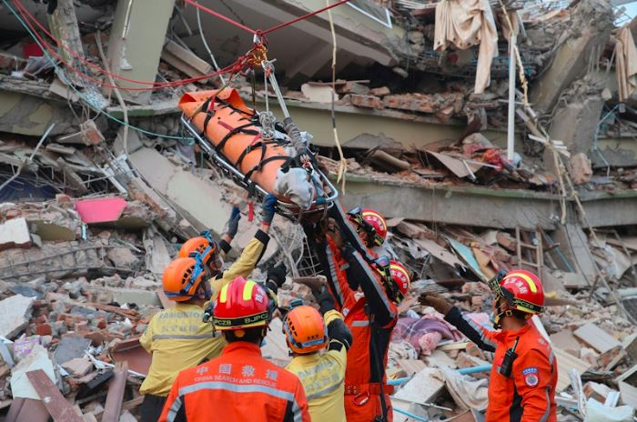

Myanmar is reeling from the devastation caused by a massive 7.7-magnitude earthquake that struck the country on Friday. The tremor, which hit during Friday prayers, has killed over 2,000 people and injured thousands more. As the country struggles with the aftermath, rescue efforts face challenges due to damaged infrastructure, communication breakdowns, and ongoing conflict.

Myanmar’s ruling junta declared a week of national mourning following the earthquake. Flags flew at half-mast across the country in sympathy for the victims. The confirmed death toll has surpassed 2,000, and more than 3,900 people have suffered injuries. Rescue teams continue to search for survivors, but the situation grows more desperate with each passing day. Over 270 people remain missing, and hopes of finding more survivors fade.

\[caption id="attachment\_31872" align="alignnone" width="697"\] Rescuers search for survivors at a collapsed building in the aftermath of an earthquake in Mandalay, Myanmar on Sunday, March 30, 2025.Photo: Xinhua News Agency\[/caption\]

Among the casualties, over 700 people died when mosques collapsed during Friday’s prayers in Mandalay. In total, 60 mosques have either collapsed or been heavily damaged. Communication networks and roadways, already compromised by ongoing civil war, have made rescue operations more difficult.

The global community has responded quickly to Myanmar’s crisis, with countries worldwide sending aid and rescue teams. India dispatched search and rescue teams along with essential supplies like blankets, food, and medical materials. The United States pledged $2 million in aid and sent a team from USAID. Vietnam deployed more than 100 rescuers and medical staff, offering critical support.

\[caption id="attachment\_31874" align="alignnone" width="700"\] Members of a China search and rescue team transfer a pregnant survivor from a collapsed building in Mandalay, Myanmar on March 31, 2025. Photo: Xinhua News Agency\[/caption\]

Other nations have also extended help. South Korea committed $2 million in humanitarian aid, while Thailand, which was also affected by the earthquake, sent 55 personnel for search and rescue operations. Russia and Japan sent teams that included medical professionals and sniffer dogs to help locate survivors.

Southeast Asian countries have played a significant role in the relief efforts. Malaysia, chairing ASEAN this year, pledged $2.25 million in aid and deployed a 50-member disaster relief team. Singapore also contributed, sending an 80-member team to assist with rescue operations and providing seed money for the Singapore Red Cross to support fundraising efforts.

The Philippines announced it would send 114 personnel, including search and rescue teams and medical assistance teams, to Myanmar on April 1. Taiwan, despite having a standing rescue team on standby, donated $50,000 in disaster relief funds.

In Thailand, rescuers are still working to find survivors under the rubble of a collapsed skyscraper in Bangkok. The building, under construction, collapsed during the same earthquake. Over 70 people remain trapped, and despite dwindling hopes of finding survivors, emergency teams continue their search. Rescue teams have detected weak life signs under the debris, and dog sniffers have been dispatched to pinpoint survivors. The official death toll in Thailand stands at 18, but it may rise as more bodies are discovered.

\[caption id="attachment\_31875" align="alignnone" width="1024"\] Rescuers search for survivors at a collapsed building in the aftermath of an earthquake in Mandalay, Myanmar on Sunday, March 30, 2025. Photo: Xinhua News Agency\[/caption\]

The collapse of the skyscraper has raised concerns about the building’s construction, with Thailand’s Anti-Corruption Organisation flagging irregularities in its design and construction.

Myanmar faces severe communication breakdowns. Many people rely on social media platforms like Line and WeChat to contact loved ones. Relatives, especially in Taiwan, struggle to reach family members in Myanmar. The lack of reliable communication complicates rescue coordination and hampers support efforts.

Lee Pei, chairman of the Myanmar Overseas Chinese Association in Taiwan, shared that calls often fail or deteriorate quickly, making it difficult to connect with people in Myanmar.

The earthquake has particularly devastated children, who already face hardship in war-torn Myanmar. Trevor Clark, UNICEF’s Regional Chief of Emergency Operations, called the earthquake “the latest brutal assault on children.” Many children have lost their homes, families, and lives in this disaster.

The international community’s response is crucial in meeting the immediate needs of affected children, but the long-term impact on Myanmar’s youth will require sustained efforts to ensure their survival and recovery.

\[caption id="attachment\_31873" align="alignnone" width="697"\] People offer food to Buddhist monks at a Myanmar community centre in the Zhonghe district in New Tapei City on March 31, 2025. 
Photo: I-Hwa Cheng/AFP.\[/caption\]

As Myanmar begins its recovery from one of the worst natural disasters in decades, the road ahead is long and difficult. The country’s critical infrastructure lies in ruins, and rescue operations remain challenging due to damaged roads and the ongoing civil war. Despite these obstacles, the international community continues to send aid and personnel to assist Myanmar.

This ongoing support will be vital as Myanmar rebuilds. With the death toll continuing to rise and widespread destruction, recovery will take months, if not years.

In the face of such immense loss, Myanmar’s people have shown resilience. With continued international aid, they will begin the long journey to recovery.

**African Updates**
