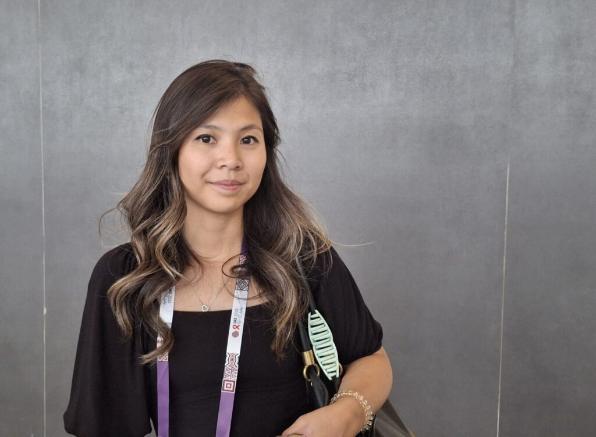
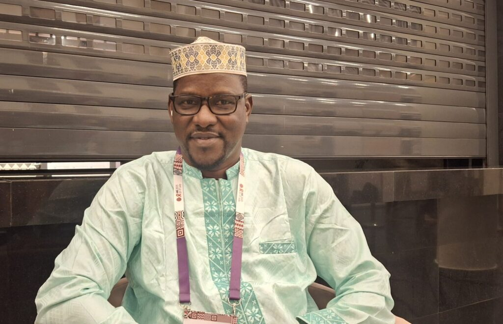
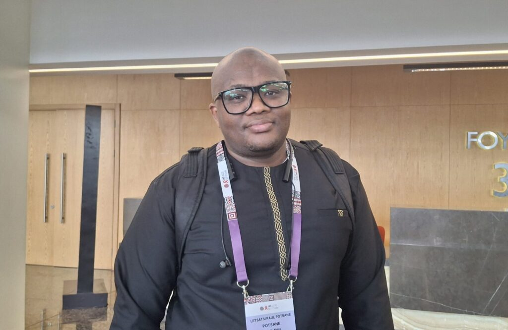

KIGALI, Rwanda – As the International AIDS Society (IAS) 2025 conference in Kigali drew to a close, a clear message resonated among participants. The global fight against HIV demands continued dedication, fresh ideas, and strong community voices. Despite growing worries about reduced funding, attendees left with a renewed spirit, ready to push for a future free from the virus.

A major point of excitement at the conference centered on groundbreaking prevention methods, especially long-acting shots. "There are truly promising tools for prevention on the horizon," shared Thu, who works in medical affairs for Gilead Sciences. This enthusiasm highlights new advancements like Lenacapavir, a medication that could prevent HIV with just two injections each year.

\[caption id="attachment\_36228" align="alignnone" width="1024"\] Thu, works in medical affairs for Gilead Sciences\[/caption\]

Letsatsi Paul Postane, representing Shout It Now, an organization dedicated to young people in South Africa, also called these new injectable options a "real game changer" for HIV prevention. He noted the positive shift in guidelines for PrEP, a daily pill that helps prevent HIV.

However, a crucial challenge remains. Professor AlMustapha Maiga Issiaka, a leading virologist from Mali, pointed out that these life-changing drugs are not yet widely available in Africa, the continent most affected by HIV. "We need strong voices to bring these medications quickly to Africa," he urged, highlighting the critical need for fair access worldwide.

A key concern for many participants was the impact of reduced financial support, particularly from the United States. Alexandra de Noy, a PhD student from South Africa, expressed this worry. "So much good work has happened, but there's still so much more to do, especially with the funding cuts." She stressed the need for clever solutions to keep the HIV response moving and to protect the progress already made.

Professor Issiaka confirmed that these cuts are forcing organizations to carefully choose their activities to make the most of the money they have. Yet, despite these difficulties, Thu observed a strong sense of unity and commitment among attendees. The message was clear. The HIV community is determined to find ways forward.

\[caption id="attachment\_36223" align="alignnone" width="1024"\] AlMustapha Maiga Issiaka, a leading virologist from Mali\[/caption\]

Beyond scientific breakthroughs, the conference highlighted the vital role of local communities in leading the HIV fight. Letsatsi Paul Postane passionately called for young people to lead the way**.** "Young people must take the forefront... because we've got an appointment with the future." This powerful statement underscores that youth are not just recipients of services but active drivers of change, crucial for putting plans into action and tracking progress.

Discussions also broadened to include the effects of climate change on HIV and the essential importance of mental well-being in HIV care.

\[caption id="attachment\_36229" align="alignnone" width="1024"\] Letsatsi Paul Postane, representing Shout It Now, an organization dedicated to young people in South Africa\[/caption\]

Adding to the forward-looking discussions, Professor Issiaka spoke about the growing use of smart digital systems in managing HIV. He stressed that countries need their own clear plans for using these tools to effectively monitor and manage the virus, showing how technology can be a powerful ally.

The consensus from IAS 2025 is unmistakable. Ending HIV requires a unified effort. From ensuring new medicines reach everyone who needs them to empowering young leaders and using digital insights, the path forward demands teamwork and unwavering dedication.

As the conference concluded, attendees left with a renewed sense of purpose, ready to "take the message back home and try to implement some of the best practices, the innovative ideas that have emerged from this conference." The core message from Kigali resonates deeply. Invest in communities, support youth-led efforts, and together, we can overcome HIV**.** As one participant powerfully stated, "United we stand, divided we fall." The energy from the conference's final day suggests a community ready to meet this challenge head-on.

**African Updates**
