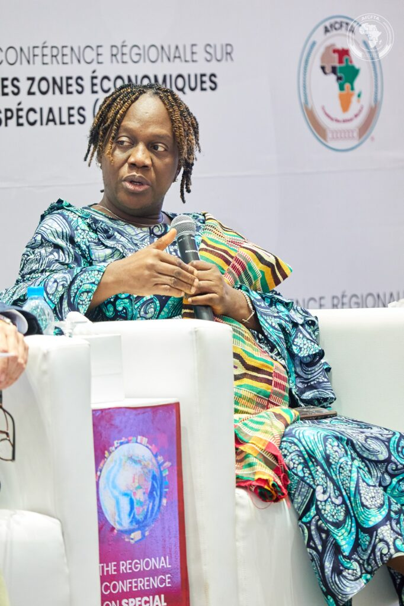
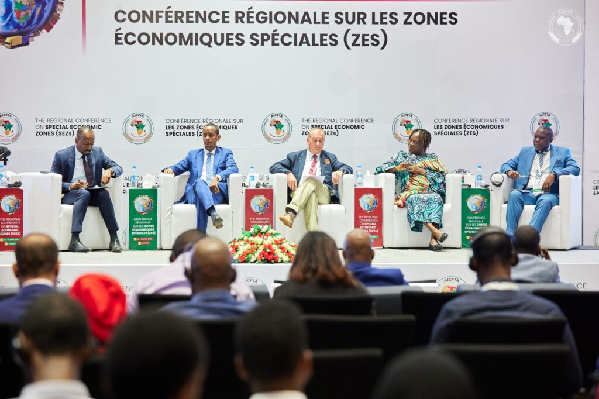
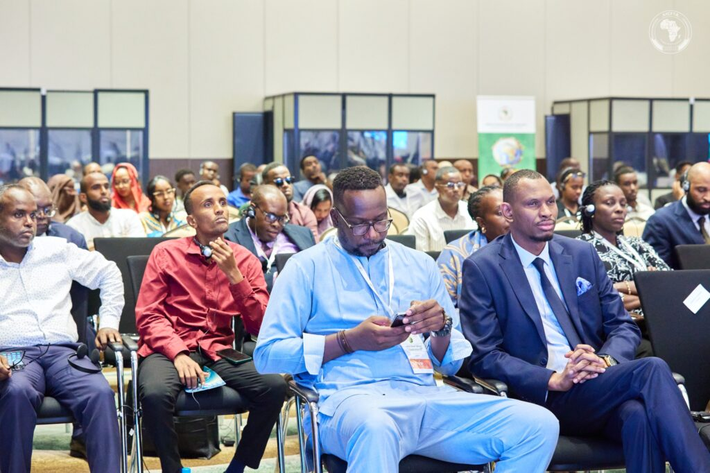
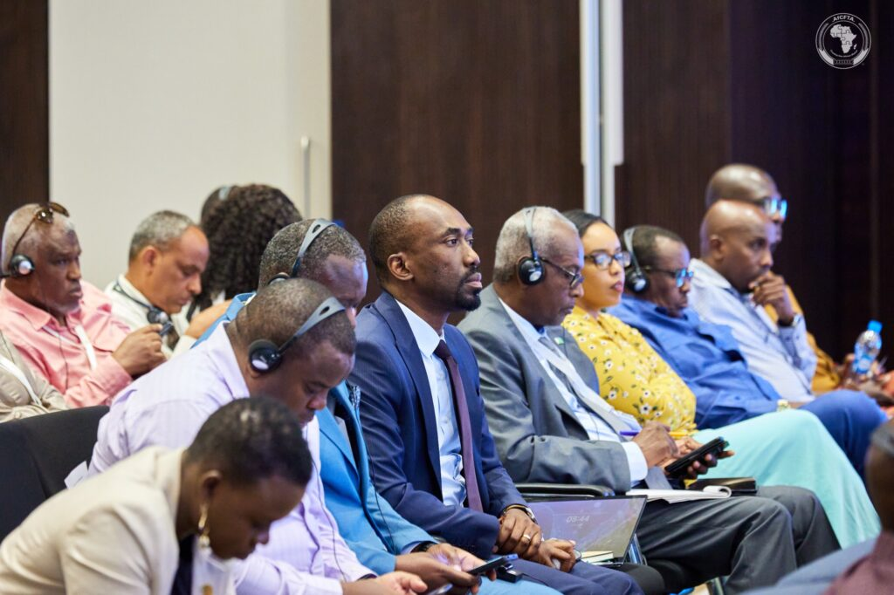
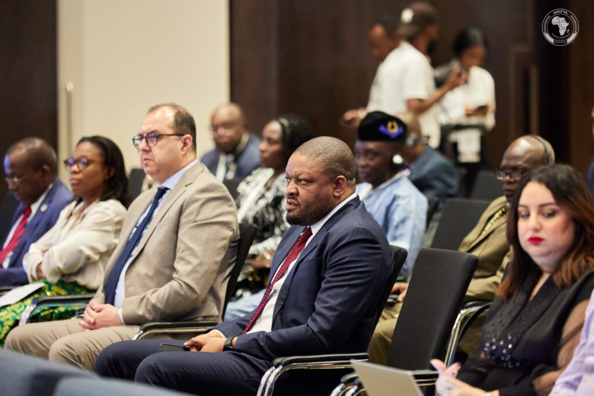
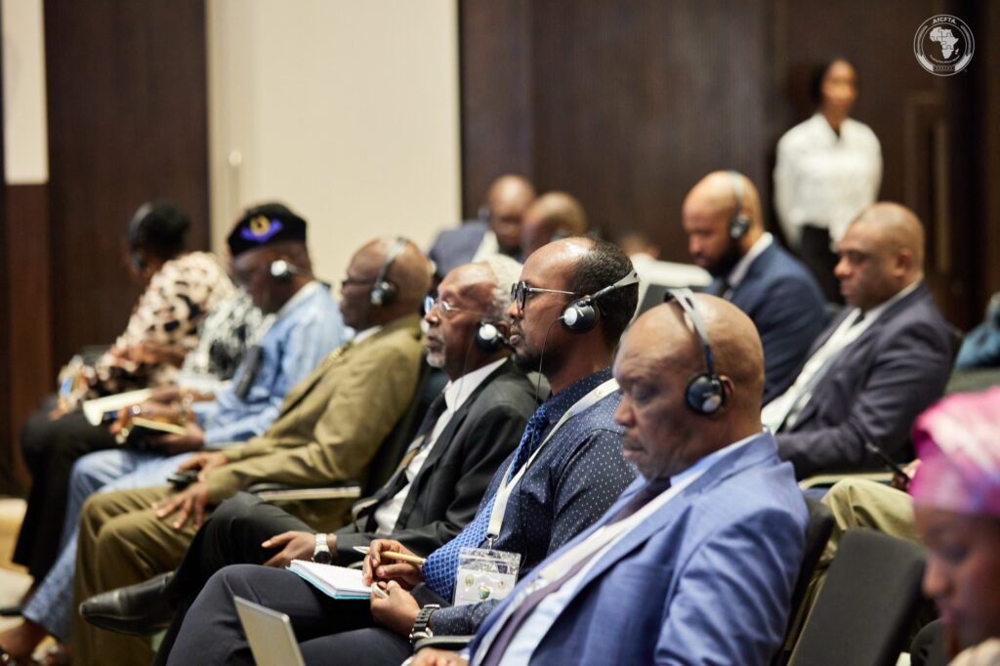
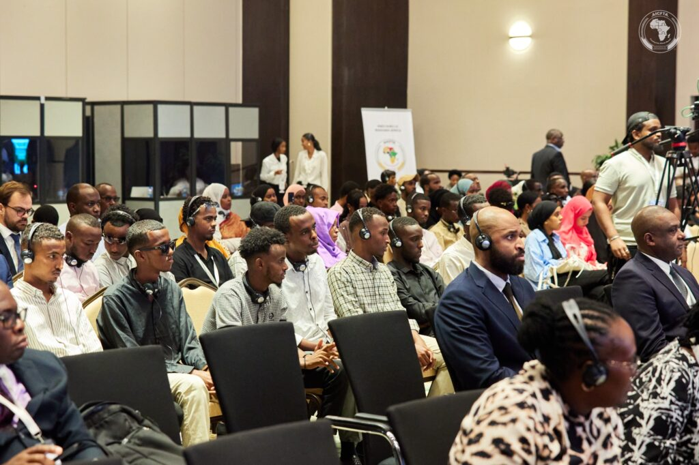

Djibouti City, Djibouti - in the Regional Conference on Special Economic Zones in Djibouti on April 22, 2025, focused on the development of infrastructure and trade corridors across Africa, recognizing their vital role in enhancing connectivity and integration.

Discussions centered on initiatives like the Trans-Africa Land Bridge and the challenges and opportunities in developing the continent's infrastructure.

Mr. Denis Muganga, Director of Private Sector Investment at the Northern Corridor Transit and Transport Coordination Authority (NCTTCA), highlighted the ambitious Trans-Africa Highway project, spanning 18 to 30 countries with a planned 60,000-kilometer network. "I'm sure most of us have heard about this project, considered as one of the major projects of the century," Muganga stated. However, he also pointed out the slow progress and challenges hindering infrastructure development in Africa.

Muganga emphasized the significant infrastructure investment gap, citing an African Development Bank (AfDB) report that estimates the need at $130 to $170 billion per year. 

Mr. Angus Miller, Horn of Africa Regional Advisor at Trademark Africa, discussed successful infrastructure initiatives. He noted the significant reduction in border crossing times due to one-stop border posts, with clearance times reduced by 70% and annual savings of around $63 million. "The results come from the sea, where we've been working since 2011 time to cross the border. On average, reduced by 70% a huge, huge number," Miller said.

This improvement not only reduces costs but also enhances the competitiveness of businesses operating in the region. He also highlighted the reduction in port clearance times at the Port of Mombasa, from 11 days to 3.5 days, thanks to investments in infrastructure and process improvements. "Clearance time for trades reduced from an average of 11 days down to three and a half days," Miller added. Mombasa's port is a vital artery for trade in East Africa, serving not just Kenya but also landlocked countries like Uganda. These efficiencies are crucial for facilitating the flow of goods under the African Continental Free Trade Area (AfCFTA).

Miller emphasized the need for innovative financing, citing the example of the Nairobi Expressway with its tolling system. This demonstrates how user-pays models can contribute to funding essential infrastructure projects. He also stressed the importance of learning from global best practices in port management and leveraging private sector expertise in SEZs. 

Ms. Demitta Gyan, Director of Customs Administration at the AfCFTA Secretariat, underscored the criticality of infrastructure for trade facilitation. "Africa has one of the highest transportation costs in the world. The reason is, part of it is the infrastructure needed to support transport, to support the movement of goods," Gyan explained.

According to the World Bank, these high costs can be attributed to a combination of factors, including poor road and rail networks, congestion at ports, and inefficient border crossings. She detailed the AfCFTA's corridor approach to trade facilitation, which includes conducting corridor diagnostics to identify bottlenecks. 

\[caption id="attachment\_32021" align="alignnone" width="682"\] Ms. Demitta Gyan, Director of Customs Administration at the AfCFTA Secretariat\[/caption\]

Gyan categorized the key challenges into three areas: soft and hard infrastructure, systems, and people's capacity. She emphasized the need for both physical infrastructure and efficient systems to facilitate the movement of goods. She also highlighted the importance of capacity building to ensure that people can effectively utilize the infrastructure and systems. 

The AfCFTA is working on continental instruments to facilitate trade, such as a single bond guarantee system and an electronic certificate of origin. "We have worked on, we are working on a single bond guarantee system, which then facilitates the movement of goods within these corridors," Gyan said. 

In addressing non-tariff barriers (NTBs), which also significantly hinder trade, Gyan mentioned the recent launch of an NTB reporting mechanism, including a mobile app. This initiative aims to streamline the process of identifying and addressing NTBs, which can include cumbersome customs procedures, licensing requirements, and other regulatory obstacles.

Mr. Dileyta Soultan Mohamed, Director of Transport and Infrastructure at the Ministry of Infrastructure of Djibouti, stressed the importance of harmonizing regulations to support infrastructure development and trade corridors. "We need to harmonize them. And these are some of the things I would have to do to put in place a text that exists, the mechanisms that are existing," Mohamed said.

Djibouti's strategic location at the intersection of major shipping routes gives it a vital role in regional trade. He highlighted ongoing corridor projects, such as the corridor from Djibouti to Kampala. "There are a lot of corridors that are we're talking about corridors from Djibouti up to Kampala," Mohamed added.

The development of this corridor will further enhance connectivity between East Africa's coastal and inland regions.

The panel discussion underscored the urgent need for infrastructure development and trade corridor improvement to drive economic growth and integration in Africa. The success of the AfCFTA, which aims to create a single continental market, is intrinsically linked to the development of efficient and interconnected infrastructure networks.

 

**African Updates**
