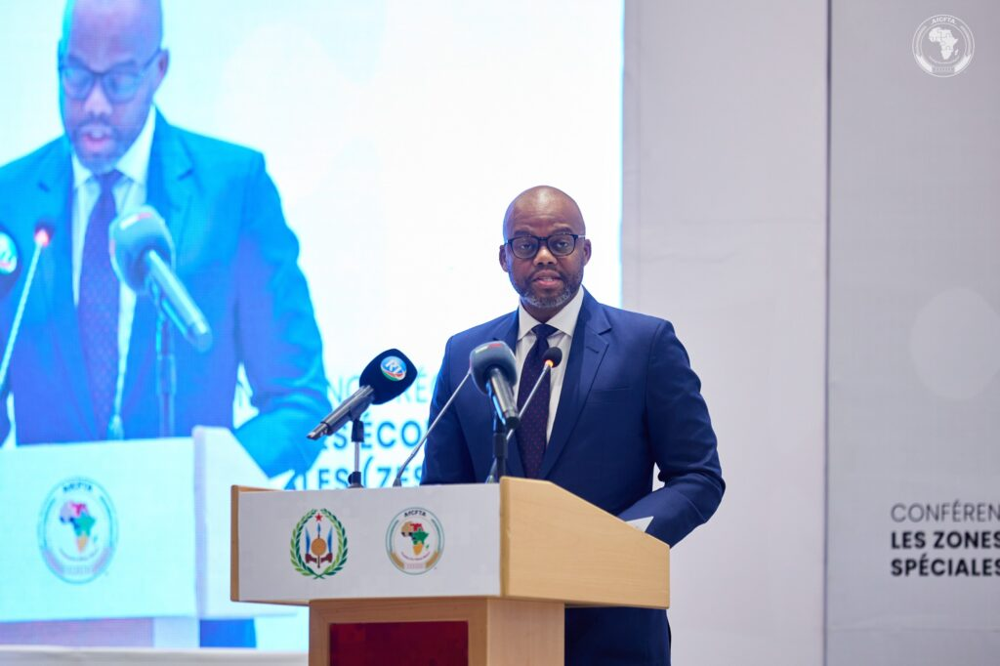
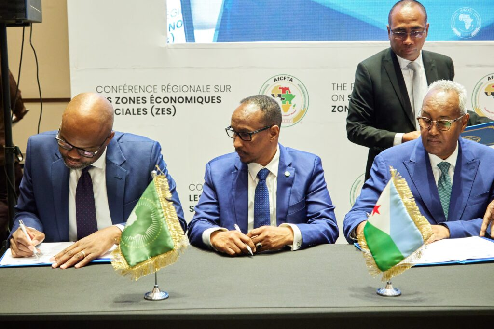
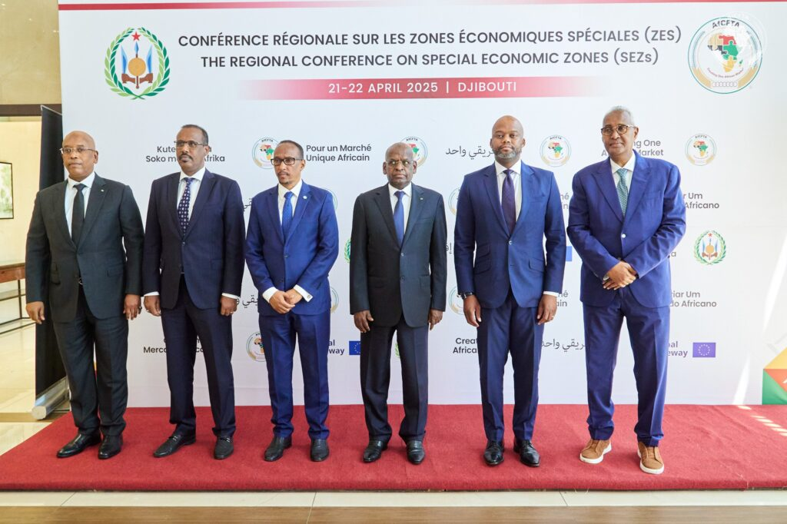
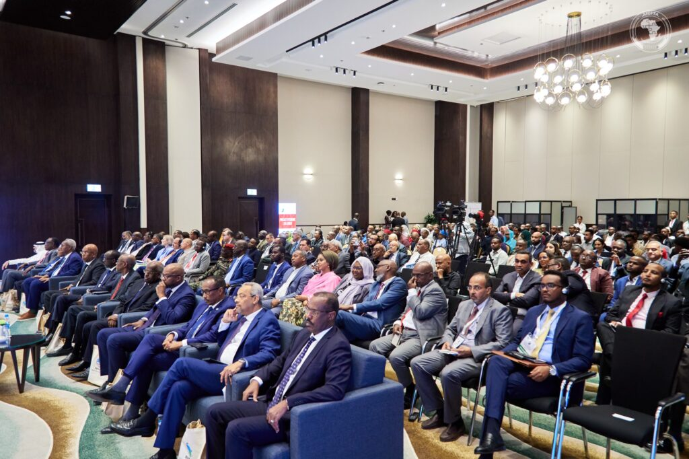

Djibouti City, Djibouti - The Regional Conference on Special Economic Zones commenced its first day on April 21, 2025, in Djibouti, drawing officials and delegates from across Africa. The event highlighted Djibouti's strategic importance in driving African trade and the critical role of the African Continental Free Trade Area (AfCFTA) in the continent's economic integration.

The Minister of Trade and Tourism in Djibouti, Mohamed Warsama Dirieh, extended a warm welcome, emphasizing the collaborative spirit of the conference. Minister Dirieh underscored Djibouti's historical and ongoing commitment to economic integration.

He further emphasized the transformative potential of the AfCFTA, stating, "Africa, having a historical with implementation of AfCFTA, we have the possibility of transforming our continent into a unique market, bringing together more than 1.4 billion consumers, and to have a country made up more than $400 billion this account is constitute a greater vision of integrating Our continental, to have an agenda of 2063 of the African Union."

Djibouti's strategic location at the crossroads of Africa, the Middle East, and Asia was a recurring theme. Minister Dirieh highlighted how AfCFTA represents an exceptional opportunity for strengthening law of the Trade and Industry logistics, and opens new prospects of for our use and for the private sector and investments. He also detailed Djibouti's significant investments in modern infrastructure, including world-class ports, to enhance its role as a catalyst for competitive and innovative services, driving Africa's prosperity.

Wamkele Mene, Secretary General of the AfCFTA, echoed this sentiment in his address. He emphasized the importance of collaboration in realizing the AfCFTA's goals. “Let us remember that the AfCFTA is an initiative by our heads of states that require collaboration at regional level and continent level, and More importantly, that requires collaboration between the private sector and governments.” He stressed that "it is not governance but trade," highlighting the private sector's crucial role in driving investment, innovation, and productive capacity. He also noted that the role of the Council of Ministers of trade, is to establish the regulatory environment, the legislative conditions.

The AfCFTA, aimed at creating a single market for goods and services, is expected to significantly boost intra-African trade and contribute to the continent's industrial development. The IMF has stated that the AfCFTA has the potential to increase income and welfare significantly for its member countries, with the largest gains expected from the reduction of non-tariff barriers. The World Bank also highlights that full implementation of the AfCFTA agreement could boost intra-Africa FDI and external investment.

The event also included a signing of Memorandums of Understanding (MOUs) between the Ministry of Trade, the AfCFTA Secretariat, the Chamber of Commerce, and the Port Authority, further solidifying commitments to the AfCFTA's objectives.

 The conference drew participation from various African nations, including Djibouti, Libya, and Kenya, along with delegates from across the continent, underscoring the widespread commitment to advancing Africa's economic integration agenda. The conference is slated to continue through April 22nd 2025.

**African Updates**
