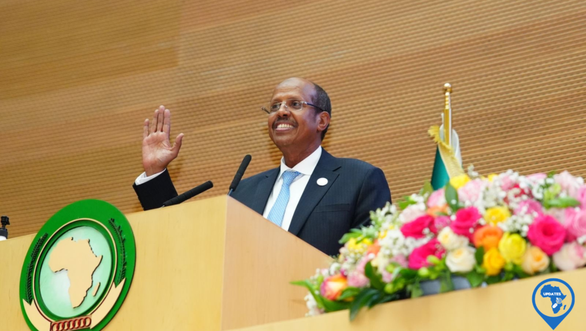

Mahmoud Ali Youssouf, Djibouti's long-serving Foreign Minister, secured a significant victory on Saturday, being elected as the new Chairperson of the African Union Commission. The election, held in Addis Ababa, Ethiopia, saw Youssouf garner the necessary two-thirds majority support from African leaders, solidifying his position as the head of the pan-African bloc representing over 1.5 billion people.

Youssouf's election marks a significant achievement for the small East African nation of Djibouti. Despite facing stiff competition from seasoned Kenyan politician Raila Odinga, Youssouf's steady and diplomatic approach resonated with regional leaders. His low-key campaign, coupled with his extensive experience as Djibouti's Foreign Minister since 2005, ultimately swayed the vote in his favor.

Djibouti, a strategically vital nation situated at the Bab-el-Mandeb Strait, a crucial maritime passage for global trade, holds a unique position within the African continent. President Ismail Omar Guelleh, expressing his pride in Youssouf's election, stated, "His leadership will serve Africa with dedication and vision."

\[caption id="attachment\_31776" align="alignnone" width="1024"\] Mahmoud Ali Youssouf, Chairperson of the African Union Commission\[/caption\]

Addressing the pressing challenges facing the continent, Youssouf has emphasized the need to prioritize peace and security. With conflicts raging in regions like eastern Democratic Republic of Congo and Sudan, and the looming threat of significant US aid cuts, the African Union faces a daunting task. Youssouf has acknowledged the "problem with governance" in some African nations, particularly those grappling with recent coups, and has pledged to address these issues with utmost urgency.

The election of Mahmoud Ali Youssouf as the Chairperson of the African Union Commission signifies a new chapter for the pan-African bloc. His leadership and experience will be crucial as the continent navigates complex political and economic landscapes, striving for peace, stability, and sustainable development.

**African Updates**
