On Saturday, January 25, 2025, Kigali, Rwanda, became the epicenter of East Africa's law enforcement efforts as the 26th Annual General Meeting (AGM) of the Eastern Africa Police Chiefs Cooperation Organization (EAPCCO) has began. The event will gather police officers and leaders from across the region to discuss critical issues surrounding cross-border security and cooperation. The theme for this year’s meeting, "Strengthening Regional Law Enforcement Cooperation," reflects the growing need for collaboration in combating emerging criminal threats.

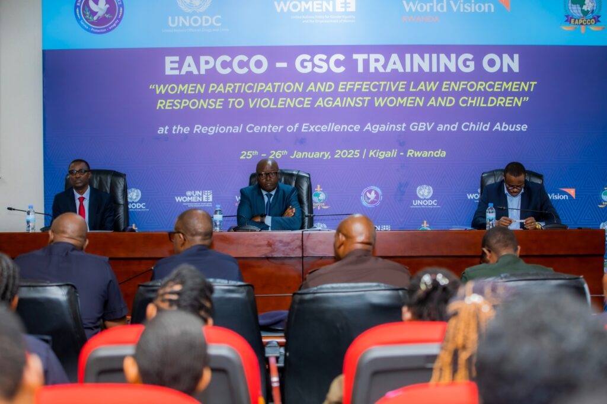The EAPCCO, founded in 1998, is a regional body formed to coordinate law enforcement efforts across East Africa. With 14 member countries, including Rwanda, Uganda, Kenya, Tanzania, Ethiopia, and Somalia, the organization has long played a pivotal role in tackling transnational crime. The AGM brings together Chiefs of Police from these nations to share intelligence, strategize, and build regional capacity in areas like counterterrorism, cybercrime, human trafficking, and more.

Africa Sendahangarwa Apollo, the Chief Executive Officer of EAPCCO and Head of the Interpol Regional Bureau, addressed the significance of this meeting. "Crimes like human trafficking and illegal immigration are growing concerns. Our borders are critical in the fight against these crimes, and regional cooperation is essential," he said during the press conference.

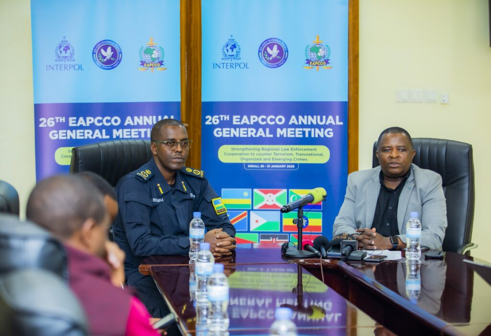A major highlight of this year’s meeting is the introduction of the EAPCCO SWAT Challenge, scheduled to take place from January 29-30, 2025, at the Counter-Terrorism Training Center (CTTC) in Mayange, Bugesera District. The challenge will showcase the tactical readiness of elite police units from EAPCCO member countries, testing their physical strength, teamwork, and response abilities to simulate counterterrorism operations. The challenge will not only demonstrate the region’s preparedness in the face of terror threats but also foster knowledge sharing among the participants.

“We are excited to witness the SWAT Challenge, which will highlight the skills and preparedness of our police units in responding to terror threats. It is an opportunity to learn from one another and to demonstrate our region's capacity to ensure public safety,” said Apollo.

\[caption id="attachment\_31757" align="alignnone" width="1024"\]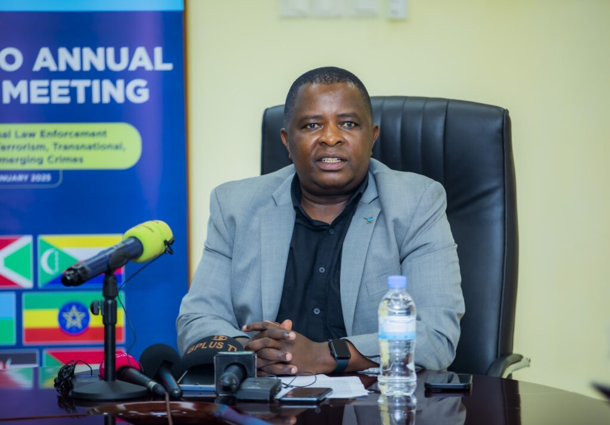 Africa Sendahangarwa Apollo, the Chief Executive Officer of EAPCCO\[/caption\]

The event is expected to enhance the region’s collaboration and provide practical insights into effective law enforcement strategies. One of the key points emphasized throughout the first day of the AGM was the importance of regional collaboration to combat the sophisticated and increasingly cross-border nature of modern crimes. With criminals operating across national borders, it is essential that countries work together to tackle issues such as terrorism, cybercrime, drug trafficking, and intellectual property crimes.

Rwanda National Police Spoksperson,  ACP Boniface Rutikanga also highlighted the importance of media in spreading awareness about law enforcement efforts.

\[caption id="attachment\_31758" align="alignnone" width="1024"\]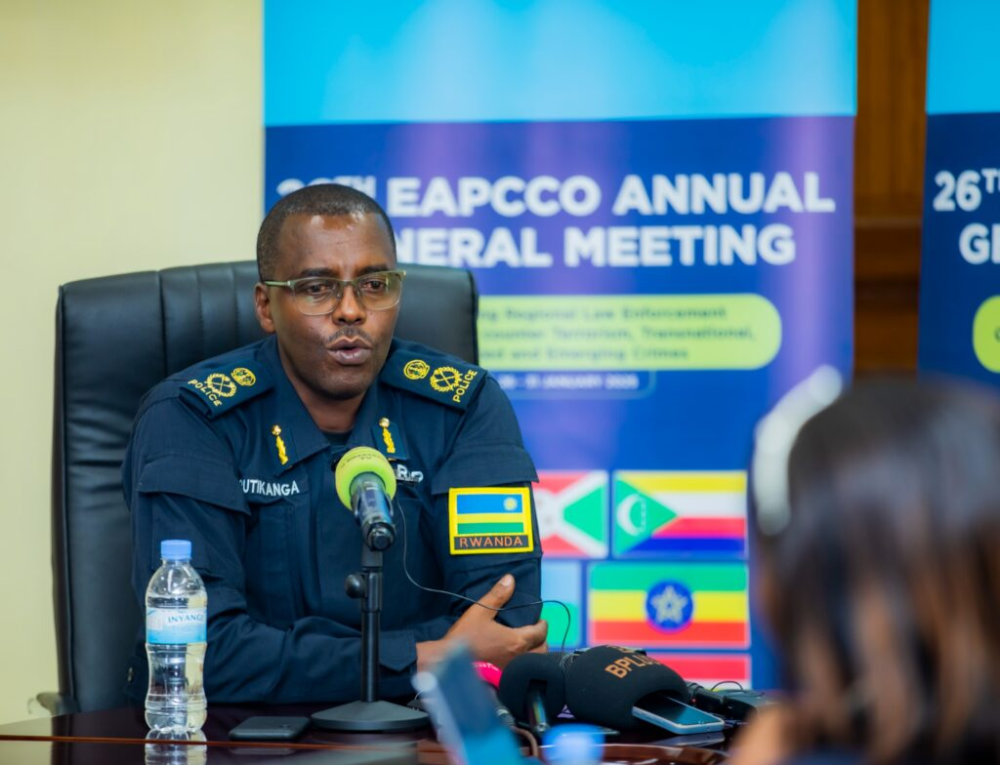 ACP Boniface Rutikanga, The Rwanda National Police Spoksperson.\[/caption\]

The EAPCCO has also partnered with international organizations like Interpol, particularly in the use of the i24/7 system, a secure communication network that facilitates the exchange of real-time crime-related information between member countries. This collaboration is essential for addressing cross-border crimes that threaten regional stability.

The meeting also provided a platform to discuss new and emerging security challenges, particularly in the realm of cybersecurity. The rapid growth of digital technology has created new opportunities for criminals to exploit online platforms for illicit activities. “Cybercrime is a growing threat. EAPCCO is working with member countries to develop strategies that protect our citizens and businesses from cyber threats,” said Apollo.

\[caption id="attachment\_31759" align="alignnone" width="1024"\]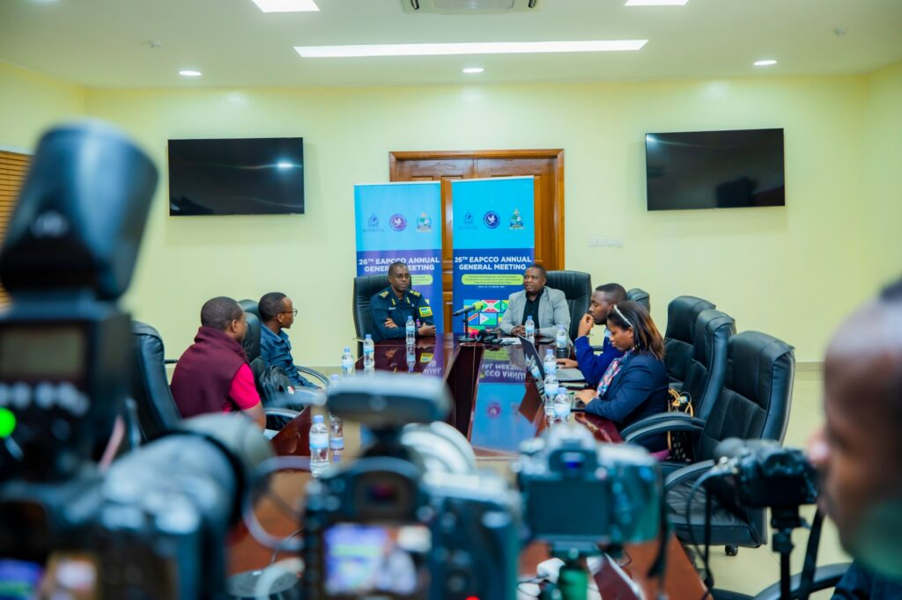 EAPCOO Leaders and Rwanda National Police in Press Conference on 25th January, 2025 Kigali, Rwanda\[/caption\]

The AGM is not just a meeting of police chiefs but a dynamic exchange of ideas and best practices. Subcommittee meetings have been organized on topics such as legal cooperation, training, gender, and counterterrorism. Each session will provides an opportunity for police leaders to discuss challenges, share experiences, and evaluate progress in tackling regional security issues.

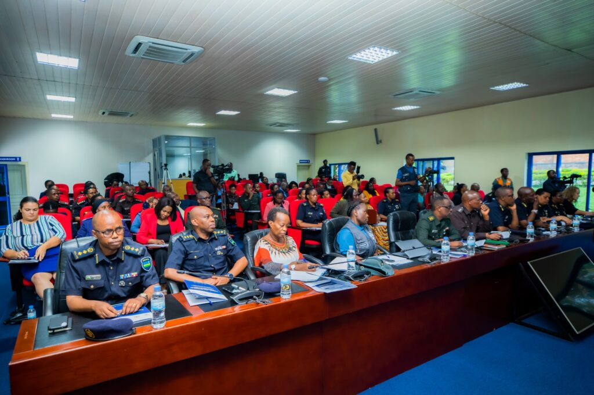

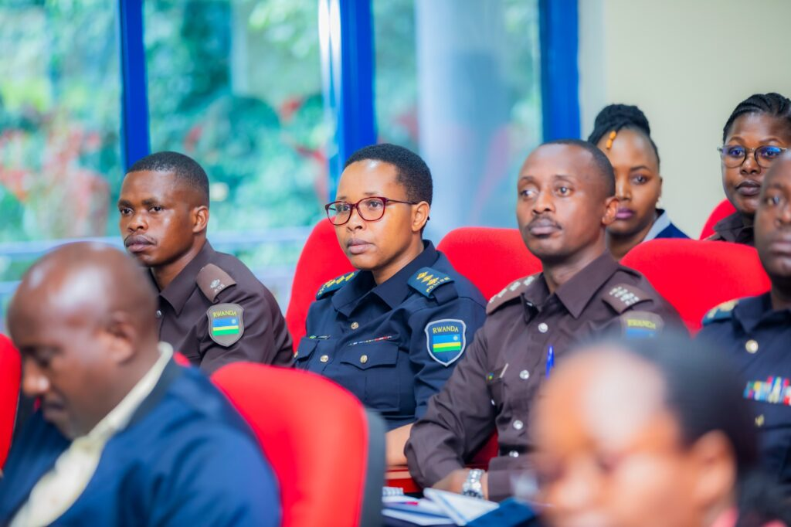

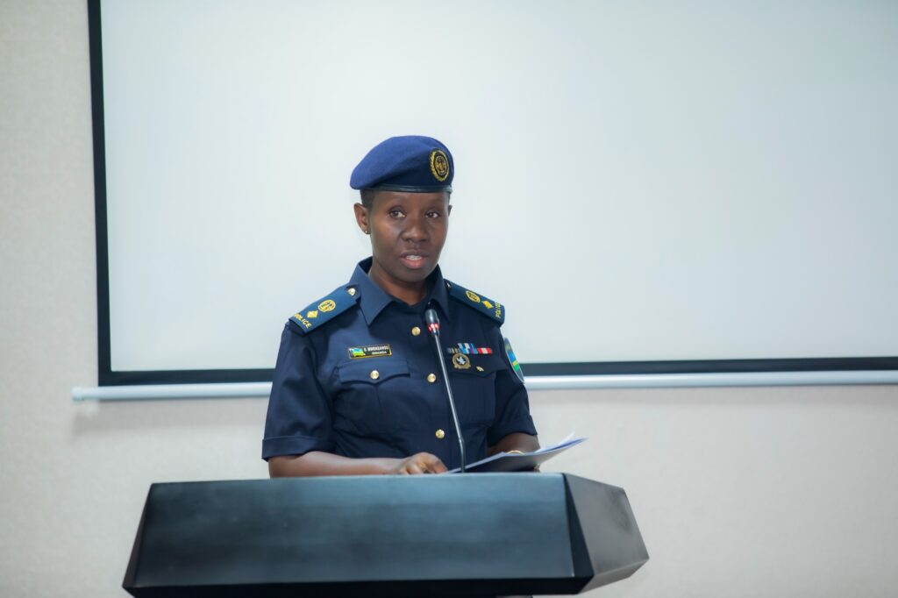

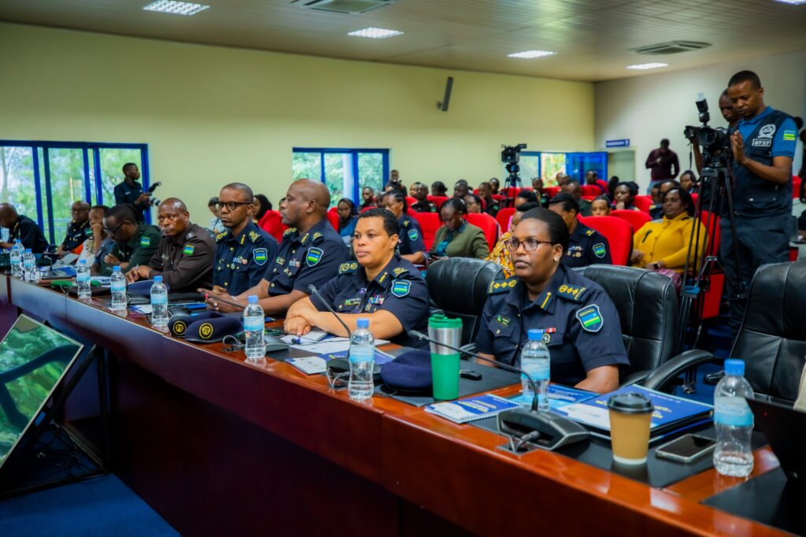

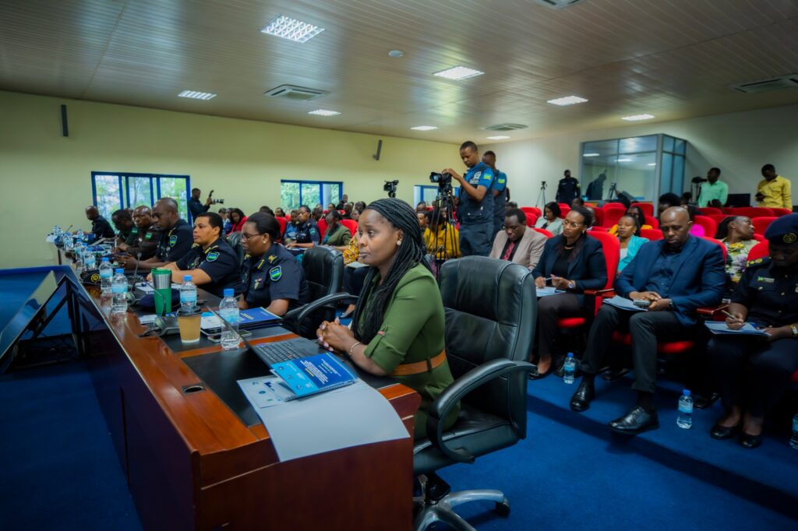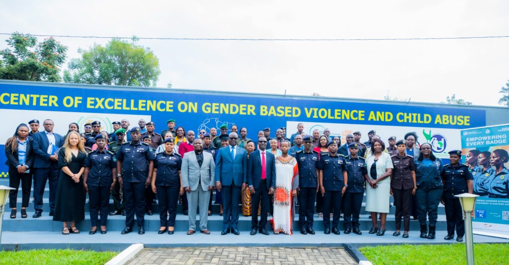

**African Updates**
