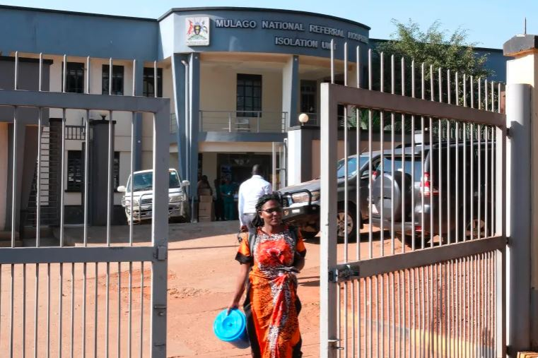

On Thursday, a renewed cluster of Ebola cases has been detected in Uganda, prompting the Africa Centres for Disease Control and Prevention (Africa CDC) to call for intensified monitoring and contact-tracing efforts. This development follows Uganda's declaration of an Ebola outbreak in January, centered in the capital, Kampala, after the death of a male nurse at the national referral hospital. 

The World Health Organization (WHO) confirmed a second fatality, a four-year-old child, further heightening concerns. According to Africa CDC officials, a new cluster comprising three confirmed and two probable cases has emerged since the last briefing. Notably, two new districts have reported Ebola cases, expanding the outbreak's reach beyond the initially affected three districts.  

"Ebola in Uganda is a very important challenge, especially the resurgence of these cases. However, I think everything is being done in the country to intensify the monitoring," stated Africa CDC official Ngashi Ngongo during a briefing. As of the latest update, Uganda has recorded a total of 14 cases and two deaths since the beginning of the outbreak.

Ebola, a highly infectious haemorrhagic disease, presents with symptoms including fever, headache, and muscle pains. Transmission occurs through direct contact with infected bodily fluids and tissue. Uganda, which endured a previous outbreak in late 2022 resulting in 55 deaths out of 143 infections, had declared that outbreak over in 2023. 

The region faces additional health challenges, with a Marburg outbreak, a disease related to Ebola, declared in neighboring Tanzania in January. Uganda also shares borders with Rwanda, which recently emerged from a Marburg outbreak in December, and the Democratic Republic of Congo, where Ebola outbreaks are a recurring concern.  

Health authorities are urging heightened vigilance and adherence to preventive measures to contain the spread of the virus. Contact-tracing initiatives are being prioritized to identify and monitor individuals who may have been exposed. Public health officials are urging citizens to be vigilant, and to report any suspected cases to health facilities immediatly.

**African Updates**
