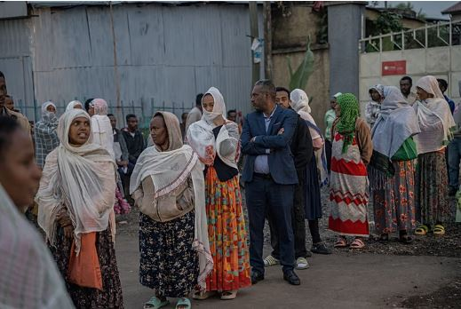

Ethiopians headed to polling stations on Monday for parliamentary elections expected to reinforce the political dominance of Prime Minister Abiy Ahmed and his ruling Prosperity Party.

Voting began early across the country, with more than 50 million registered voters eligible to cast ballots at around 48,000 polling stations nationwide. Polls opened at 6 a.m. local time and were scheduled to close 12 hours later, according to Ethiopia’s National Election Board.

The election is seen as another major political test for Abiy, who has led Africa’s second most populous nation since 2018 and whose administration has focused on economic reforms, infrastructure development and regional diplomacy.

The Prosperity Party is widely expected to secure a strong parliamentary majority, building on its commanding performance in the 2021 elections when it won an overwhelming share of seats in parliament.

Election officials said vote counting would begin after polling stations close, with final results expected within about 10 days.

Observers from the African Union and the regional bloc Intergovernmental Authority on Development were deployed to monitor the electoral process.

While voting proceeded in most parts of the country, no election was held in the northern Tigray region, where tensions between federal and regional authorities remain unresolved following the devastating 2020–2022 conflict that displaced large numbers of civilians.

Authorities also faced logistical and security challenges in some areas of the Amhara and Oromia regions, where armed groups have remained active in recent years. However, the National Election Board confirmed that polling operations would continue in the majority of constituencies across both regions.

Political analysts say the fragmented opposition landscape and the large number of political parties participating in the election could further strengthen the ruling party’s position.

Despite political and security challenges, Ethiopia continues to post some of Africa’s fastest economic growth rates. The International Monetary Fund projects the economy will expand by more than nine percent this year, supported by ongoing reforms and investment initiatives.

Abiy first came to power promising national unity and political transformation, earning international recognition for restoring diplomatic relations with neighboring Eritrea efforts that helped secure him the 2019 Nobel Peace Prize.

The elections are being closely watched across the region as Ethiopia seeks to balance political stability, economic growth and national reconciliation in a country of more than 120 million people.

****

**African Updates**
