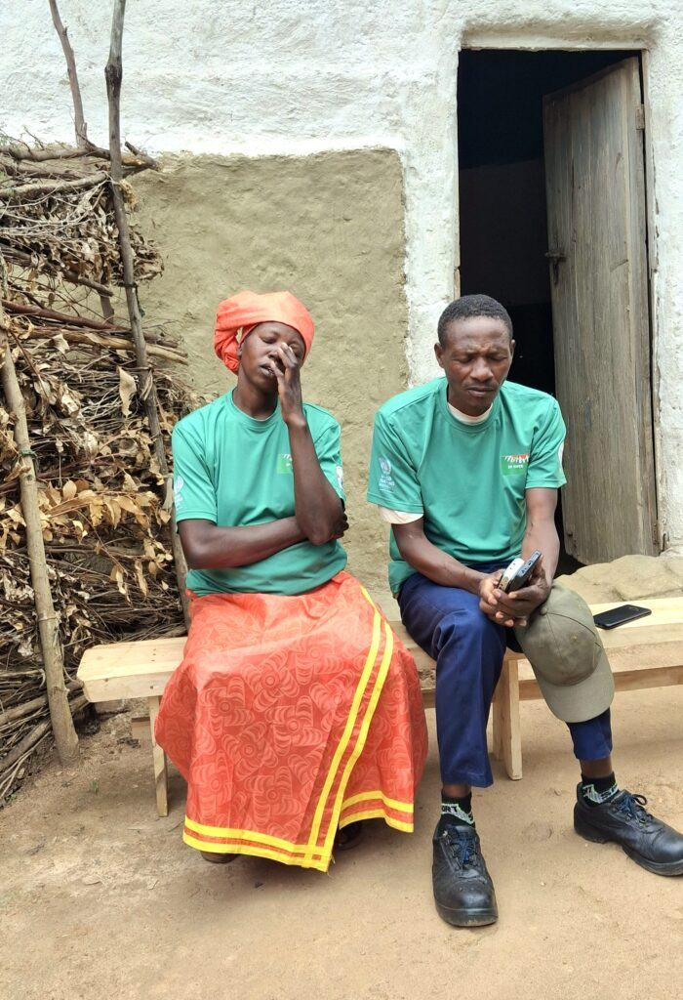
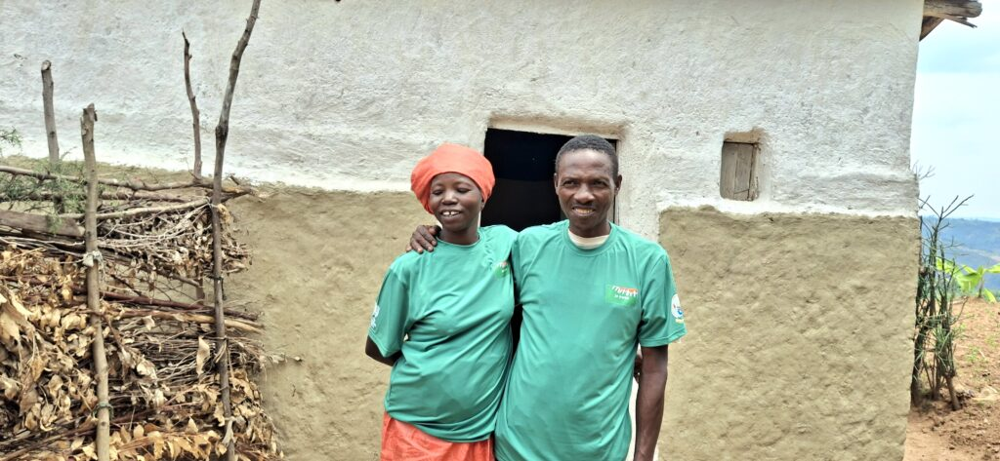
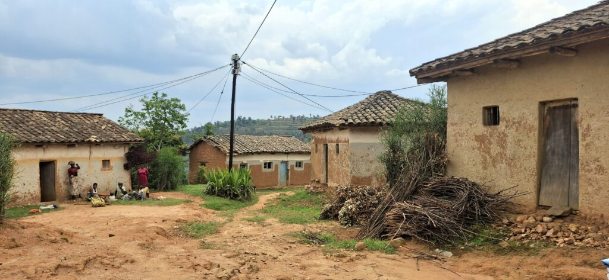
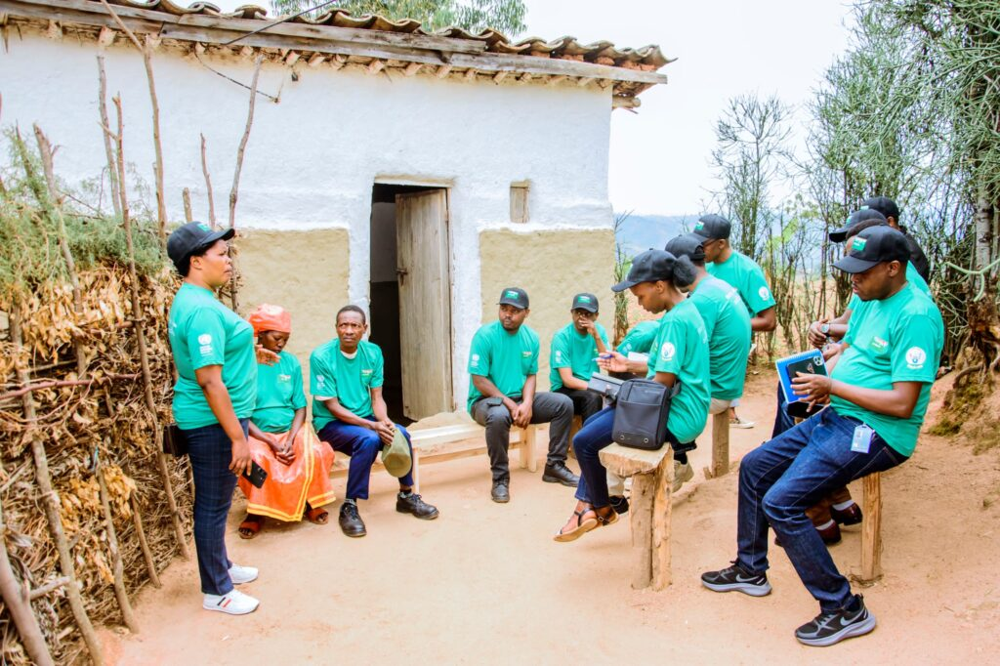
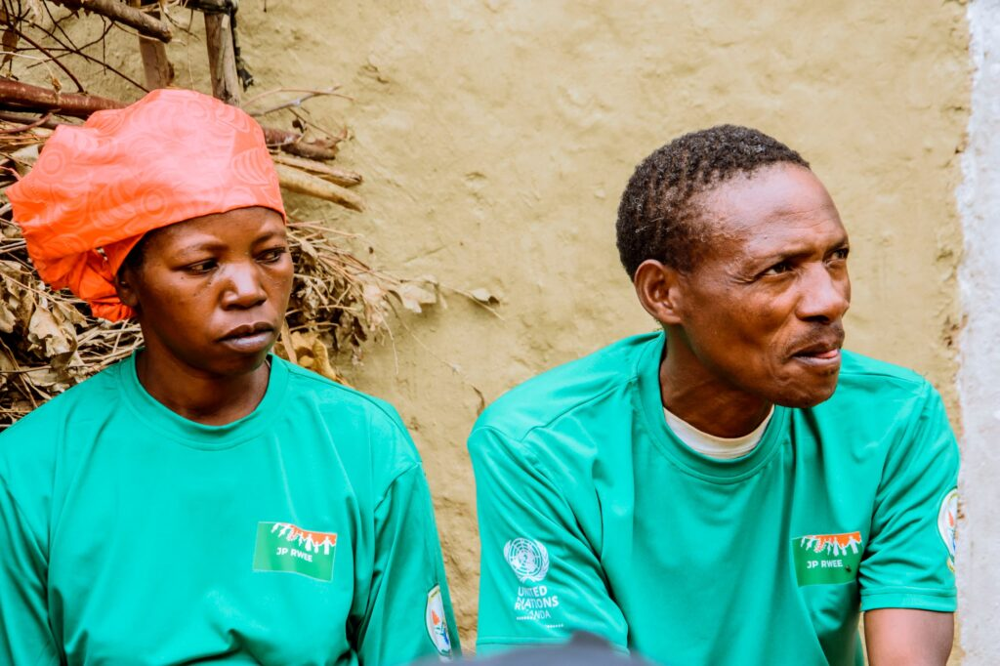
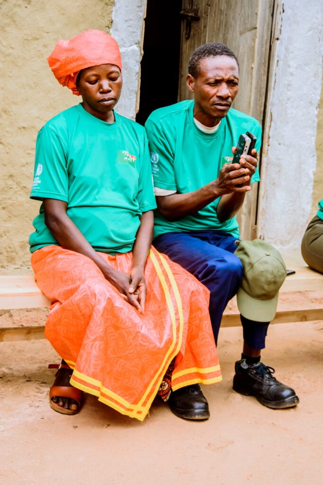

For years, the home of Bizimana Damascene and Tuyishimire Valerie in Cyahinda Sector, Nyaruguru District, was filled with pain and conflict. Constant family fights, often caused by alcohol abuse, created fear and sadness in their household.

Today, that same home is a story of peace, love, and progress, all thanks to training and support from the Joint Programme on Accelerating Progress towards Rural Women’s Economic Empowerment (JP RWEE).

Valerie Tuyishimire, 38 years old, recalls those dark days with emotion.

“We used to fight every day, My husband would come home drunk and angry. When he arrived, the children and I would run and hide. We were living in fear.” she said.

\[caption id="attachment\_42612" align="alignnone" width="700"\] Valerie and Damascene share their emotional story of family conflict and change\[/caption\]

Their family life was falling apart. They could not afford health insurance, and at one point, Damascene refused to take a sick child to the hospital a moment Valerie remembers with deep pain.

Everything began to change in February 2025, when Damascene attended a JP RWEE training session about social life, gender equality, and family harmony.

“Everything they talked about anger, disrespect, not communicating, it was all about me, That day, I decided to change” Damascene, admitted.

He stopped drinking and began treating his wife with respect. Together, they rebuilt their relationship step by step.

“After the trainings, I told her I love her again, We are now living like a newly married couple.” Damascene smiled.

\[caption id="attachment\_42611" align="alignnone" width="1024"\] Valerie and Damascene share a smile that tells their story from conflict to love, rebuilt through JP RWEE’s empowerment programme.\[/caption\]

Through JP RWEE’s guidance, they also learned how to save money and make joint financial decisions. Their teamwork paid off they bought a piece of land together and began improving their home.

Their children have returned to school, and the house is clean and well-kept, showing both dignity and peace.

What makes their story even more powerful is how they are now giving back. Damascene and Valerie are using their own experience to counsel other couples facing family conflict.

So far, they have helped seven families in their neighborhood find peace and rebuild trust.

\[caption id="attachment\_42610" align="alignnone" width="1024"\] The rural neighborhood of Cyahinda in Nyaruguru District, where JP RWEE’s empowerment programs are changing lives\[/caption\]

This ripple effect shows the true power of JP RWEE’s work an intervention that not only changed one family but also created agents of change within the community.

By connecting social well-being with economic empowerment and climate-smart agriculture, JP RWEE’s approach ensures that the peace and progress achieved by families like this one will continue for generations.

\[caption id="attachment\_42604" align="alignnone" width="1024"\] Valerie and Damascene share their journey of change with JP RWEE and UN partners, 21 October 2025\[/caption\]

 

**African Updates**
