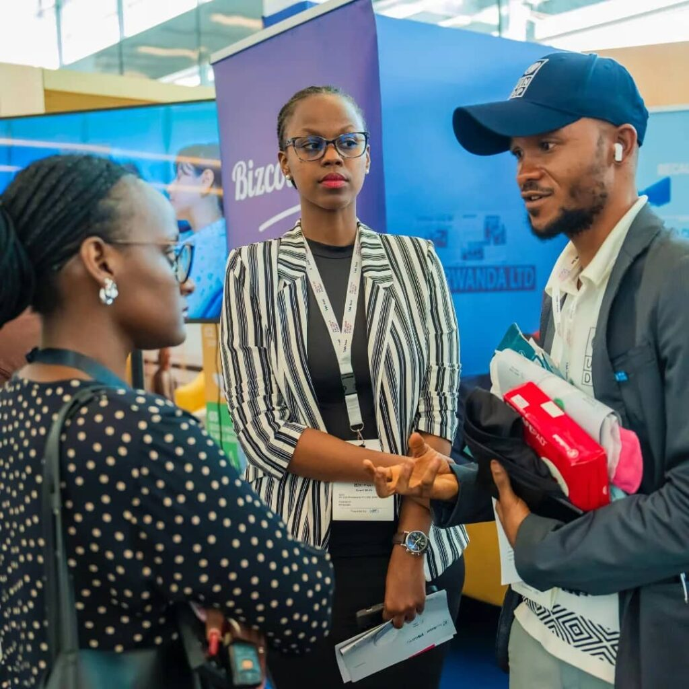
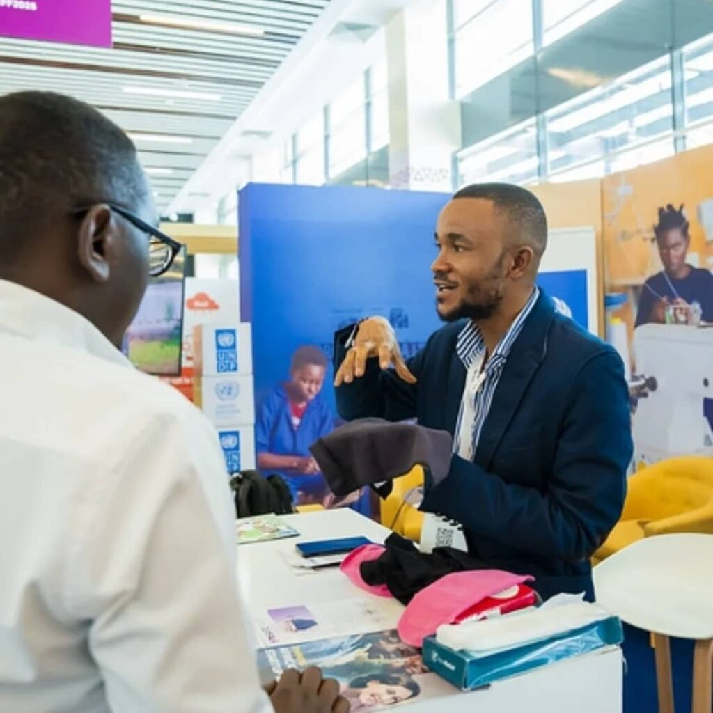
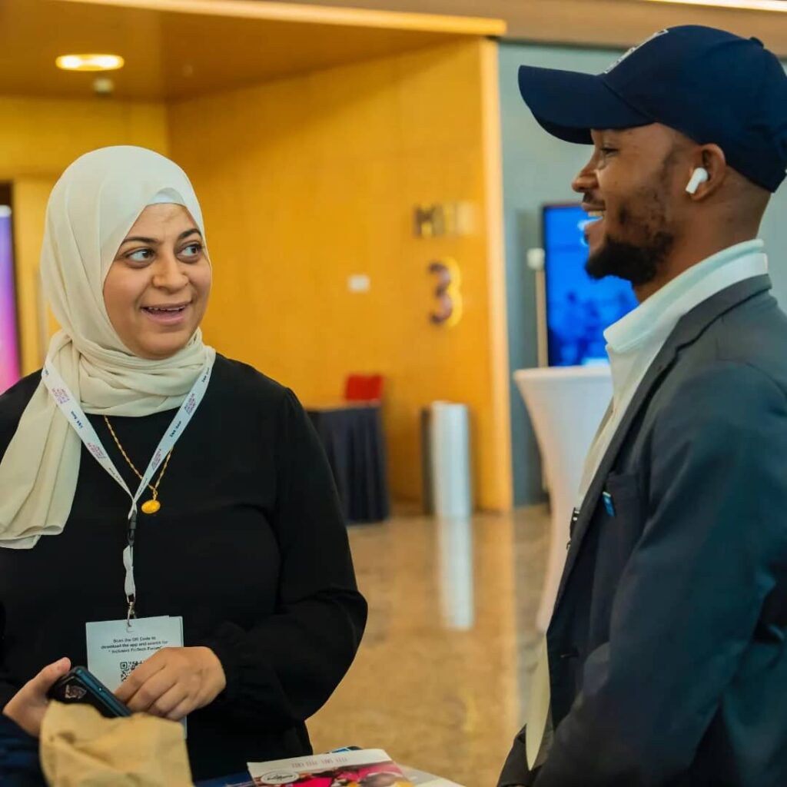
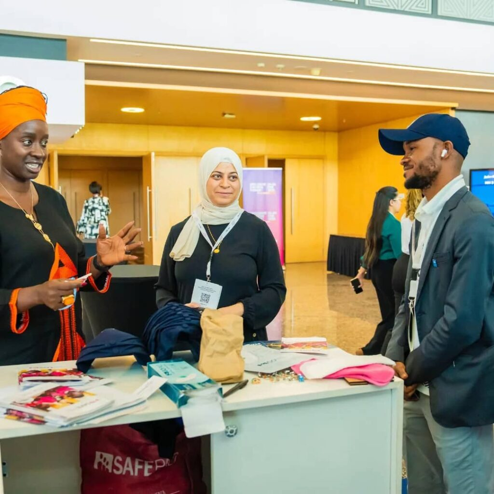
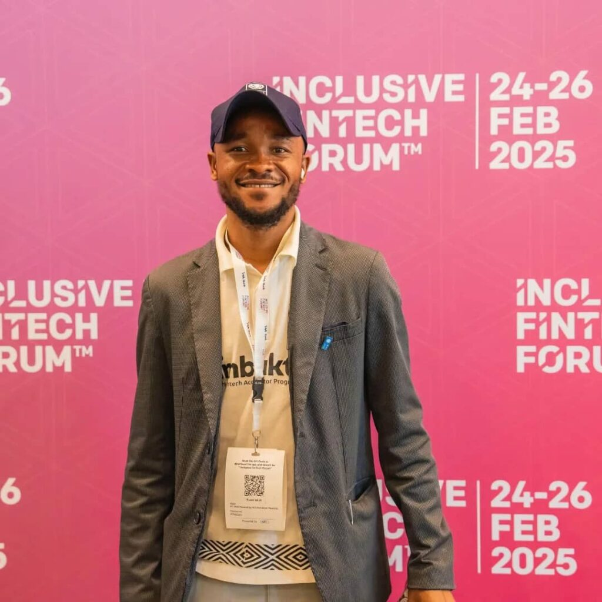

Bishop Darlington Wolah journey began in the challenging environment of a Liberian slum, where he witnessed firsthand the struggles women faced with menstrual hygiene. These experiences, coupled with a poignant memory of a young girl publicly humiliated during an unexpected period, ignited a passion within him. Now, based in Rwanda, Bishop Wolah is the driving force behind MySafepad, a sexual reproductive health and rights organization dedicated to transforming the lives of women and girls across Africa. MySafepad goes beyond simply providing menstrual products. It’s a holistic approach that encompasses education, access, and sustainable solutions. The organization focuses on menstrual hygiene management, antimicrobial resistance awareness, and supplying healthcare facilities with safe, antimicrobial materials. Recognizing the prevalence of unhygienic practices, especially in rural areas, MySafepad also collaborates with weavers to produce antimicrobial fabrics, ensuring that even everyday materials contribute to better health.

Bishop Wolah vision is rooted in a deep understanding of gender equality and women’s rights. He believes that every woman deserves the opportunity to participate fully in society, to build her career, and to make informed choices about her reproductive health. This belief drives MySafepad mission to provide access to quality healthcare services and products, particularly focusing on menstrual hygiene management. The organization’s product line includes both reusable and biodegradable disposable pads. The reusable pads, designed to last up to four years, feature antimicrobial technology that combats bacteria and fungi, addressing the challenges of water scarcity and limited hygiene facilities. MySafepad also offers the world’s first biodegradable disposable pad, which decomposes within 24 months, offering an environmentally friendly alternative to traditional pads that linger for decades.

MySafepad impact extends beyond product distribution. Educational programs are a cornerstone of their work. They provide training to schools, communities, and partner organizations, empowering individuals to create their own sanitary products using readily available materials. Their “My First Period” manual and the development of a mobile app and SMS service aim to provide accessible information to women and girls, regardless of their location. Bishop Wolah vision extends across Africa, aiming to impact 200 million individuals. He seeks to partner with humanitarian actors, businesses, NGOs, and governments to expand MySafepad reach and impact. He also recognizes the potential of fintech platforms to facilitate fundraising, subsidize costs, and provide financial literacy education to women and girls

Funding remains a challenge, but Bishop Wolah is determined to rely on collaboration and innovation. He envisions using crowdfunding platforms to make products more affordable and accessible, and digital payment systems to streamline distribution. He also emphasizes the importance of financial literacy, recognizing that empowering women with knowledge about managing their funds is crucial for their overall well-being. MySafepad commitment to sustainability and accessibility is evident in its efforts to employ and train women in production, providing them with livelihoods and empowering them to become agents of change within their communities. Bishop Wolah call to action is clear: invest in women’s health, invest in the future. “Every day, our girls menstruate,” he asserts, “every day our girls face complex situations.” He emphasizes that health is the foundation of development, and that addressing menstrual health is a crucial step towards building a healthier and more equitable society.

**African Updates**
