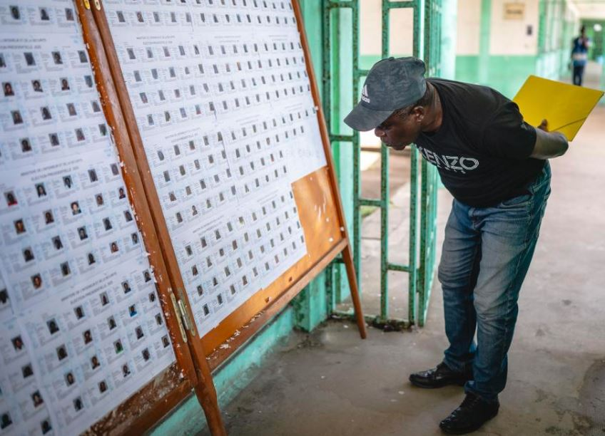
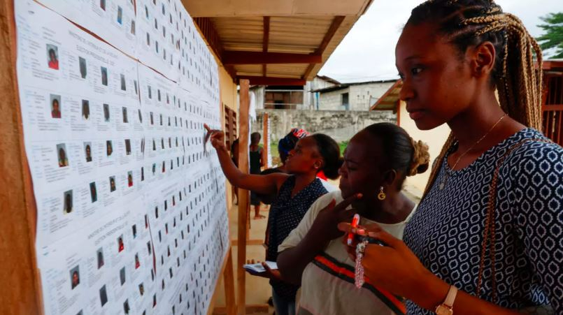

**Libreville, Gabon -** In a decisive election following the 2023 military coup, Brice Oligui Nguema has claimed a resounding victory in Gabon's presidential election. Provisional results from the Ministry of the Interior show Oligui Nguema securing 90.35% of the vote. This election marks a pivotal moment in Gabon's return to constitutional rule after a military-led transition that ousted long-time ruler Ali Bongo.  

Brice Oligui Nguema, the leader of Gabon's transitional government, received 90.35% of the vote.  Alain-Claude Bilie Bie Nze, his closest competitor, garnered only 3.02% of the vote. The election saw a 70.4% voter turnout. Approximately 920,000 voters, including over 28,000 overseas, were registered. 94.8% of polling stations operated satisfactorily, with 98.6% deemed transparent. 69.6% of observed polling stations had representatives from Oligui Nguema. 8.2% of observed polling stations had representatives from Alain-Claude Bilie Bie Nze.

Brice Oligui Nguema, 50, former head of the republican guard, led the 2023 coup that ended the Bongo family's over 50-year political dynasty. Initially pledging a return to civilian rule, Oligui Nguema entered the presidential race after taking leave from his military duties.  

The election is considered crucial for Gabon, a nation of 2.3 million people where a significant portion of the population lives in poverty despite the country's oil wealth. Oligui Nguema is now set to serve a seven-year term, with the possibility of a second term. 

**African Updates**
