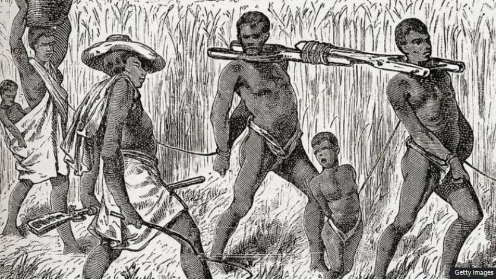

Ghana is stepping up its campaign at the United Nations, using both diplomacy and cultural advocacy to call for formal global recognition of the transatlantic slave trade as a crime against humanity.

During remarks in New York, president John Dramani Mahama highlighted that the impact of slavery goes far beyond history, pointing to the systematic dehumanization of Africans as a foundation for inequalities that still exist today. He spoke at a high-level forum centered on reparatory justice.

As part of this effort, Ghana has submitted a draft resolution to the United Nations General Assembly. The proposal aims to reshape how the international community understands both the scale of the slave trade and its lasting global effects.

Foreign Minister Samuel Okudzeto Ablakwa said the initiative is focused on recognition rather than comparison. He argued that treating slavery as a closed chapter risks ignoring its long-term consequences and diminishes the historical experiences of those affected.

Alongside its diplomatic push, Ghana is also increasing efforts to collect and preserve historical records related to slavery. Officials say this work is key to strengthening the country’s case for greater global acknowledgment, accountability, and justice tied to the legacy of the transatlantic slave trade.

**African Updates**
