More than 300 young people gathered at BK Arena on Saturday for a youth forum focused on health awareness and informed decision-making, as Rwanda positions young people at the center of the continent’s development agenda.

The event, titled **“**Your Health. Your Choice. Your Future,” was organized by Global Citizen in partnership with the Rwanda Development Board, the Ministry of Health Rwanda, the Ministry of Youth and Arts Rwanda, the Imbuto Foundation and HDI Rwanda.

Held ahead of the upcoming Move Afrika Kigali concert scheduled for March 17, the forum created a platform for adolescents to openly discuss sexual and reproductive health, consent, mental health and responsible relationships.

Organizers say these discussions are critical as Africa’s population remains the youngest in the world, with young people expected to shape the continent’s economic and social future.

Speaking at the event, Mireille Batamuliza, Permanent Secretary at the Ministry of Gender and Family Promotion, warned that unresolved youth health challenges could undermine education and opportunities for young people.

“When these challenges remain unaddressed, consequences can affect education, their well-being and life opportunities, particularly for girls,” she said.

Batamuliza highlighted several pressing concerns affecting young people in Rwanda, including rising teenage pregnancies, alcohol and drug abuse, and mental health challenges. She added that misinformation, particularly online, often worsens the situation.

“These issues are often linked through the lack of safe spaces where young people can access accurate information and guidance, As a result, many rely on social media and other untrusted sources that provide misinformation, which increases their vulnerability and risk.” She said.

\[caption id="attachment\_44502" align="alignnone" width="1024"\]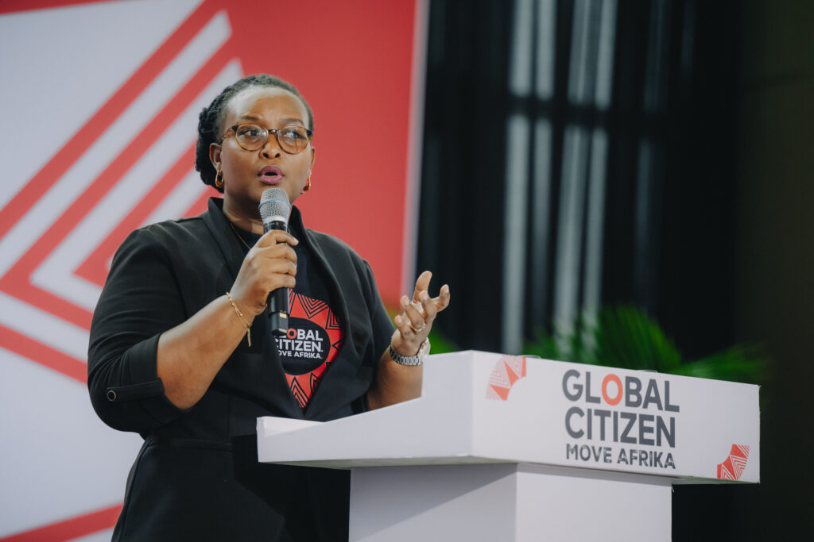 Mireille Batamuliza, Permanent Secretary at the Ministry of Gender and Family Promotion\[/caption\]

According to her, youth-focused discussions like the Kigali forum can help reverse the trend.

The forum featured a panel discussion with health experts and youth advocates, interactive question-and-answer sessions and performances from local artists.

For Iphie Chuks-Adizue, Managing Director for Africa at Global Citizen, the event is part of a broader effort to support Africa’s young population. She said the initiative reflects confidence in Africa’s creative and economic potential.

“One big thing that we want to continue to buttress is the fact that we really do believe in the creative and economic potential of Africa, Our young population is really a strength, and we want to make sure it turns out to be a strength for the continent.” Chuks-Adizue said.

\[caption id="attachment\_44499" align="alignnone" width="1024"\]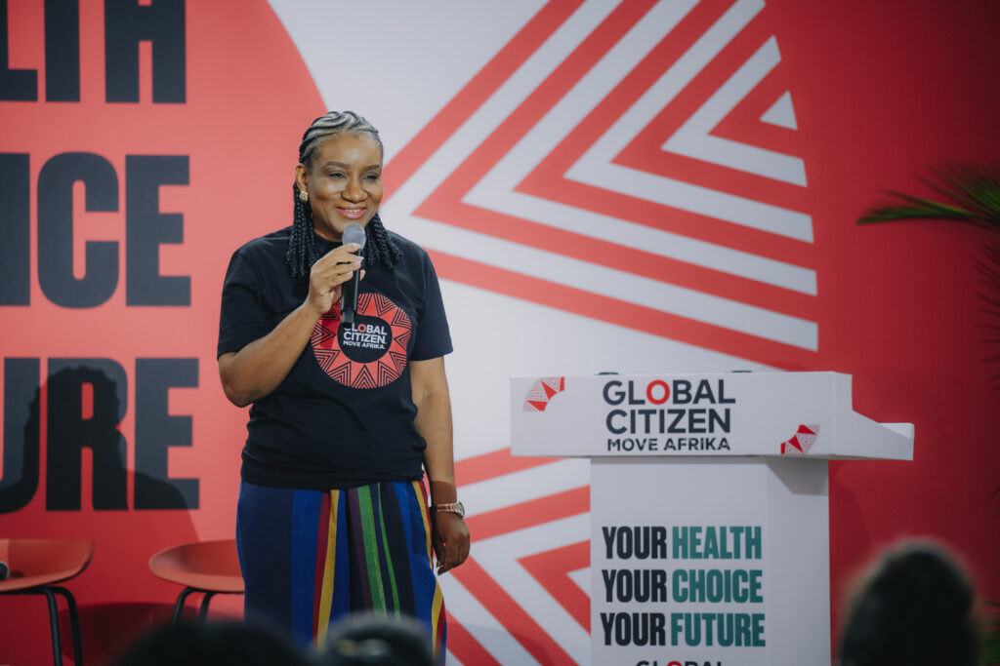 Iphie Chuks-Adizue, Managing Director for Africa at Global Citizen\[/caption\]

The theme of the forum was chosen to highlight how personal decisions shape broader societal outcomes. Iphie Chuks-Adizue also pointed to teenage pregnancy as one factor affecting education outcomes for many African girls.

“One of the key things that reduces the number of young people getting educated are issues like teenage pregnancy, which relate to sexual and reproductive health information and decision-making,” Iphie Chuks-Adizue said.

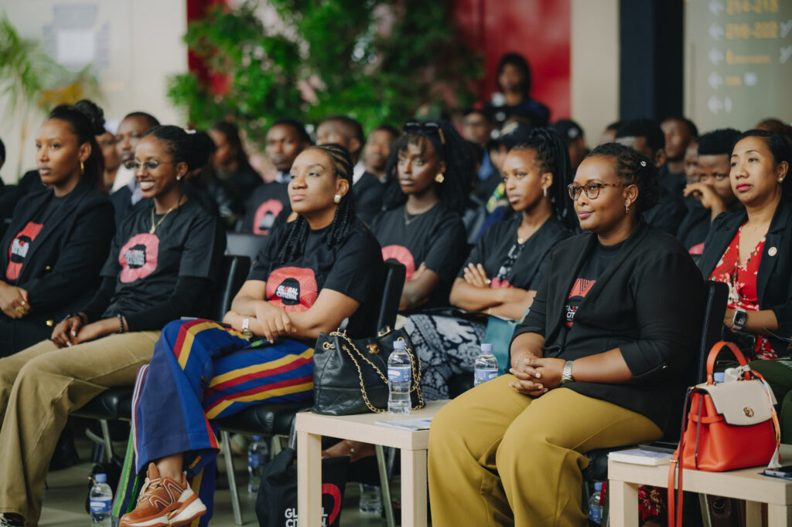

Young participants said the discussions helped them better understand issues such as consent and personal boundaries.

Ineza Bernice, a 19 year-old youth advocate from HDI Rwanda, said the forum offered practical lessons young people can apply in daily life, adding that responsible choices are essential for shaping a better future.

“Consent is something that we can apply in everyday life, For example, if someone asks me for a picture or asks to do something to me, I have the ability to say no and that no really means no. Our health and our choices will influence our future, so we have to make great decisions so that we can have a better future,” Ineza said.

\[caption id="attachment\_44503" align="alignnone" width="683"\]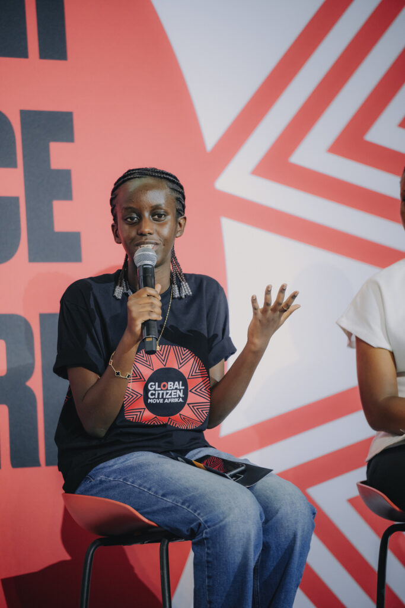 Ineza Bernice, youth advocate from HDI Rwanda\[/caption\]

The youth forum forms part of Global Citizen’s wider Move Afrika initiative, which aims to expand entertainment touring across the continent while creating jobs in Africa’s creative economy.

The upcoming Kigali show will be headlined by Grammy-winning global star Doja Cat.

Beyond entertainment, organizers say the initiative also seeks to spark social dialogue and investment in young people a demographic that represents more than 60 percent of Africa’s population under the age of 25 positioning health education as key to sustainable growth. By tackling misinformation and stigma, initiatives like this aim to lower dropout rates, boost workforce participation, and fuel economic progress in Rwanda and beyond. 

For Rwanda, which has prioritized youth empowerment in its development strategy, the forum highlighted how access to reliable health information can support education, protect well-being and unlock the potential of the continent’s next generation.

Global Citizen's efforts have mobilized over $50 billion, impacting 1.3 billion lives worldwide, with a focus on Africa's emerging generations.

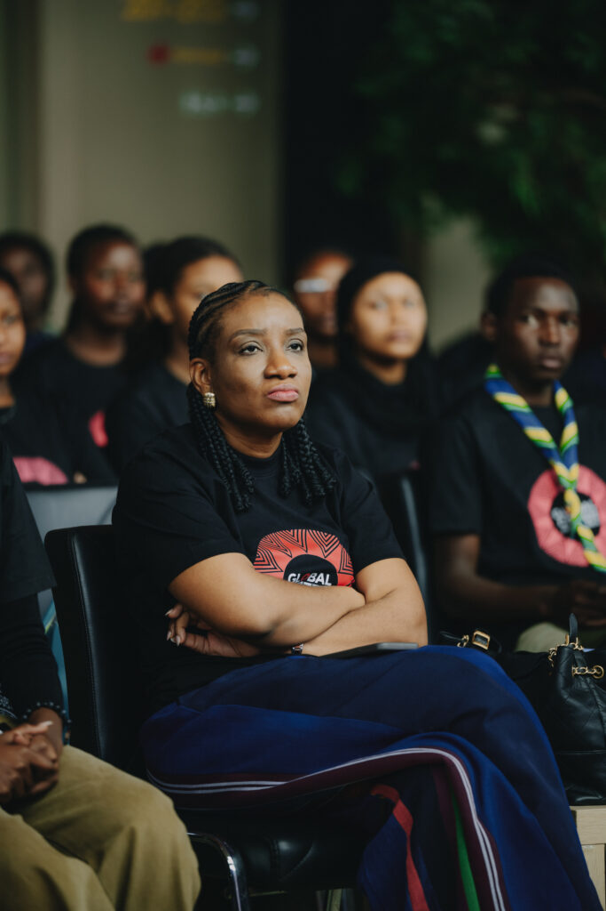

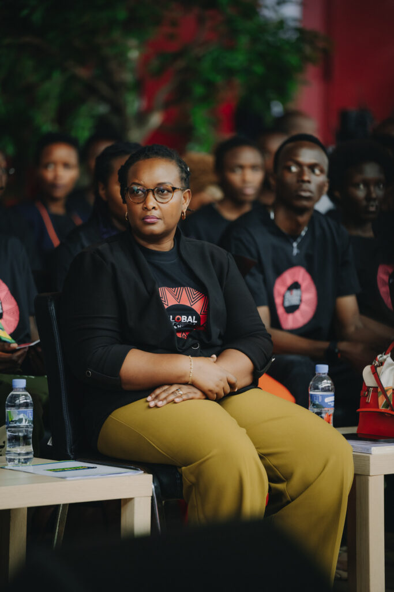

\[caption id="attachment\_44504" align="alignnone" width="1024"\]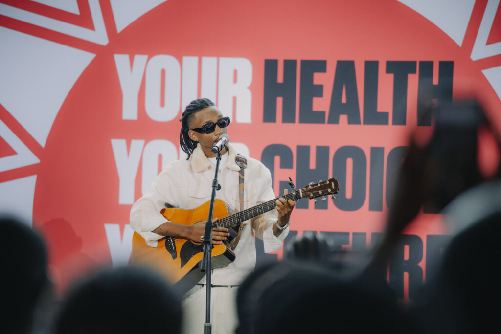 Kivumbi King, Performing his songs\[/caption\]

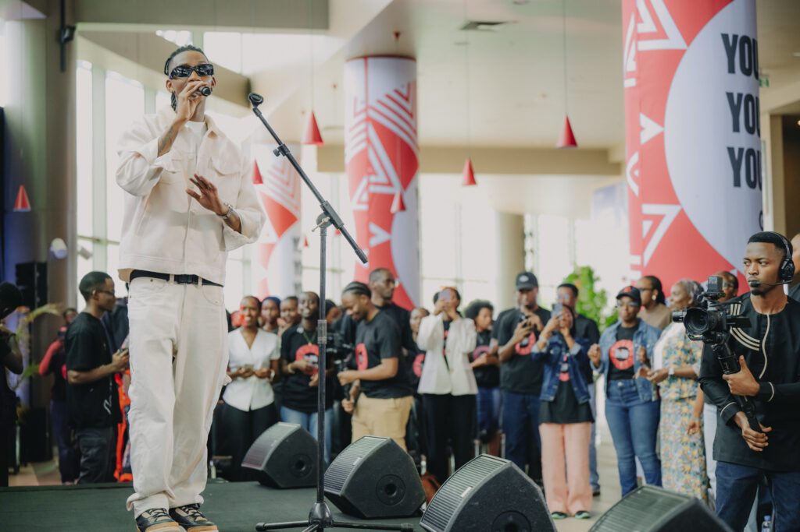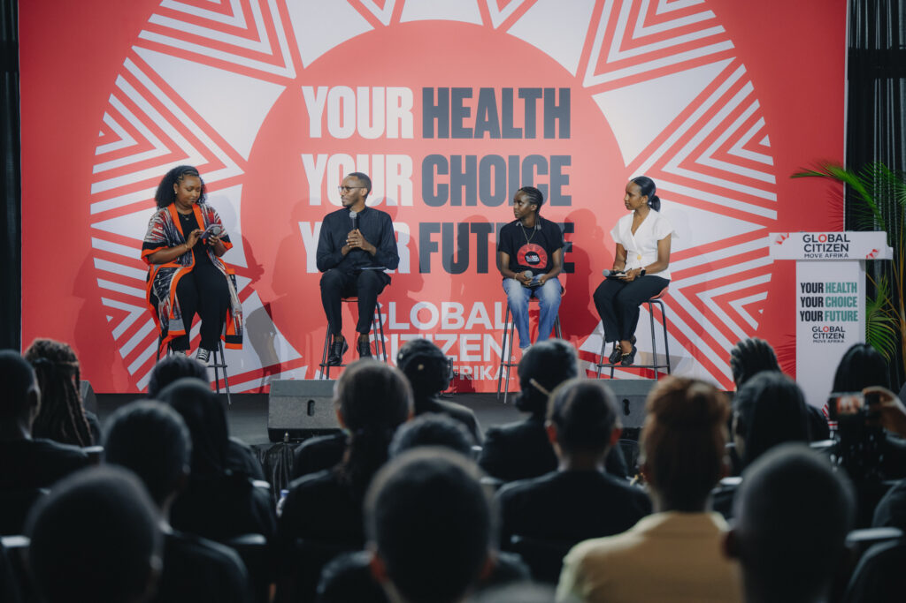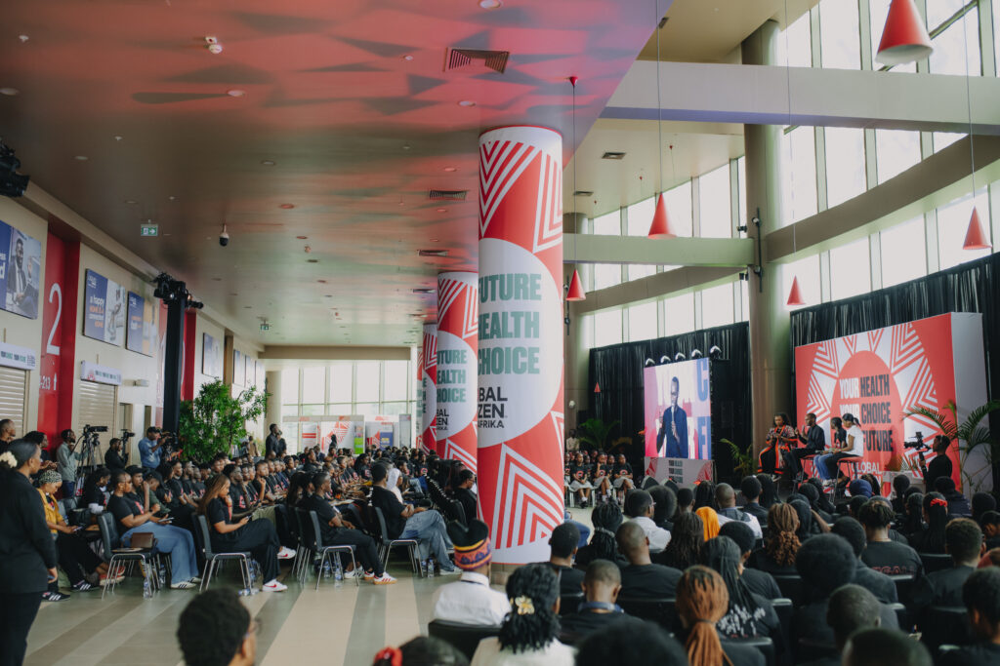 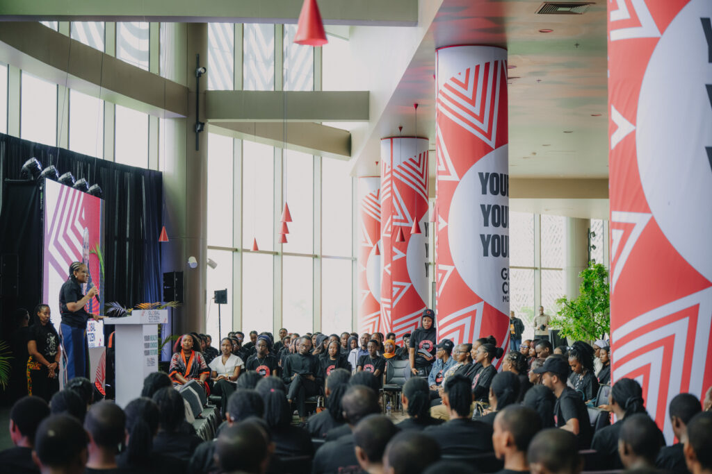

**African Updates**
