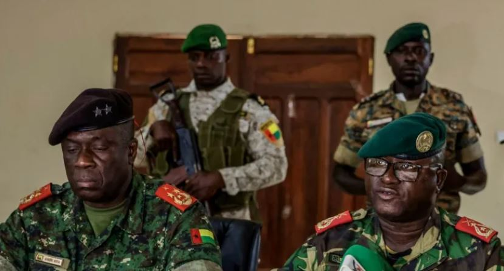
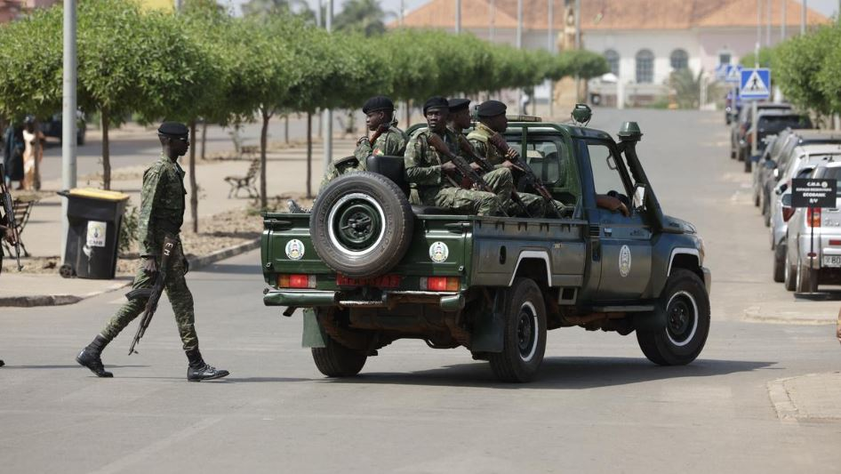

Military officers in Guinea-Bissau announced on Wednesday that they have seized full control of the country, appearing on state television to declare the suspension of national institutions following days of political tension.

In an official statement, the military high command said it had “assumed the full powers of the State of the Republic of Guinea-Bissau.” The officers claimed the takeover was triggered by what they described as “an ongoing plan” to destabilize the nation by attempting to manipulate electoral results from last week’s contentious presidential vote.

The announcement followed reports of gunfire at several key locations in the capital, Bissau, including near the presidential palace. Although it remains unclear who was involved, journalists on the ground said major roads leading to the palace were blocked by heavily armed, masked soldiers manning checkpoints.

Both leading candidates in the closely fought election outgoing President Umaro Sissoco Embaló and opposition contender Fernando Dias da Costa declared victory on Tuesday, intensifying uncertainty ahead of the expected release of provisional results.

Military spokesperson Dinis N’Tchama said the armed forces had formed “the high military command for the restoration of order,” which would govern the nation until further notice. He announced several immediate measures, including Suspension of all state institutions, Suspension of all media activity, Immediate halt of the ongoing electoral process, Closure of land borders, maritime access, and national airspace.

A member of the international election observer mission reported that the election commission chief had been arrested, and the commission’s headquarters sealed by soldiers a move that further deepened the political crisis.

French media outlet Jeune Afrique reported that President Embaló said he had been detained during what he described as a coup led by the army chief of staff. Embaló stated that he was not subjected to physical violence.

The president has recently faced a legitimacy dispute, with opposition parties arguing that his mandate expired and that they no longer recognize him as the country’s rightful leader. Embaló took office in February 2020, but the Guinea-Bissau constitution limits presidential terms to five years.

The latest power grab adds to a long pattern of coups and attempted coups in Guinea-Bissau, a country that has struggled with chronic political turbulence since achieving independence from Portugal in 1974.

The electoral commission had been scheduled to release provisional results from both the presidential and parliamentary elections on Thursday. That process is now on hold as the military solidifies its control amid growing regional and international concern. 

**African Updates**
