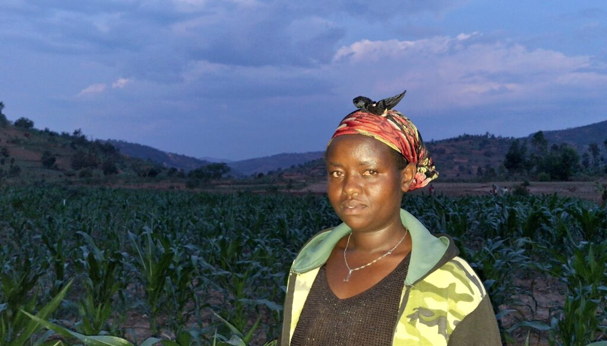
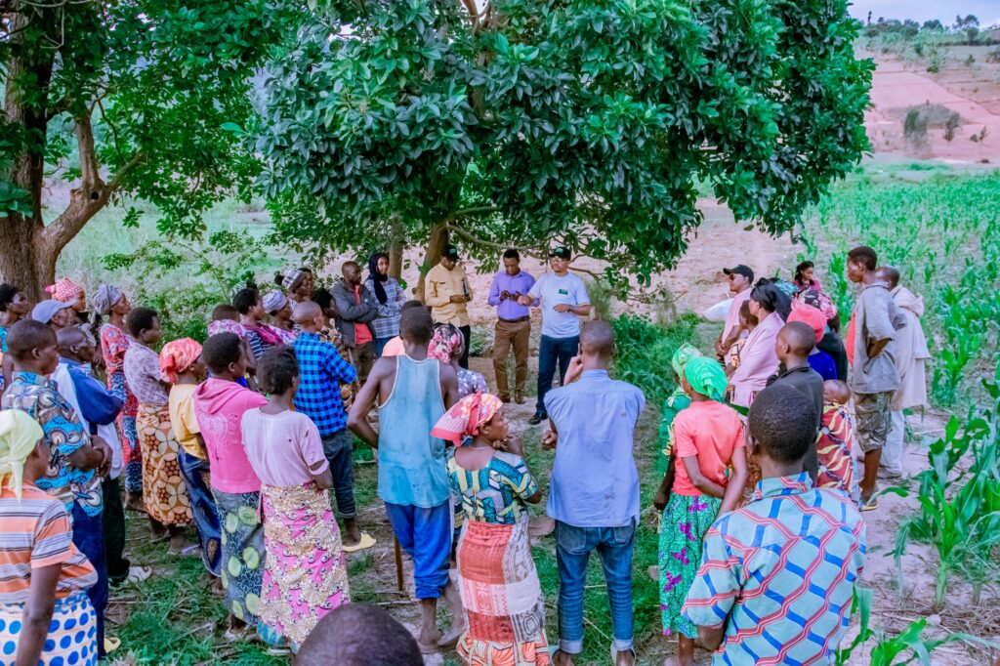
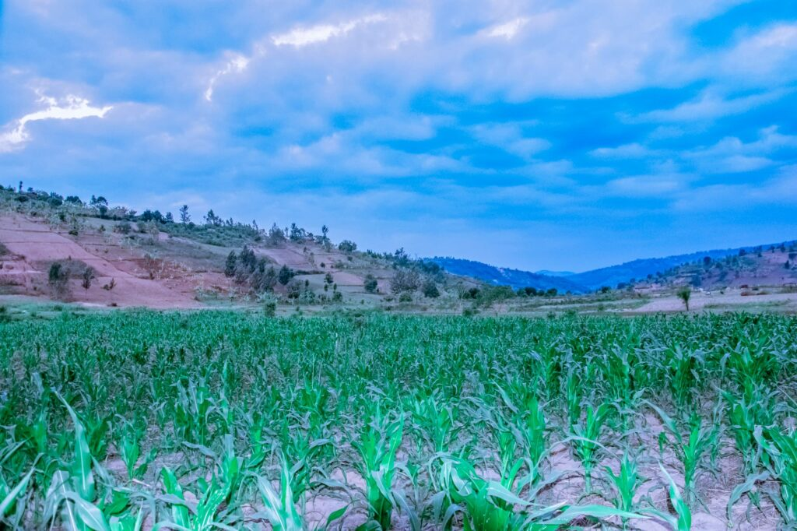
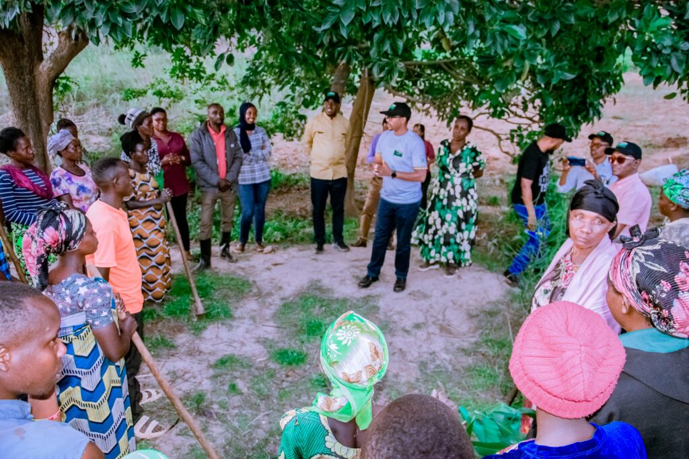

A simple, yet powerful farming method is driving huge increases in crop production for small-scale farmers in southern Province of Rwanda. Members of Urumuri Cyamukuza Cooperative in Gisagara District are celebrating bumper harvests after adopting Pfumvudza, a climate-smart agriculture technique promoted through the Joint Programme on Accelerating Progress towards Rural Women’s Economic Empowerment (JP RWEE).

This shift from traditional to modern, sustainable practices is reshaping food security, boosting incomes, and giving rural women a stronger voice in community development.

Pfumvudza a Shona word meaning _“_new beginning_”_ is a conservation farming technique designed to make better use of small plots of land. It focuses on minimum soil disturbance, proper spacing of crops, mulching, and crop rotation. Together, these practices help the soil retain moisture, improve fertility, and prevent erosion all while increasing yields.

For Uwamahoro Aline, a cooperative member of Urumuri Cyamakuza, the change has been remarkable

“Before, on my two are plot, I used to harvest only 50 kilograms of maize, Now, with Pfumvudza, I get around 200 kilograms from the same land. It has changed my life and my family’s wellbeing.” she said.

Through JP RWEE, Aline received trainings not only in farming but also in nutrition and financial literacy using the Gender Action Learning System (GALS) approach.

“Now, my family always has vegetables on the table, I also learned about saving money. I used to think saving was only for rich people, but I’ve learned that small sacrifices can lead to big goals.” Uwamahoro said.

\[caption id="attachment\_42598" align="alignnone" width="1024"\] Uwamahoro Aline a 38-year-old mother of five, the change has been remarkable\[/caption\]

The cooperative’s vice president, Nkurizanayo Valens, explained how the new techniques have changed their outlook.

“We used to grow crops just to feed our families, Now we produce enough to sell at the market, which helps us earn income.” Valens said. “

Last season, unpredictable rainfall reduced their yield to 2.6 tonnes from three hectares. But this time, the cooperative has adopted irrigation systems, allowing them to water crops during dry spells and maintain steady growth.

“Our goal now is to produce at least 2.4 tonnes per hectare, With irrigation, better seeds, and our own organic fertilizer, we believe we can achieve it.” Valens said.

Through JP RWEE’s training, the farmers learned how to make compost and organic manure, reducing dependence on expensive chemical fertilizers and improving soil health naturally. They are also planning to diversify their crops, including legumes and vegetables, to improve both income and household nutrition.

\[caption id="attachment\_42599" align="alignnone" width="1024"\] Farmers from the Urumuri Cyamukuza Cooperative share their success stories with JP RWEE and UN partners\[/caption\]

The success of Pfumvudza in Gisagara offers a powerful lesson for many African communities facing the effects of climate change. Rising temperatures, erratic rainfall, and degraded soils threaten the continent’s food systems challenges that conservation agriculture directly addresses.

In Rwanda, where agriculture remains the backbone of the economy, the government continues to promote sustainable and inclusive agricultural transformation. The adoption of climate-smart techniques such as Pfumvudza fits perfectly with the country’s vision for a food-secure and resilient future.

For women farmers like Aline, JP RWEE’s approach goes beyond farming it builds confidence, leadership, and independence.

“Before, I didn’t believe I could achieve much, But now, I feel proud of what I can do. I have food, I can save money, and I can plan for my children’s future.”  Aline reflected.

Through the combined efforts of UN Women, FAO, IFAD, and WFP, JP RWEE has shown that empowering rural women is not only about improving livelihoods it’s about transforming communities from the ground up.

\[caption id="attachment\_42601" align="alignnone" width="1024"\] Healthy maize crops grown using the Pfumvudza climate-smart farming method in southern Province, Rwanda\[/caption\]

\[caption id="attachment\_42600" align="alignnone" width="1024"\] Farmers from the Urumuri Cyamukuza Cooperative share their success stories with JP RWEE and UN partners\[/caption\]

 

**African Updates**
