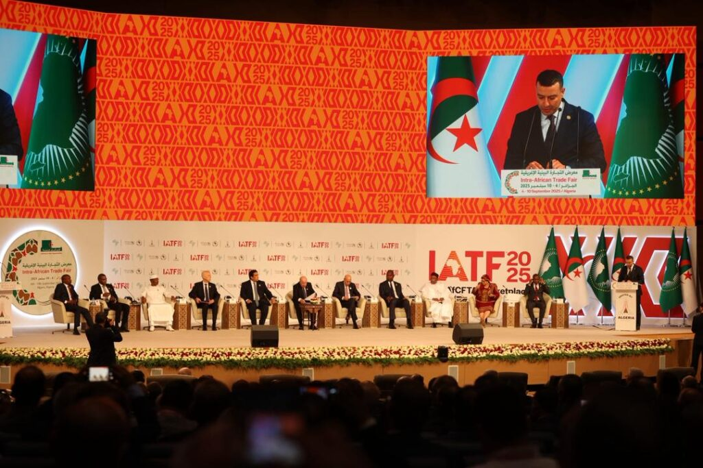
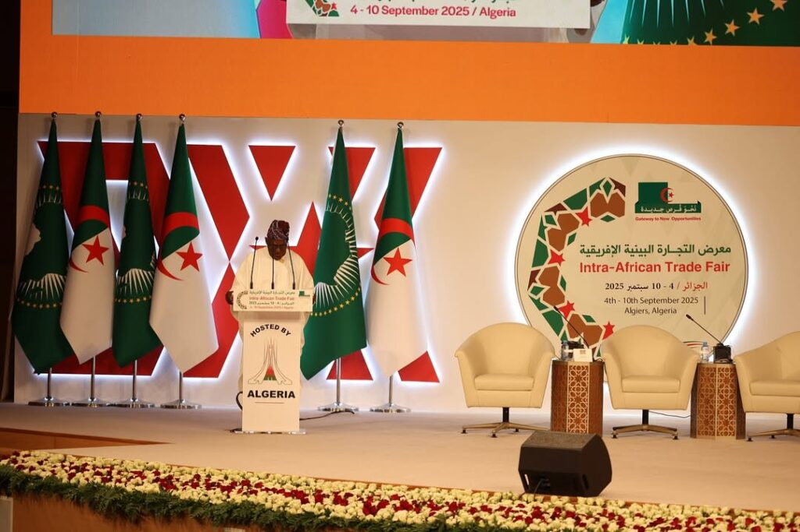
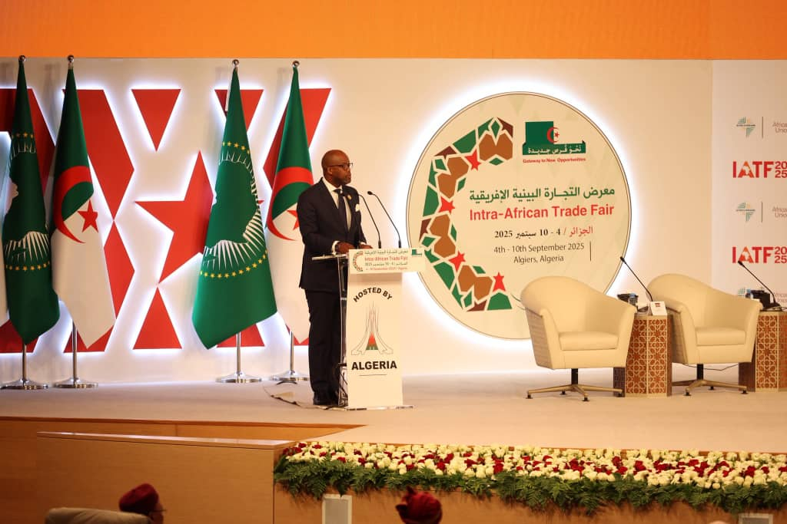
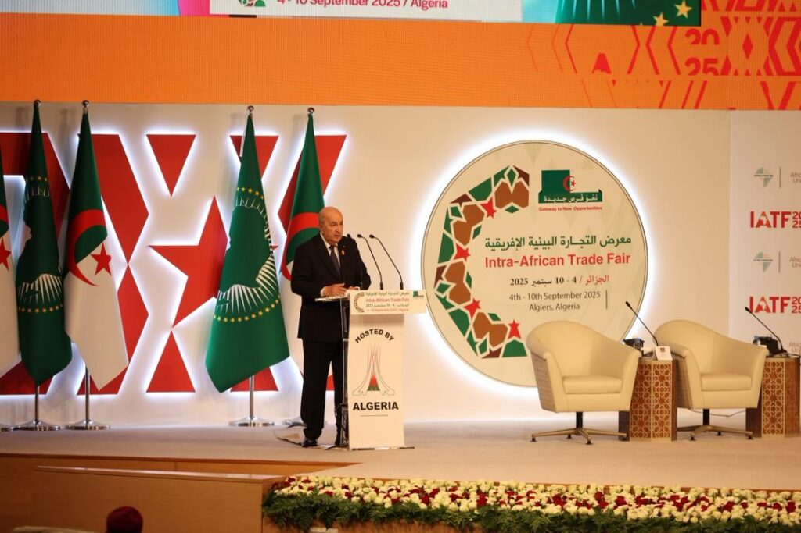
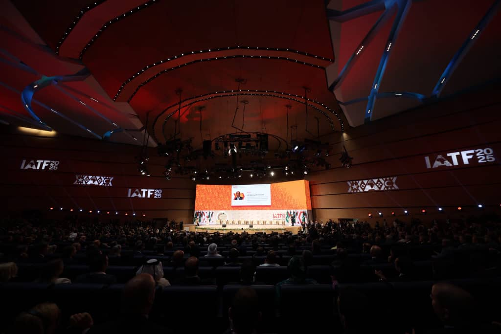
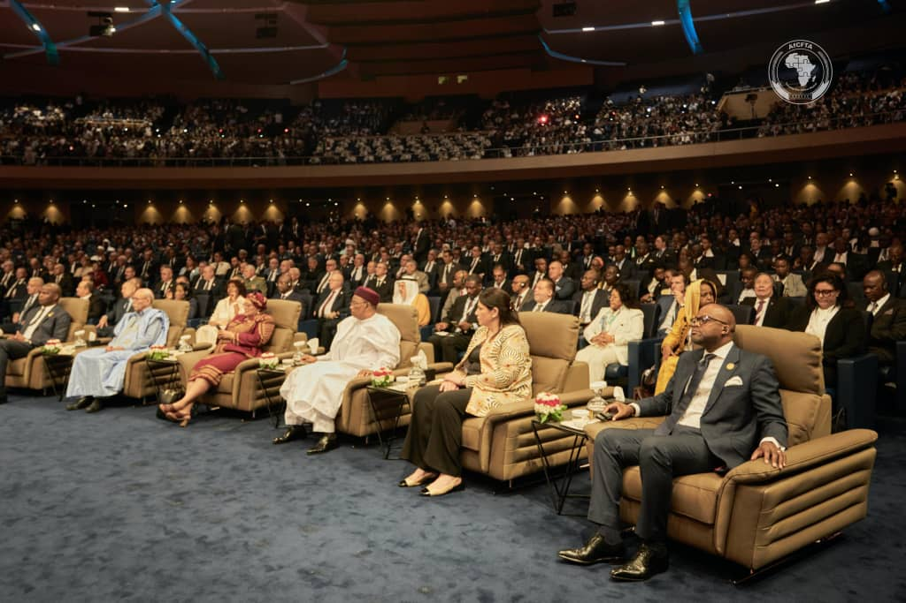
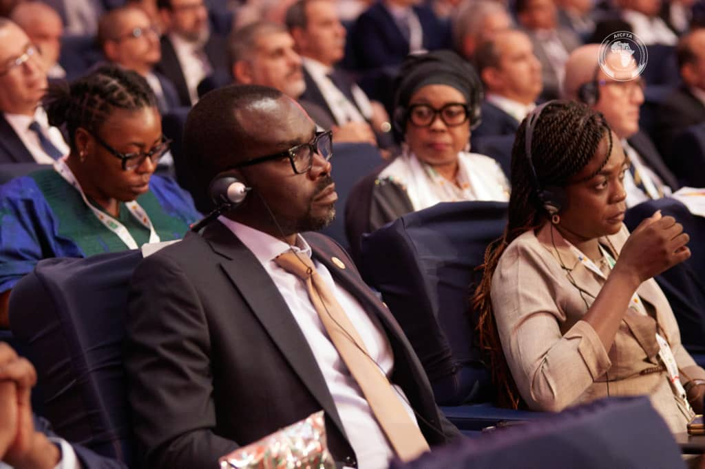
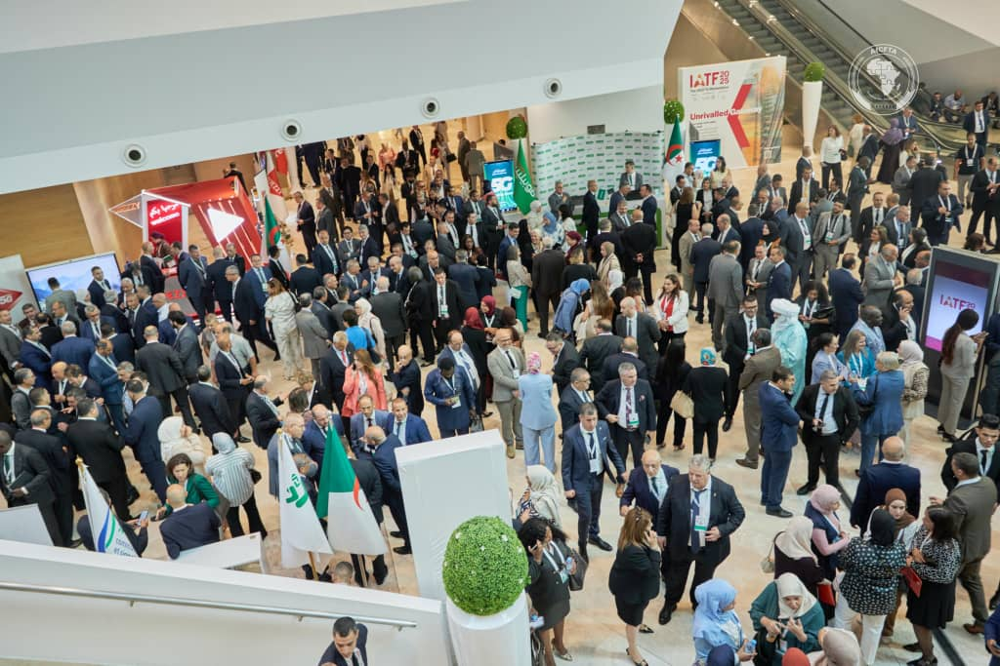

A new era for Africa's economy was announced today as leaders, visionaries, and businesses gathered for the Intra-African Trade Fair (IATF) 2025. This wasn't just a business event; it was a symbol of African unity and the big dreams of the African Continental Free Trade Area (AfCFTA).

The opening ceremony was a lively event, attended by Algerian President Abdelmadjid Tebboune and the other heads of state including President of Tunisia Kais Saied, President of Tchad Mahamat Idriss Déby Itno , President Mohamed Ould Ghazouani of Mauritania, and President Daniel Chapo of Mozambique. Their presence, along with representatives from other African countries, showed a shared commitment to bringing the continent closer through business. The IATF has become Africa's main business meeting place, where plans become real partnerships and deals get made.

During the event, Chief Olusegun Obasanjo, former President of Nigeria and Chairman of the IATF Advisory Council, spoke about a massive power project in Tanzania, a $2.9 billion deal made at a previous fair. He also honored a special person, Professor Oramah, a true visionary who has opened many doors for Africa's economic freedom.

\[caption id="attachment\_40815" align="alignnone" width="1024"\] Chief Olusegun Obasanjo, former President of Nigeria and Chairman of the IATF Advisory Council\[/caption\]

The IATF has been a huge success. Wamkele Mene, Secretary-General of the AfCFTA, noted the event's impact. The 2023 fair in Cairo brought in nearly 28,000 people and created over $43 billion in trade and investment deals. For this fair in Algiers, they expect more than 35,000 people and deals worth over $44 billion.

\[caption id="attachment\_40818" align="alignnone" width="1024"\] H.E Wamkele Mene, Secretary-General of the AfCFTA\[/caption\]

These numbers show Africa's growing confidence in itself. A recent report from Afreximbank shows that trade between African countries grew by 12.4% in 2024, reaching $220.3 billion. However, this trade still makes up only about 15% of the continent’s total trade, which means there's a lot of room to grow.

Even with all the progress, there are still challenges. A major topic of discussion was transportation. Many visitors had to travel through Europe to get to Algiers. This highlights the need for a Single African Air Transport Market to make travel easier and cheaper.

Experts at the fair are asking African nations to invest in better trade routes, logistics centers, and digital networks. This will help new trade rules create real chances for businesses and people. Another key program is the new AfCFTA Adjustment Fund, which was officially launched at the fair. It is designed to help countries and small businesses get used to the new trade rules and make sure no one is left behind.

Algeria, the host country, showed its dedication to African development. President Tebboune talked about major projects, like the trans-Saharan road and new shipping lines, all meant to connect the region better. He also mentioned opening Algerian banks in other African countries and creating free trade zones to boost business.

\[caption id="attachment\_40809" align="alignnone" width="1024"\] Abdelmadjid Tebboune, President of the People's Republic of Algeria\[/caption\]

Looking ahead, it was announced that Nigeria will host the next IATF in 2027. This continues the tradition of the event moving to different African nations. The fair is not just for showing off products; it's a place for action. It's where deals are made and a stronger, more prosperous Africa is built.

   

**African Updates**
