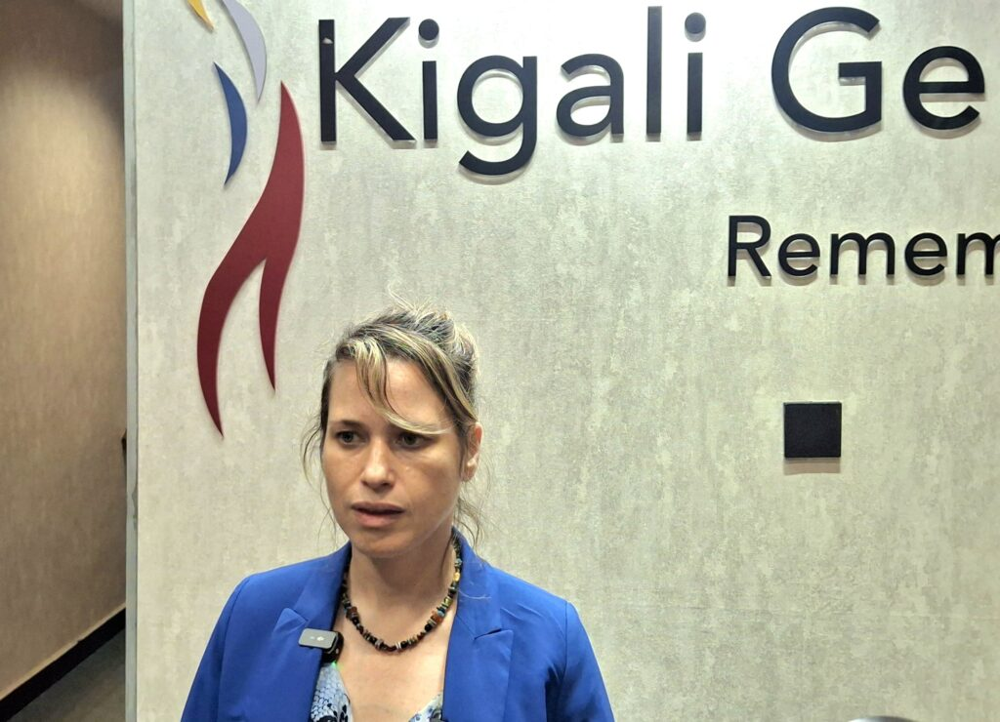
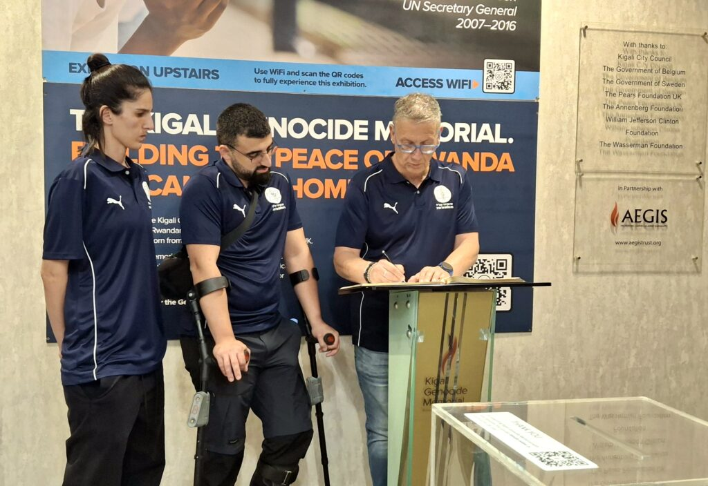
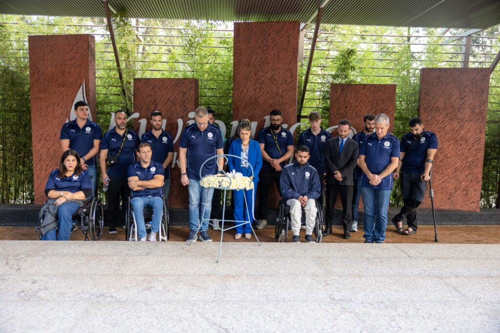

A delegation of 14 veterans from the Israel Defense Forces (IDF) arrived in Kigali this tuesday on 25th November, 2025. Their visit focused on healing and shared experience. The trip is built on the profound historical bonds between Israel and Rwanda. The delegation includes veterans injured in service, many of whom are dealing with post-traumatic stress disorder (PTSD).

The visit began with a stop at the Kigali Genocide Memorial, an event that resonated deeply with the former soldiers. Ambassador of Israel to Rwanda Einat Weiss, explained the deliberate choice of the destination, noting it goes beyond history alone. "We chose Rwanda not only because of the history, Rwanda has done tremendous steps in raising awareness to disability, to people with disabilities."

She underscored the nation's leadership in giving access to disabled people, a key motivation for bringing the veteran delegation, which includes soldiers with severe mental and physical injuries.

During the visit to the memorial, the parallels between the 1994 Genocide against the Tutsi and the Holocaust struck the veterans. Ambassador Weiss reflected on the shared nature of these atrocities, stating, "I think there is no other country in the world that can really understand Rwanda, because when you go in this maze of the museum, you realize how similar the eight steps, nine steps that led to the genocide and the Holocaust, dehumanization, how do you treat people as nothing?"

The purpose of sharing these painful histories is to reinforce a global message. "The importance of Rwanda and Israel is for the entire world, Because what happened here and what happened to the Jew can happen today." Ambassador Weiss emphasized.

\[caption id="attachment\_42844" align="alignnone" width="1024"\] Einat Weiss, Ambassador of Israel to Rwanda\[/caption\]

The delegation’s program is intensely focused on mutual support and rehabilitation. The veterans, many of whom are experiencing battlefield trauma, will engage directly with Rwandan peers. The Ambassador proudly noted the unique nature of the group "Never had we had such a big delegation of people with disability going to track the gorillas." She also highlighted crucial meetings with clinical psychology students to discuss the complex issue of post trauma and second generation trauma.

\[caption id="attachment\_42845" align="alignnone" width="1024"\] IDF veterans visit Kigali Genocide Memorial\[/caption\]

Scheduled activities include a wheelchair basketball clinic in Kigali and a mentorship session at the Agahozo-Shalom Youth Village. This structure reflects the core philosophy of the diplomatic relationship. "We never come to teach Rwanda. We come to do mutual learning, Israel gains from Rwanda, Rwanda gets from Israel. And this is what we call friendship." Ambassador Weiss said.

The week long visit is intended to solidify this bond, moving the focus from historical tragedy to shared, practical hope.

**African Updates**
