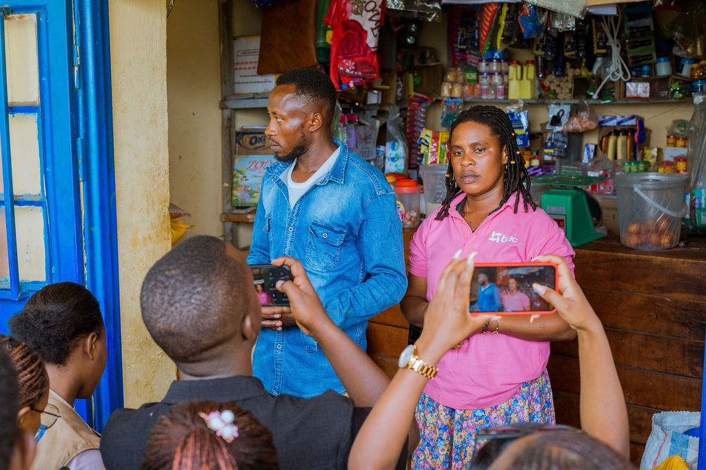
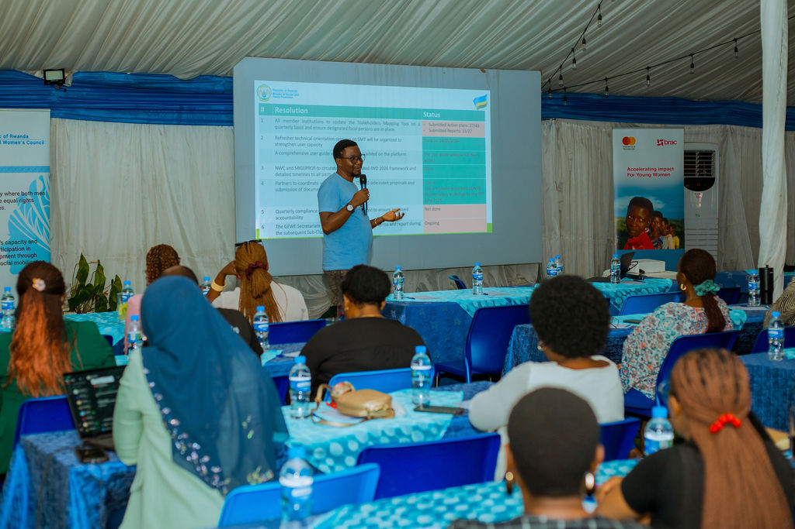
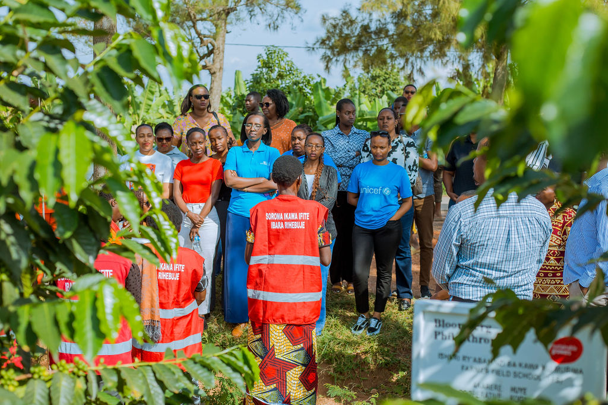
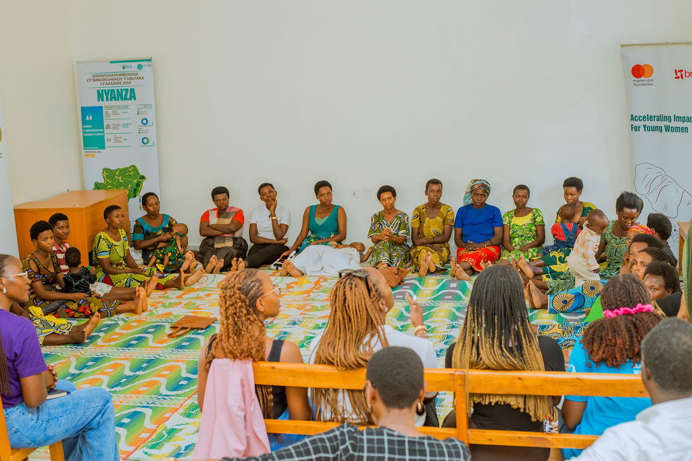
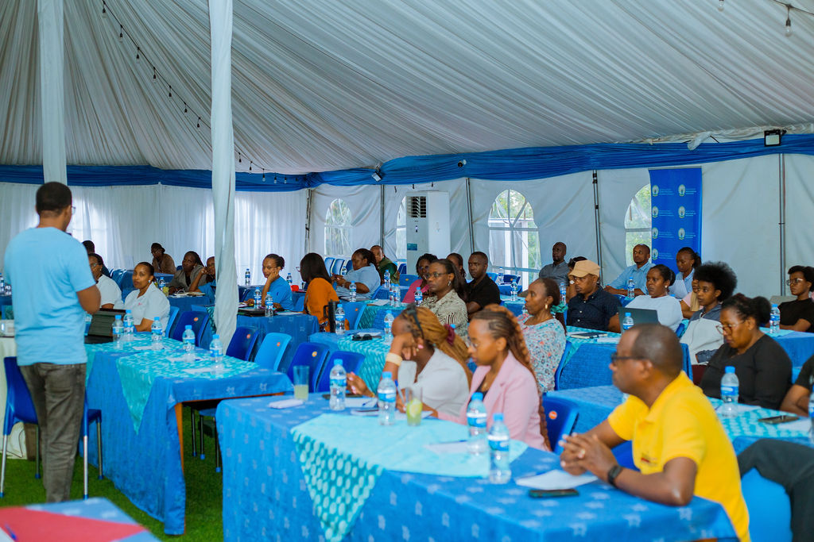
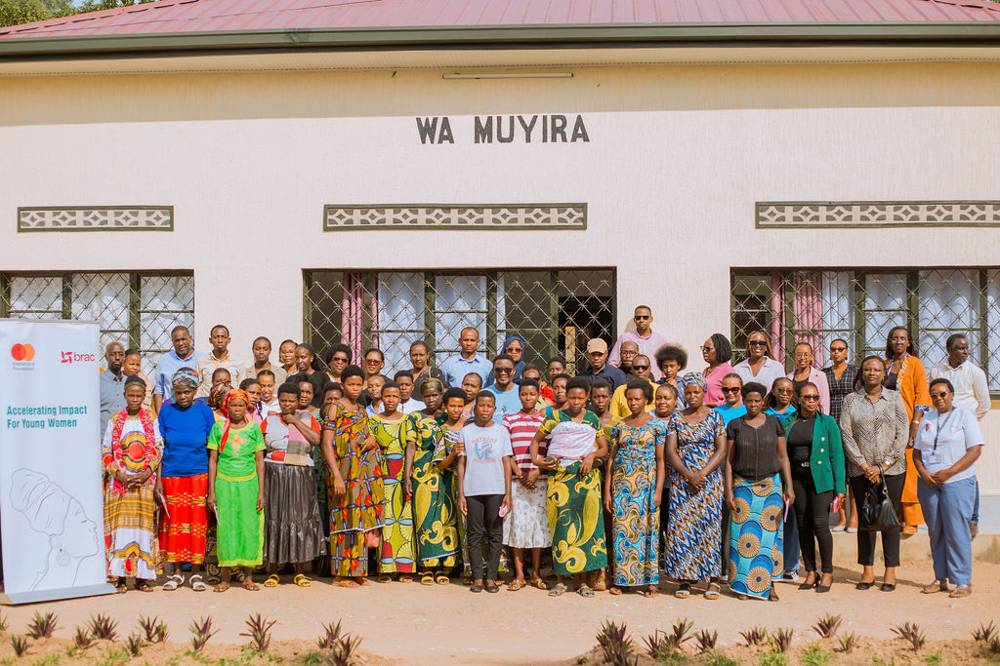

In communities across Rwanda's Southern Province, women who once struggled with poverty, limited economic opportunities and family conflicts are increasingly becoming business owners, community leaders and contributors to household prosperity.

Much of that transformation has been supported by BRAC, one of the world's largest development organizations, whose programs in Rwanda focus on women's economic empowerment, financial inclusion and family wellbeing.

Founded in Bangladesh in 1972 by the late social entrepreneur Fazle Hasan Abed, BRAC has grown into a global organization operating across Asia and Africa, reaching more than 100 million people through its development and financial inclusion programs. In Rwanda, the organization combines microfinance services with development initiatives aimed at helping vulnerable women and young people gain the skills, confidence and resources needed to improve their lives.

BRAC entered Rwanda through its microfinance operations and today runs a network of more than 30 branches across the country. Alongside financial services, the organization has expanded programs that support women, youth and low-income households, reflecting a growing recognition that economic inclusion is critical to reducing poverty and strengthening communities.

Through its work in districts such as Nyanza and Huye, BRAC has supported thousands of women with entrepreneurship training, livelihood development, financial literacy and mentoring. More than 10,000 women have participated in empowerment activities in Southern Rwanda, while thousands of young people have received support to continue their education or start income-generating activities.

The organization also promotes family dialogue and conflict resolution, recognizing that economic progress is often closely linked to stable and supportive households.

For Claudine Nyampinga, a resident of Nyanza District, the support marked a turning point.

"My husband and I were known in our community for constant conflicts. BRAC helped me change my mindset and improve my life. Today our family lives peacefully. I run businesses, raise livestock and even employ some of my neighbors," she said.

Nyampinga said the skills and support she received enabled her to grow income-generating activities and work alongside her husband to improve their family's living conditions.

The impact extends beyond individual households. Members of a cooperative of deaf people in Nyanza say support received through BRAC has helped them strengthen their economic activities, acquire productive assets and improve their livelihoods.

The experiences shared by beneficiaries reflect a broader approach that focuses not only on income generation but also on confidence-building, leadership and social transformation.

Speaking during an interaction with women participating in BRAC-supported initiatives, Silas Ngayaboshya, Director General for Women Empowerment at Rwanda's Ministry of Gender and Family Promotion (MIGEPROF), said the progress demonstrated by participants showed the value of long-term investment in women's capabilities.

"The confidence, dignity and self-awareness demonstrated by the participants reflect the positive impact of an integrated approach to empowerment," he said.

Ngayaboshya noted that sustainable change begins with knowledge, skills and mindset transformation, arguing that women who gain the necessary capacities are better positioned to continue improving their lives long after a project has ended.

He also encouraged women to embrace financial literacy and digital financial services, describing technology as an important pathway to economic inclusion and resilience.

The government's emphasis on partnership-driven development aligns closely with the work of organizations such as BRAC and other members of the Gender Equality and Women's Empowerment (GEWE) network, which support initiatives aimed at advancing gender equality and improving opportunities for women and girls.

Rwanda is often recognized as one of the world's leading countries in women's representation, with women holding more than 60% of seats in Parliament, the highest proportion globally. However, development experts note that challenges remain in areas such as access to finance, employment opportunities and economic resilience, particularly in rural communities where agriculture remains the main source of income.

The collaboration between government institutions, civil society organizations and development partners seeks to address some of these challenges by expanding access to skills, financial services and livelihood opportunities while strengthening family wellbeing.

Beyond entrepreneurship and financial inclusion, some initiatives are helping women improve productivity in agriculture, which employs more than half of Rwanda's workforce and remains a key pillar of the economy. During community visits, development partners also met women coffee farmers supported through programs implemented by Sustainable Growers, an organization that works with farming communities to strengthen livelihoods and improve agricultural productivity.

The experiences shared by women involved in both initiatives highlighted a common theme 'when women gain access to knowledge, financial resources and supportive networks, the benefits often extend beyond individuals to families and entire communities'.

Across Africa, BRAC has become known for combining economic empowerment with social development. Through partnerships and programs operating in several African countries, the organization has supported millions of women and young people through training, entrepreneurship development, financial inclusion and livelihood support.

In Rwanda, its growing presence reflects a broader recognition that empowering women is not only a matter of social justice but also a key driver of economic growth, family stability and community development.

As women continue to build businesses, strengthen their families and take on leadership roles within their communities, the results offer a glimpse into how targeted investments in empowerment can create lasting change far beyond the beneficiaries themselves.   

**African Updates**
