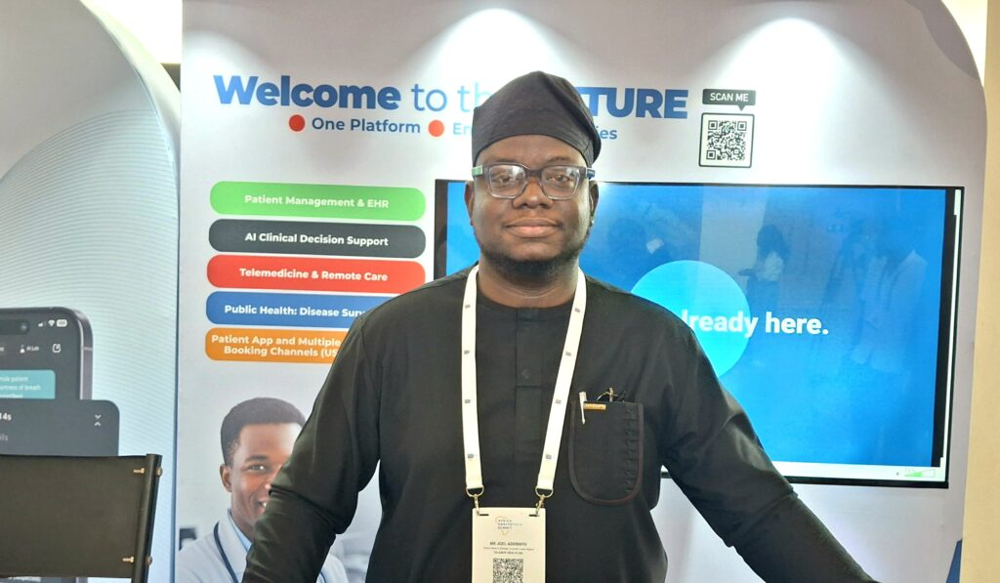
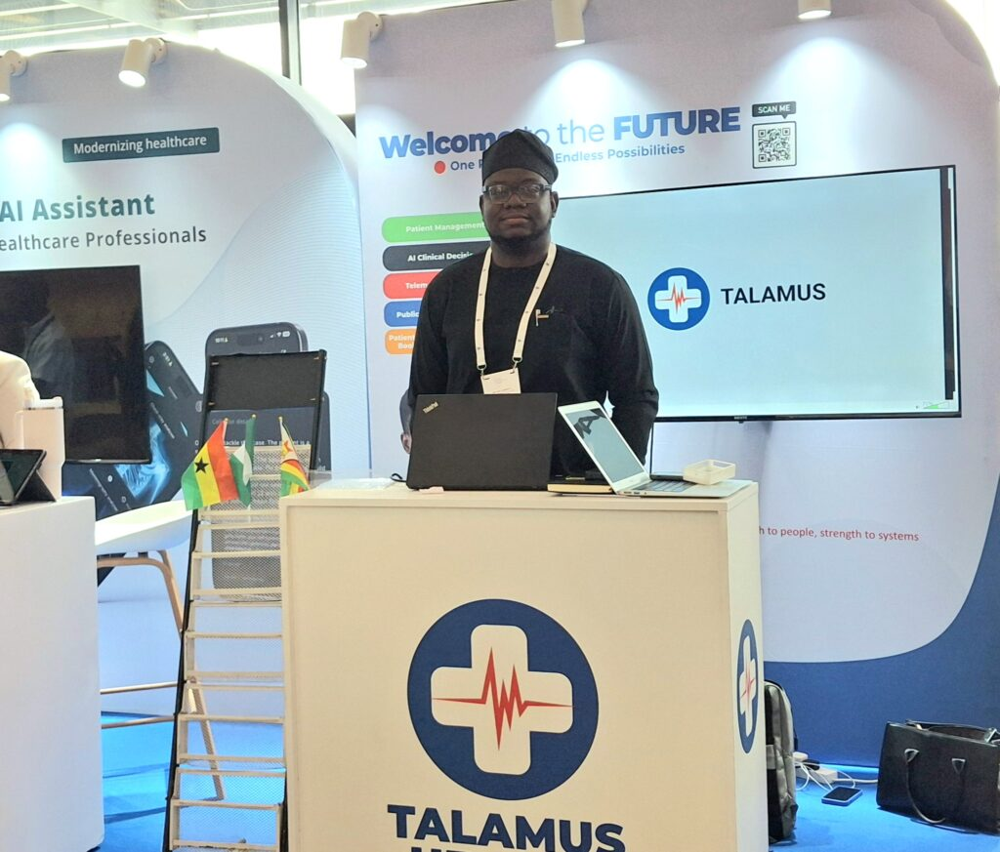

At the Africa Healthtech Summit 2025, innovators from across the continent showcased life-changing digital health solutions. But beneath the progress lies a stubborn challenge slowing down impact poor internet access.

Joel Aderinto, Country Lead for Talamus Health in Nigeria, explained how their platform connects patients to pharmacies, hospitals, laboratories, radiology centers and policymakers.

“Our solutions help patients find and access the right care when they need it and how they need it,” he said.

Talamus has already digitized 101 primary health care centers in Lagos State, allowing patients to move between facilities without registering twice. With just a phone number, doctors can access a patient's history from past medication to allergies.

This model solves one of Africa’s biggest problems which is fragmented, siloed patient records. But there is a catch.

“In Nigeria, there are some spots where internet in those areas is not very great, So you have to do an offline-first solution. The system must work inside the facility even without internet, and then sync to the cloud when the connection is restored.” Joel admitted.

\[caption id="attachment\_42544" align="alignnone" width="1024"\] Joel Aderinto, Country Lead for Talamus Health, Nigeria\[/caption\]

From Uganda, Joan Rukundo Nalubega, CEO of Uganics Repellents Ltd, has spent eight years fighting malaria using a mix of prevention and digital access.

Their products mosquito-repellent soaps, creams and petroleum jelly have reduced malaria cases by 88% in households using them. But the impact stalled.

Access to healthcare was still a problem. Public health centers were too far, expensive, and hard to reach without transport. Many people turned to self-medication or unverified pharmacies.

To solve this, Uganics partnered with local cooperatives, village health teams, clinics and pharmacies. They introduced community health subscriptions starting from $1 per person, with flexible payments as low as 10 cents a day.

Households can now use a USSD code to Find nearby hospitals, Book appointments, Access treatment nad View past health data, But internet limitations still block progress.

“Internet is a challenge. It’s not very accessible, especially to our target market with low-income communities, Most of them are illiterate, some don’t know how to use smartphones. That’s why we rely on at least one person in the household who has a smartphone.” Joan said.

\[caption id="attachment\_42541" align="alignnone" width="1024"\] Joan Rukundo Nalubega, CEO of Uganics Repellents Ltd\[/caption\]

Across Africa, healthtech is rising but internet inequality threatens to widen gaps instead of closing them.

As of numbers 66% of people in Sub-Saharan Africa still lack internet access and Only 28% of rural households have a smartphone. 1 in 4 health facilities in Africa has no reliable connectivity.

Meanwhile The digital health market in Africa is estimated to reach $52 billion by 2030, but only if connectivity improves.

Solutions like Talamus and Uganics show promise, yet they operate under pressure to build tools that work with or without internet.

To survive in the current ecosystem Developers are building apps that operate offline and sync later. USSD is being used as a bridge where smartphones and internet are scarce and the Community health workers are acting as translators between technology and low-literacy households.

Healthtech startups are proving that connected care is possible, but without strong internet access, their progress risks being limited to urban centers and wealthier users.

If governments, telecom companies and global partners do not close the connectivity gap, millions will be left behind not because solutions don’t exist, but because they cannot reach them.

\[caption id="attachment\_42542" align="alignnone" width="1024"\] Joel Aderinto, Country Lead for Talamus Health in Nigeria attended African Healthtech Summit 2025 In Rwanda\[/caption\]

\[caption id="attachment\_42543" align="alignnone" width="1024"\] Uganics Products such as mosquito-repellent soaps, creams and petroleum jelly Showcased during Africa Healthtech Summit 2025 in Rwanda\[/caption\]

 

**African Updates**
