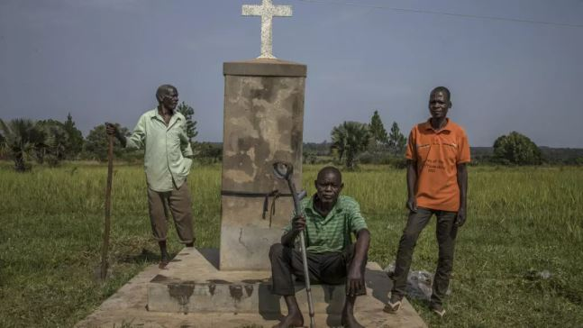
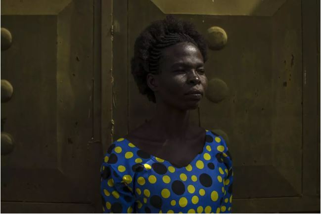

The International Criminal Court (ICC) has begun hearings against Ugandan warlord Joseph Kony, even though he remains at large. This is the first time the ICC has held such proceedings in absentia.

Kony, leader of the Lord’s Resistance Army (LRA), is accused of killing more than 100,000 people and abducting at least 60,000 children during his decades-long insurgency in Uganda and across Central Africa. He faces 39 charges, including murder, rape, torture, enslavement, and sexual slavery.

\[caption id="attachment\_41130" align="alignnone" width="647"\] Prosecutors hope the victims will find some justice. © Stuart Tibaweswa, AFP\[/caption\]

The hearing, which started Tuesday in The Hague, will run for three days. Judges will decide if there is enough evidence to move toward a trial. However, ICC rules do not allow a full trial without the suspect present. Prosecutors say the process is still vital, as it prepares the ground should Kony ever be caught.

For survivors, the hearing offers a small step toward justice. Many recall extreme violence. Former child captive Everlyn Ayo, now 39, said she was only five when rebels stormed her school. Teachers were killed and she and other children were forced to watch and take part in gruesome acts. “Those memories destroyed my childhood. I still see blood when I close my eyes,” she told reporters from Gulu, northern Uganda.

The LRA became infamous for its cruelty. Children were turned into fighters, girls were forced into sexual slavery, and communities were left in terror. Thousands of families still live with scars from the conflict.

Kony, once a church altar boy, has been on the run for nearly two decades. The ICC first indicted him in 2005, but efforts to capture him have failed. A UN report last year suggested he may be hiding in a remote part of the Central African Republic, though it remains unclear if he is still alive. His last known interview was in 2006, when he denied being a terrorist and dismissed reports of atrocities as “propaganda.”

\[caption id="attachment\_41129" align="alignnone" width="649"\] Everlyn Ayo was abducted by the LRA as a small child. © Stuart Tibaweswa, AFP\[/caption\]

For many victims, however, the hearing represents recognition of their pain. Stella Angel Lanam, who was kidnapped at age 10 and forced to fight, now helps other survivors. “We know Kony may never face court. But these hearings tell the world what happened to us,” she said. “It is not full justice, but it is hope.”

The ICC is expected to issue its decision within 60 days.

 

**African Updates**
