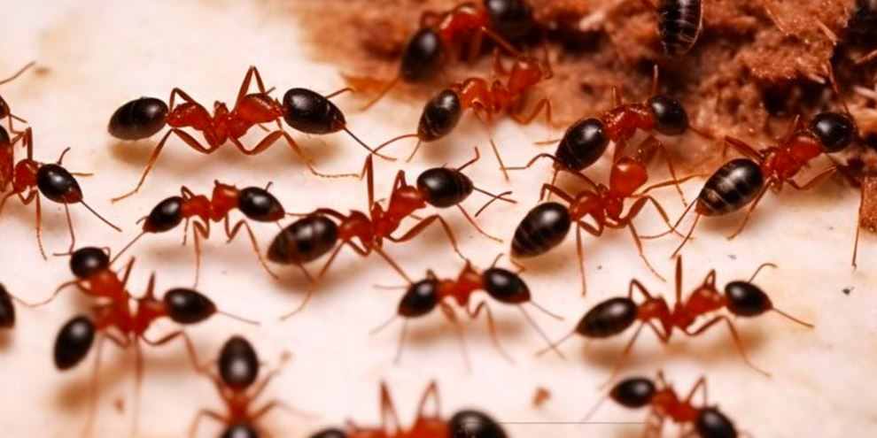

_Nairobi, Kenya – April 2025_ In a first-of-its-kind wildlife crime case, four individuals including two Belgian teenagers, have been charged in Kenya for trafficking more than 5,000 rare live ants. The case, described as “unprecedented” by the Kenya Wildlife Service (KWS), highlights a growing global trade in lesser-known species, particularly rare insects.

The suspects are Belgian nationals Lornoy David and Seppe Lodewijckx, both aged 19, a Vietnamese national, and a Kenyan citizen were arrested in separate operations earlier this month. Authorities say the group was attempting to smuggle the ants out of the country using specially modified containers.

David and Lodewijckx were apprehended on April 5 at a guesthouse in Nakuru, central Kenya. During the operation, wildlife officers discovered 2,244 test tubes and syringes packed with ants, secured with cotton wool to sustain the insects during transit. The KWS stated the containers were “designed to sustain the ants for up to two months” and evade airport detection systems  indicating a well-planned and “premeditated” trafficking attempt.

In Nairobi, authorities separately arrested a Vietnamese and a Kenyan suspect with an additional 400 ants in their possession.

The total seizure included queen ants of the Messor cephalotes species, native to East Africa and highly sought after by insect collectors. The seized insects are valued at approximately 1 million Kenyan shillings, or around $7,800.

### 

Appearing in a Nairobi courtroom on Tuesday, the Belgian teens were described as “visibly distressed” and received comfort from relatives present in court. Both pleaded guilty to the illegal possession and attempted export of protected wildlife.

Speaking to the magistrate, David said, “We did not come here to break any laws. By accident and stupidity we did.”

The court has postponed sentencing to April 23, pending pre-sentencing reports from the KWS, the National Museums of Kenya, and a probation officer.

“This unprecedented case signals a shift in trafficking trends from iconic large mammals to lesser-known yet ecologically critical species,” the KWS said in a public statement.

Experts say that as global conservation efforts tighten around high-profile animals like elephants and rhinos, traffickers are increasingly turning to rare insects, reptiles, and plants often overlooked by enforcement and legislation.

The case has also shone a spotlight on the rising popularity of formicariums transparent habitats where ant colonies are raised and observed. Among enthusiasts, the Messor cephalotes queen is highly prized for her striking red and black coloration and large size. British retailer AntsRUs, for instance, lists the species as the “dream species,” with individual queens priced at £99.99 ($132) though they are currently out of stock.

A source familiar with the insect trade told Reuters that the species is “very hard to come by” and that legal export requires both a KWS license and a health certificate neither of which the suspects possessed.

Kenya’s wildlife protection laws cover a wide range of species, including insects. Any collection, trade, or export of protected species regardless of size must be authorized through official permits.

The KWS emphasized that the illegal export attempt “not only undermines Kenya’s sovereign rights over its biodiversity but also deprives local communities and research institutions of potential ecological and economic benefits.”

Conservationists warn that unregulated trade in ants and other insects poses serious ecological risks. Philip Muruthi, vice president of conservation at the African Wildlife Foundation, stressed the critical role ants play in maintaining healthy ecosystems.

“When you see a healthy forest, like Ngong Forest, you don’t think about what is making it healthy. It is the relationships all the way from the bacteria to the ants to the bigger things,” Muruthi said in an interview with the Associated Press.

He added that removing native species and introducing them into foreign environments can have unpredictable consequences. “Even if there is trade, it should be regulated, and nobody should be taking our resources just like that,” he said.

The four defendants are expected to appear in court again on April 23, when the magistrate will review pre-sentencing assessments and determine penalties. The outcome may set a precedent for future prosecutions involving lesser-known wildlife species in Kenya.

**African Updates**
