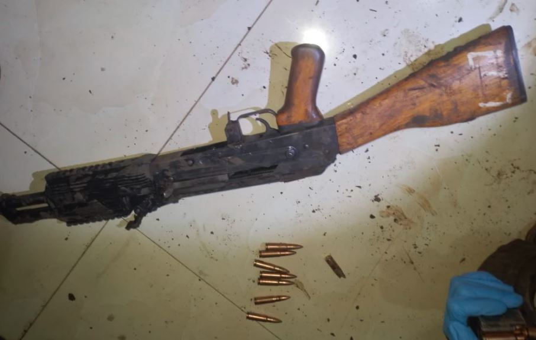

In a shocking incident in Mombasa, a Kenya Defence Forces (KDF) officer was killed by a mob after he fired shots into the air during a heated argument over a boda boda fare.

The tragedy unfolded on Friday at Likoni Primary Vyemani Grounds, where the officer, whose name has not yet been released, was dropped off by boda boda rider Antony Otieno. Upon arrival, instead of paying for the ride, the officer began making numerous phone calls. When Otieno demanded his payment, the situation escalated quickly.

The officer, in an attempt to intimidate Otieno, pulled out an AK47 rifle from a small bag, cocked it, and fired shots into the air. This terrifying act led to a scuffle where Otieno managed to disarm the officer while trying to escape on his motorbike. But the officer grabbed the bike in an attempt to flee, leading to a physical struggle during which more shots were fired.

Residents, witnessing the chaos, intervened. Enraged by the officer's actions, they overwhelmed him, pelting him with stones until he was fatally injured. The confrontation also resulted in two bystanders, Claudia Mwashikaji and Mary Trizer, being hit by stray bullets. They, along with Otieno, who had his nose bitten during the struggle, were rushed to Likoni Sub-County Hospital for treatment.

Police from Inuka Police Station quickly responded to the scene. They collected crucial evidence, including the rifle, 12 rounds of ammunition, the motorcycle, a mobile phone, and four spent cartridges. The body of the deceased KDF officer was moved to Coast General Mortuary for a post-mortem examination.

This incident highlights the dangerous turn that simple disputes can take when violence is introduced, leaving a community in shock and mourning.

**African Updates**
