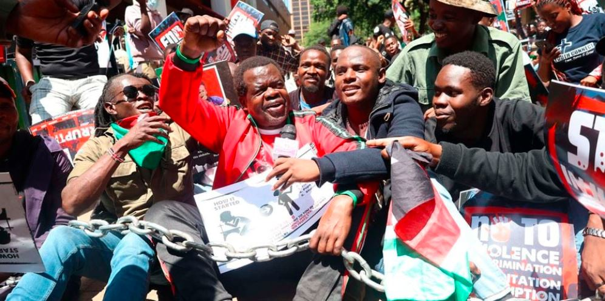
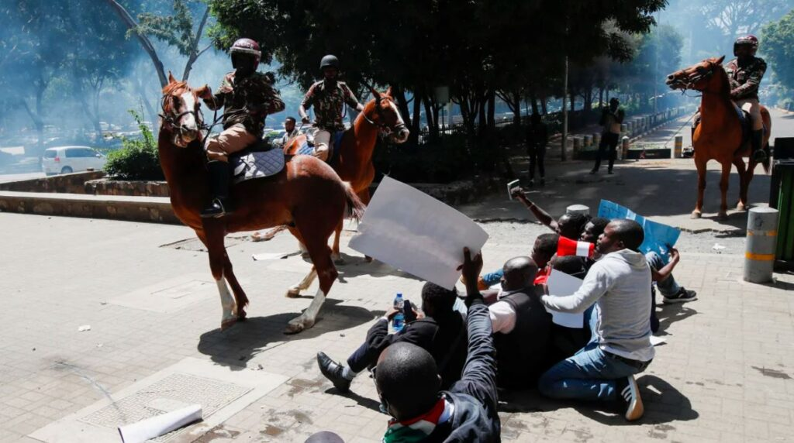
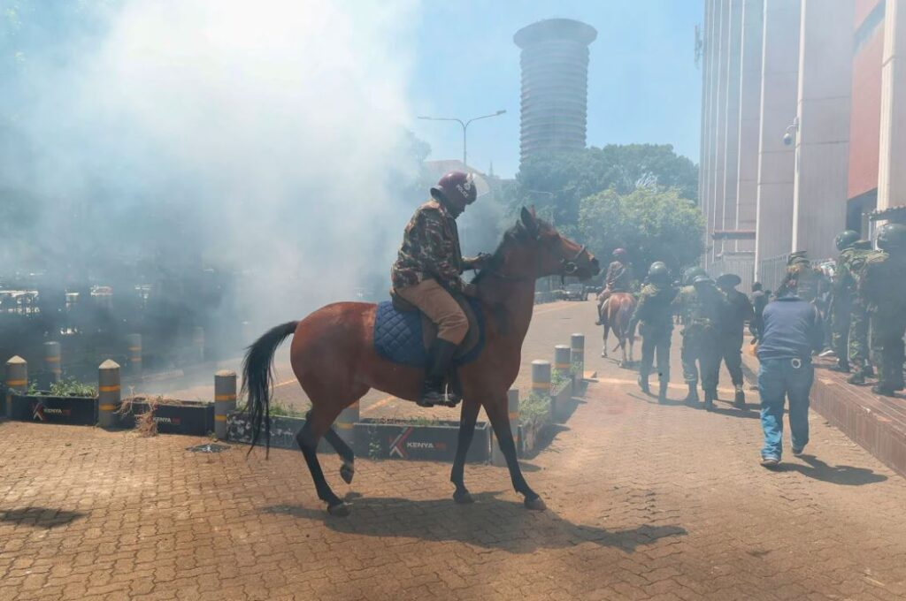

In Nairobi and Mombasa, human rights activists were taken into custody on Monday during protests against the recent wave of abductions. The demonstrations were a call for the immediate release of those who have been kidnapped.

In Nairobi's bustling city center, well-known activist Julius Kamau was arrested. He was loudly protesting the increasing abduction cases when he was detained, shouting, "Why are you arresting me? Stop abductions in Kenya!"

The police in Nairobi used anti-riot measures to break up the crowd on Kimathi Street, stopping the protests from spreading further.

\[caption id="attachment\_31720" align="alignnone" width="996"\] Busia Senator Okiya Omtatah (center) with other protesters during the anti-abduction protests on Aga Khan walk in downtown Nairobi on December 30, 2024.\[/caption\]

 

In Mtwapa, Kilifi County, many people came together to voice their concerns about the abductions. A local resident spoke out, saying, "It's our duty to educate our children, but that doesn't mean they should be kidnapped. Who is taking them?" This statement highlighted the community's frustration and confusion over the abductions.

Police were heavily deployed in Nairobi, Mombasa, and Kilifi, keeping a close watch to prevent any disturbances. The authorities were worried that the protesters might interfere with daily activities if their demands were ignored.

\[caption id="attachment\_31722" align="alignnone" width="1024"\] Riot police lob tear gas canisters as they attempt to disperse protesters, in downtown Nairobi, Kenya, on Monday.\[/caption\]

The protests have sparked fear and anger across Kenya, with activists demanding an end to the kidnappings. They have warned that they will intensify their actions if the government does not respond to their calls for justice and safety.

In Kenya, there has been a notable increase in reported abduction cases, particularly highlighted over the past year. based on recent reports Human Rights Watch documented that Kenyan security forces have been involved in abducting, arbitrarily arresting, torturing, and even killing perceived leaders of protests against the Finance Bill 2024 from June to August 2024. These individuals were detained in illegal facilities, like forests and abandoned buildings, without access to family or legal representation.

Meanwhile The Judiciary of Kenya expressed concern over the surge in abductions, describing them as a direct threat to citizens' rights. This followed public outcry and international attention, with diplomatic missions also raising issues about arbitrary arrests and disappearances.

The Kenyan government, through statements from the Inspector General of Police, has denied involvement in these abductions, labeling such reports as misinformation. However, independent bodies like the Independent Policing Oversight Authority (IPOA) have committed to investigating these claims.

Since then,There have been protests against these abductions, with activists and citizens demanding accountability and the release of abductees. These protests have led to further arrests of activists, escalating the tension between the public and security forces.

\[caption id="attachment\_31721" align="alignnone" width="1024"\] a mounted anti-riot police officer attempting to flee from teargas during a protest in Nairobi, Kenya, on Monday.\[/caption\]

The African Commission on Human and Peoples' Rights has called for urgent actions from the Kenyan government, including thorough investigations and reinforcing the independence of oversight bodies to address these human rights violations.

The situation remains tense, with demands for transparency, justice, and an immediate end to these abductions echoing across both national and international platforms.

**African Updates**
