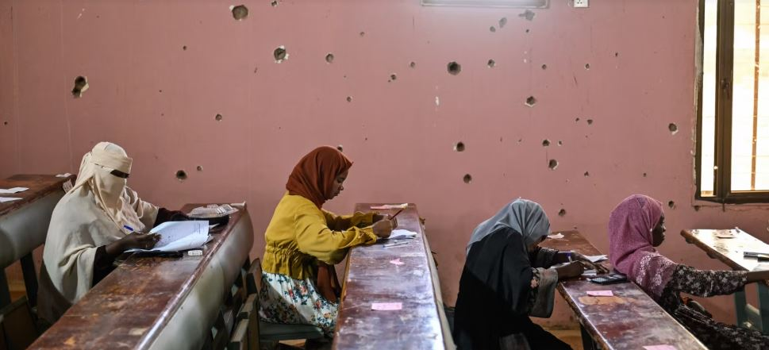

As Sudan’s civil war enters its fourth year, the capital, Khartoum, is beginning to show tentative signs of recovery. Yet despite limited progress, the scale of destruction and humanitarian need remains severe.

Three years into the conflict and one year after the city was retaken by the Sudanese army much of Khartoum remains subdued. Large sections of the capital still bear the scars of intense fighting, with major buildings heavily damaged or destroyed. Among them is the Corinthia Hotel Khartoum, one of the city’s most prominent landmarks, which stands gutted after sustaining significant damage during the الحرب.

Khartoum was a central battleground in clashes between the Sudanese army and the Rapid Support Forces, where some of the fiercest urban fighting of the war took place.

In the city center, the once-bustling Arab Souk previously known for trading goods ranging from gold to electronics now lies largely abandoned.

In May 2025, Sudanese armed forces regained full control of the capital. Subsequent advances in central السودان enabled the return of approximately four million displaced residents to their homes, according to the International Organization for Migration in a March update.

However, those returning face widespread challenges, including damaged infrastructure and limited access to basic services. Electricity and water supplies have gradually begun to resume in parts of the city, though coverage remains inconsistent.

The conflict has caused significant loss of life. According to the Armed Conflict Location & Event Data Project, at least 59,000 people have been killed. The U.S.-based monitoring group cautions that the true toll is likely higher due to reporting constraints.

The war has also displaced millions, contributing to what the United Nations has described as the world’s worst humanitarian crisis. The International Committee of the Red Cross estimates that around 33 million people across Sudan are in need of humanitarian assistance.

**African Updates**
