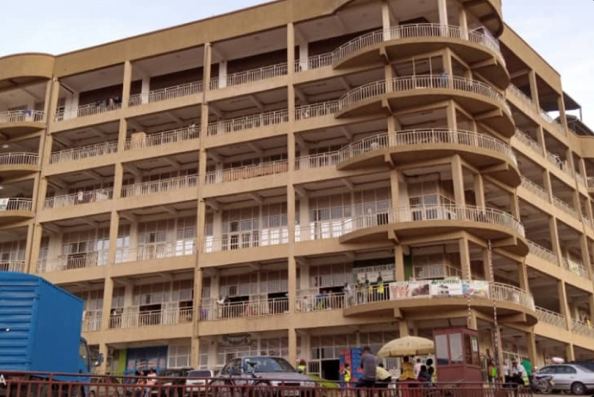

The City of Kigali has reopened the Inkundamahoro Building in Nyabugogo, three days after temporarily shutting down the busy commercial facility over concerns related to sanitation, safety and environmental compliance.

The reopening was announced on Tuesday, August 11, after the building's management began implementing measures required by the city to address the concerns.

The closure, announced on August 8, followed what the City described as the management's continued failure to address serious safety, sanitation and environmental deficiencies despite several directives issued between May and August.

According to the City, one of the most serious violations involved the discharge of untreated wastewater, including blackwater from toilets, directly into a wetland. The latest incident was confirmed on August 7, one day before the building was temporarily closed. The authorities said the building would remain closed until corrective measures were implemented and compliance verified.

The reopening has brought relief to traders, employees and other people whose livelihoods depend on businesses operating inside the building. After the three-day closure, workers can now return to their workplaces and resume their normal activities.

For traders and service providers operating from the building, the reopening is particularly significant because Inkundamahoro is located in Nyabugogo, one of Kigali's busiest commercial and transport areas.

According to Tuesday's notice, the management must continue implementing outstanding corrective measures, including installing an appropriate wastewater treatment system, ensuring the daily collection and proper disposal of solid waste, carrying out necessary repairs and repainting, among other requirements.

The city also reminded people working in the building that maintaining cleanliness and proper sanitation is a shared responsibility. Those who fail to comply with the requirements or implement corrective measures identified during inspections could face enforcement action, the city said. The City of Kigali concluded its notice with a reminder that keeping the capital clean, safe and healthy is a shared responsibility.

**African Updates**
