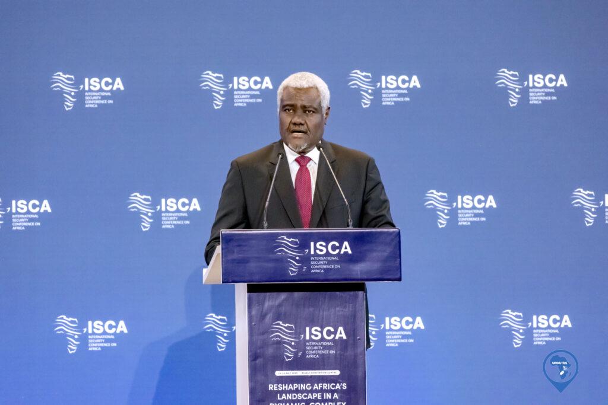
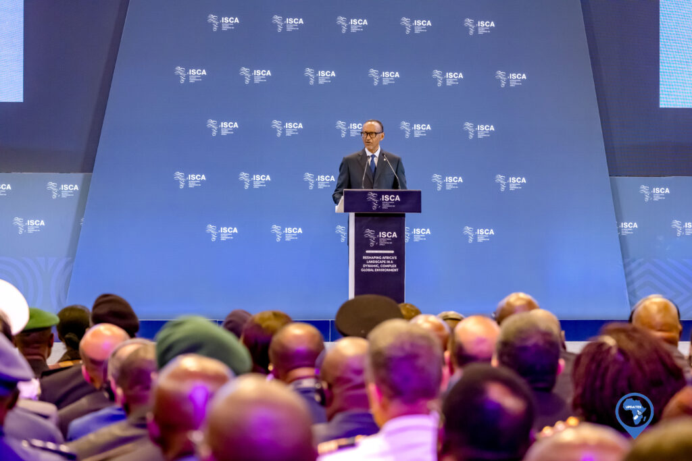
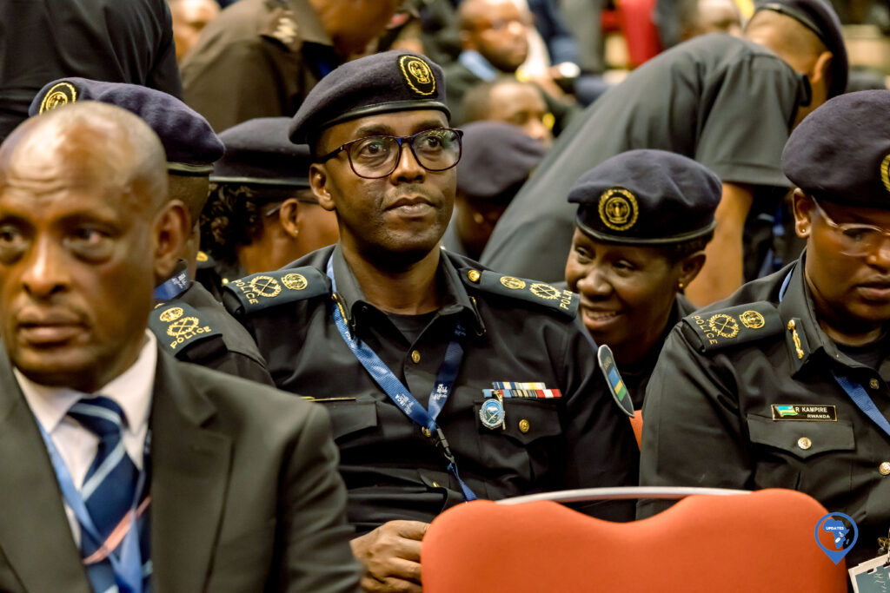

A high-level gathering convened in Kigali on 19th May, 2025, as the International Security Conference on Africa (ISCA) opened its doors, drawing a diverse and influential audience. The conference is poised to redefine the narrative around African security.

President Paul Kagame declared the forum "long overdue," emphasizing the need for the continent to chart its own course in peace and security.

The event attracted key figures from across Africa and beyond. Notably, the Secretary-General of La Francophonie joined the assembly, alongside prominent members of security forces, including top-ranking army and police officials. Delegates filled the Kigali Convention Centre, signaling the weight of the issues at hand.

Rtd. Frank Mushyo Kamanzi, in his welcome address, urged attendees to forge stronger partnerships. He stressed that these partnerships are crucial for building a more prosperous future for Africa.

Moussa Faki Mahamat, Chairperson of the ISCA Advisory Council, underscored the historical significance of the conference. He stated that Africa has long needed a dedicated platform for strategic dialogue on peace and security.

\[caption id="attachment\_32120" align="alignnone" width="1024"\] Moussa Faki Mahamat, Chairperson of the ISCA Advisory Council\[/caption\]

President Kagame's keynote address anchored the day. He said that "Africa's future, particularly in matters of peace and security, cannot be outsourced." The President challenged the long-standing practice of external actors managing African security concerns. He argued that this approach has consistently fallen short.

President Kagame framed the conference as "a deliberate effort to change both the narrative and the substance of how Africa engages with the global security debates." He called for Africa to engage as a "credible and capable partner."

\[caption id="attachment\_32119" align="alignnone" width="1024"\] H.E Paul Kagame, President of The Republic of Rwanda,\[/caption\]

The conference is expected to end on 20th May 2025. Delegates aim to develop strategies for African-led solutions to the continent's security challenges.

\[caption id="attachment\_32130" align="alignnone" width="1024"\] Moussa Faki Mahamat, Chairperson of the ISCA Advisory Council\[/caption\]

African Updates
