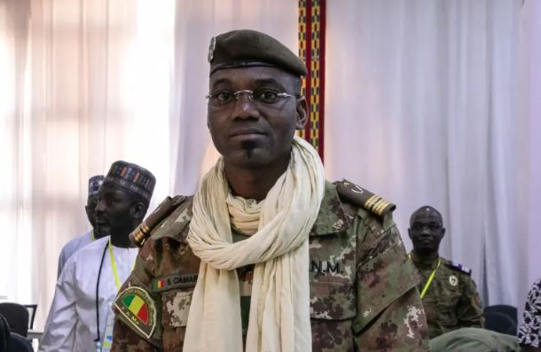
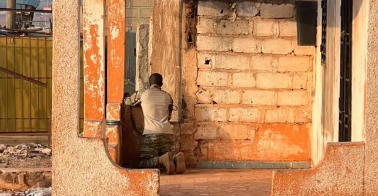
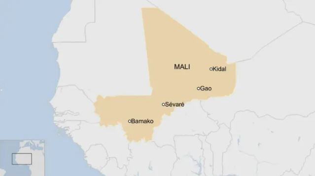

Mali’s Defence Minister, General Sadio Camara, has been killed during a series of coordinated attacks on military targets across the country, according to an official government statement.

Government spokesperson Issa Ousmane Coulibaly confirmed that Camara died after armed assailants attacked his residence in the garrison town of Kati on Saturday. The attack was part of a wider offensive carried out simultaneously in multiple regions.

Kati, located about 15 kilometres northwest of the capital Bamako, is considered one of Mali’s most secure military strongholds. Despite this, fighters linked to the al-Qaeda-affiliated group Jama’at Nusrat al-Islam wal-Muslimin (JNIM), alongside Tuareg rebels from the Azawad Liberation Front (FLA), managed to breach the area.

Reports indicate that the attack on Camara’s home involved a suicide car bomb. The explosion killed not only the defence minister but also members of his family, including his wife and two grandchildren.

Camara was a key figure in Mali’s military leadership and played a central role in the coups that brought the current government to power in 2020 and 2021. He was widely regarded as one of the most influential figures within the ruling junta and was seen by some as a potential future leader of the country.

During the attack, Interim President Assimi Goita, who also resides in Kati, was moved to a secure location. Officials confirmed that he is safe and remains in control of the government.

The violence extended beyond Kati, with attacks reported in several other locations, including Bamako, the northern cities of Gao and Kidal, and the central town of Sevare. Residents in some areas reported ongoing gunfire and explosions more than 24 hours after the attacks began, suggesting that security operations were still underway.

Security analysts warn that the situation could worsen in the coming days. Analyst Bulama Bukarti noted that previously rival armed groups have increasingly coordinated their efforts, forming alliances to target the Malian state.

“These groups have different long-term goals, but they have chosen to work together against a common enemy,” he said, adding that the recent attacks demonstrate the growing effectiveness of this cooperation.

The attacks have drawn widespread international condemnation. The African Union, the Organization of Islamic Cooperation, the United States Bureau of African Affairs, and the European Union all issued statements denouncing the violence.

Camara’s death marks a significant development in Mali’s ongoing security crisis and raises concerns about the stability of the country’s military leadership as it continues to confront a persistent and evolving insurgency.

 **Denyse Mbabazi Mpambara / African Updates**
