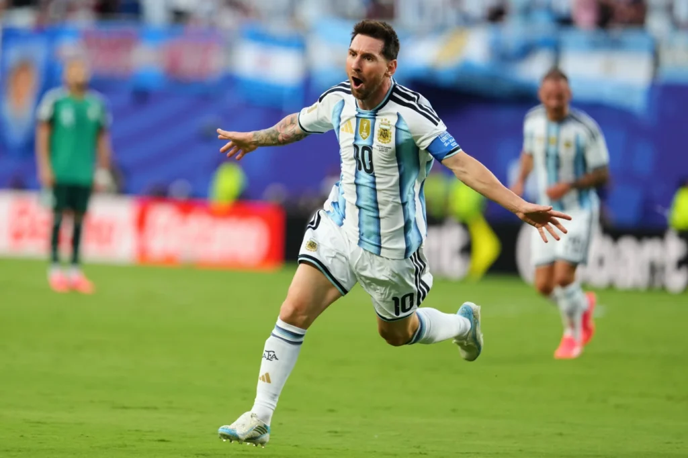

Lionel Messi and Kylian Mbappé delivered memorable performances as Argentina and France began their World Cup campaigns with impressive victories, underlining why they remain among the tournament’s biggest contenders.

For Argentina, Messi once again took center stage, scoring a hat trick in a commanding 3-0 win over Algeria. The reigning world champions controlled much of the contest, with the 39-year-old captain producing a performance that delighted supporters and added another chapter to his remarkable international career.

Messi found the net in both halves before completing the first World Cup hat trick of his career, helping Argentina secure all three points in their opening match.

The achievement also saw Messi reach another milestone, drawing level with Miroslav Klose on 16 World Cup goals and becoming only the second player, alongside Cristiano Ronaldo, to score in five different World Cup tournaments.

Argentina's victory provided an ideal start to their title defense and reinforced expectations that Lionel Scaloni’s side will once again be among the leading challengers for football’s biggest prize.

Meanwhile, France overcame a spirited Senegal side to claim a 3-1 victory in their opening Group match.

After a closely contested first half, France captain Kylian Mbappé made the difference, breaking the deadlock in the 66th minute before playing a key role in his team's strong finish.

Bradley Barcola added a second goal as France gained control of the contest, while Mbappé capped his performance with a spectacular long-range strike late in the game to secure the win.

The two-goal display also moved the French star past Brazilian legend Pelé in the World Cup scoring charts, taking his tally to 14 goals at the tournament.

France, runners-up in 2022, showed both patience and quality in overcoming a determined Senegal team, while Mbappé once again demonstrated why he is regarded as one of the leading players in world football.

With Messi and Mbappé both producing headline performances, two of the tournament’s biggest stars have already provided an early reminder of their ability to influence the sport’s grandest stage.

**African Updates**
