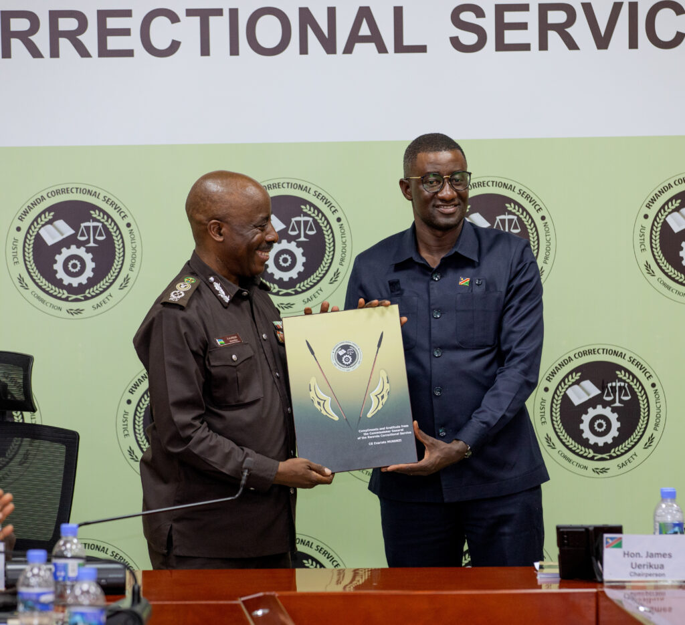
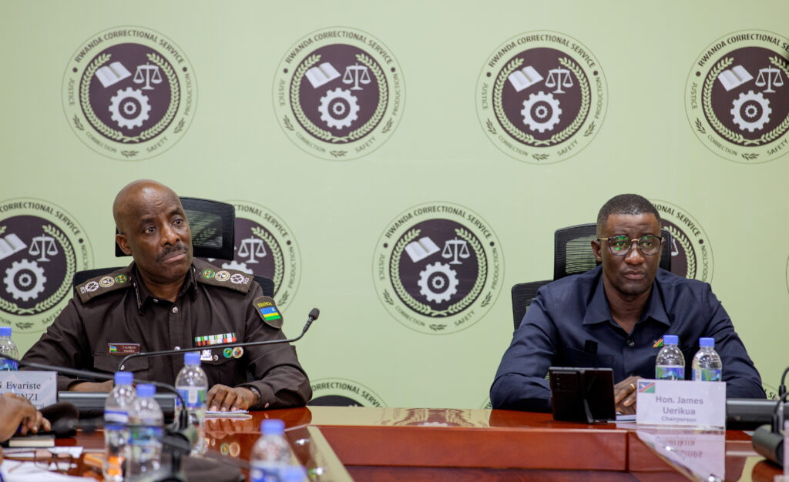
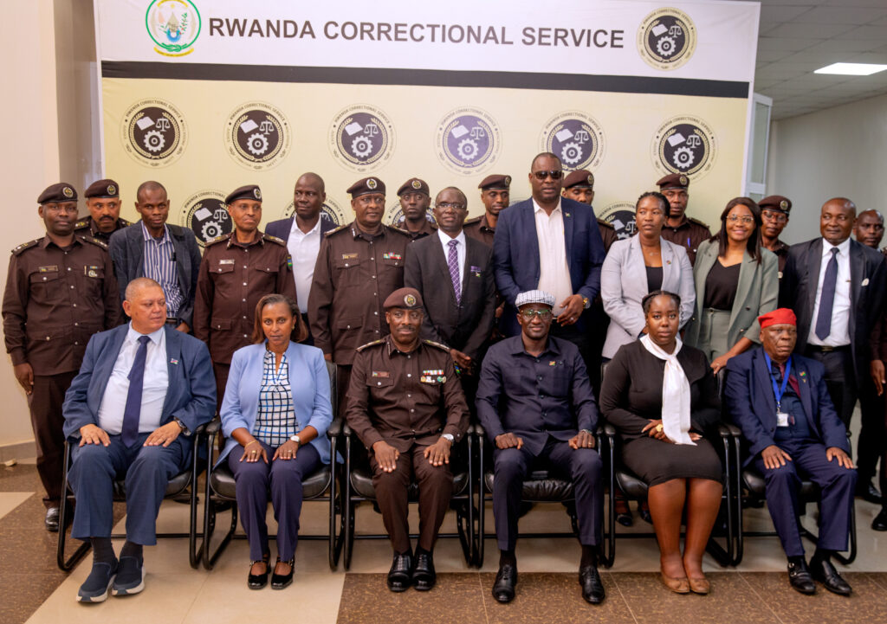

In a powerful display of Pan-African cooperation, a high-level delegation from the National Assembly of the Republic of Namibia convened at the Rwanda Correctional Service (RCS) Headquarters in Kigali yesterday, Wednesday, January 28, 2026.

The visit, part of a week-long oversight exchange program, highlights a growing trend across the continent: moving away from traditional "prison" mentalities toward holistic rehabilitation and reintegration.

The delegation, led by Hon. James Uerikua, Chairperson of the Standing Committee on International Relations, Defense, and Security, was received by CG Evariste Murenzi, Commissioner General of RCS. The meeting served as a platform to discuss how Rwanda has transformed its justice system in the three decades following the 1994 Genocide against the Tutsi.

CG Murenzi praised the excellent relationship between Namibia and Rwanda, emphasizing that such visits are crucial for the development of both nations.  During the session, Hon. James Uerikua highlighted the shift in how African nations view incarceration. He noted that modern correctional services must focus on how to "convert criminals into productive citizens."

"We came primarily to look at how they handle their Correctional Services, because today, Correctional Service has actually graduated from prison to nothing else but rehabilitation," Hon. Uerikua stated.

One of the take-home lessons for the Namibian delegation was Rwanda’s unique approach to criminal records. In Rwanda, after five years of demonstrated good behavior, an individual can have their criminal record cleared a policy designed to remove the stigma that often prevents former inmates from finding employment.

As many African countries face rising energy costs and electrical instabilities, the delegation was particularly impressed by Rwanda’s Biogas initiatives. Currently, approximately 70% of cooking in Rwandan correctional facilities is powered by biogas produced from converted waste.

"In terms of cost-cutting and electrical issues that are a problem in Africa in general, I think that’s a good way to go," Hon. Uerikua remarked, comparing it to Namibia’s own heavy investment in solar energy.

The discussions also touched on food security within prisons, where Namibia utilizes mass gardens and beef farms to feed inmates directly, with excess produce supporting the national police.

Rwanda focuses on TVET (Technical and Vocational Education and Training), ensuring inmates graduate with qualifying certificates in trades that make them eligible to be employed by whoever is an employer of choice.

The visit wasn't strictly limited to security and corrections. Hon. Uerikua used the platform to promote Intra-African trade, a key goal of the African Continental Free Trade Area (AfCFTA).

Namibia, a powerhouse in the livestock industry, is the largest exporter of beef in Africa, shipping to the EU, USA, and China.  As the Namibian delegation prepares to head back to the Land of the Brave this Saturday, the message remains clear; African nations are stronger when they share knowledge.

**African Updates**
