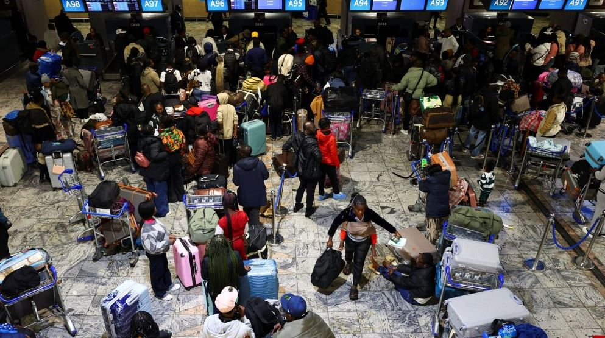

ACCRA, Ghana The first group of nearly 300 Ghanaians evacuated from South Africa following a surge in anti-immigrant protests arrived in Accra on Wednesday, as concerns grow over the safety of foreign nationals living in Africa’s most industrialized economy.

The returnees landed at Kotoka International Airport to an emotional reception led by Ghana’s Foreign Affairs Minister, Samuel Okudzeto Ablakwa, with patriotic music echoing through the arrival terminal.

Ghanaian authorities said about 800 citizens have so far registered for government-assisted repatriation flights from South Africa, citing fears for their safety amid escalating hostility toward migrants.

The evacuation follows weeks of demonstrations and attacks targeting both documented and undocumented foreigners in several South African communities, reigniting long-standing concerns over xenophobic violence in the country.

One returnee said he was forced to abandon the salon business he had built after his shop was looted during the unrest.

“I wanted to sell my salon before leaving, but nobody was willing to buy it,” he said. “I had no option but to run because life is more important than anything.”

Another evacuee, Victor Atsu Togbe, described recent weeks in South Africa as deeply distressing and thanked the Ghanaian government for rescuing citizens from what he called “the lion’s den.”

South Africa has for decades attracted migrant workers from across the continent due to its relatively advanced economy. However, persistent unemployment — currently above 30 percent — has fueled recurring waves of anti-immigrant sentiment and violence.

South African immigration officials said only 10 of the nearly 300 returnees were legally residing in the country, adding that many had overstayed their visas. Ghanaian diplomatic officials, however, argued that delays in processing permit renewals had contributed to the situation.

Ablakwa revealed that 26 Ghanaians who had been detained in South Africa over immigration-related offences were also among those repatriated on Wednesday’s flight.

The minister said the government would provide psychosocial support, transportation assistance and reintegration funds to help returnees rebuild their lives.

“President Mahama has directed that all returnees receive transportation support to their homes as well as a special reintegration package,” Ablakwa told journalists.

Authorities also announced plans to place returnees in a national database aimed at connecting them with employment opportunities and startup support programs.

The latest developments have renewed debate across Africa over migration, xenophobia and the disconnect between pan-African ideals and the experiences faced by migrants within the continent.

Tensions in South Africa intensified after a citizen-led movement demanded that undocumented migrants leave the country by June 30, raising fears of additional violence.

Earlier this month, hundreds of migrants from countries including Democratic Republic of the Congo, Rwanda and Somalia sought refuge in the port city of Durban, claiming local groups had gone door-to-door warning foreigners to leave before the deadline.

The South African government has said it is increasing enforcement against undocumented migration while urging citizens not to take the law into their own hands.

According to South Africa’s statistics agency, more than three million foreign nationals live in the country, representing about 5.1 percent of the population. Nearly two-thirds originate from member states of the Southern African Development Community (SADC).

**Denyse Mbabazi Mpambara / African Updates**
