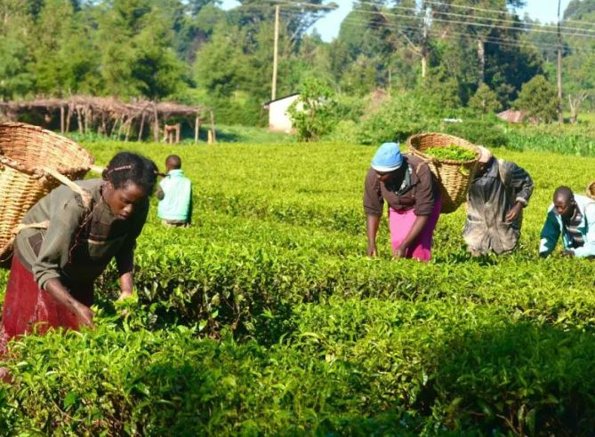

In a significant step for Africa's food future, two of the continent's major financial organizations have joined forces. The Bank of Agriculture (BOA) and the African Export-Import Bank (Afreximbank) have made a powerful commitment to help Nigeria's small-scale farmers. At a recent trade meeting in Algeria, they signed an agreement to create a funding program worth up to US$1 billion. This money is meant to help farmers grow more food and sell it more easily.

This new fund, called the ‘National Smallholder Farmers Fund’, is a big deal because it will provide farmers with loans they can actually afford. For a long time, a lack of money has been a major hurdle for these farmers, making it difficult to buy good seeds, modern tools, and better equipment. By getting this essential support, they can produce more from their land and earn a better living.

While this story is focused on Nigeria, it is a a good example of issues that are facing Africa as a continent. In the region of sub-Saharan, smallholder farmers are considered as the backbone of the food supply, because it grows up to 80% of the food. Which shows how They are a vital part of the economy.

Yet, these farmers often face immense difficulties. They are vulnerable to the effects of climate change, such as droughts and floods. Many lack access to modern technology and face significant losses after harvesting their crops because they don't have good storage. Most critically, they have struggled to get the financial help needed to invest in their farms.

This new fund is a direct solution to some of these challenges. It aims to not only provide loans but also to help farmers connect to larger markets, both within Nigeria and across Africa.

The importance of this funding cannot be understated. In Nigeria, food security is a serious challenge, with reports indicating that nearly 31 million people were acutely food insecure in 2025. The BOA and Afreximbank's partnership is a direct attempt to tackle this issue. By supporting the people who grow over 90% of Nigeria's food, this initiative could change the lives of countless families.

The agreement also highlights a bigger idea as African nations are working together to solve shared problems. Afreximbank is also a key player in the African Continental Free Trade Area (AfCFTA), an initiative that aims to create a single market for goods and services across the continent.

By connecting farmers to this wider network, the BOA and Afreximbank are not just investing in Nigeria, but are helping to build a more secure and prosperous future for all of Africa. This deal shows that collaboration is a powerful tool for progress and a way to support the hard work of people on the ground.

**African Updates**
