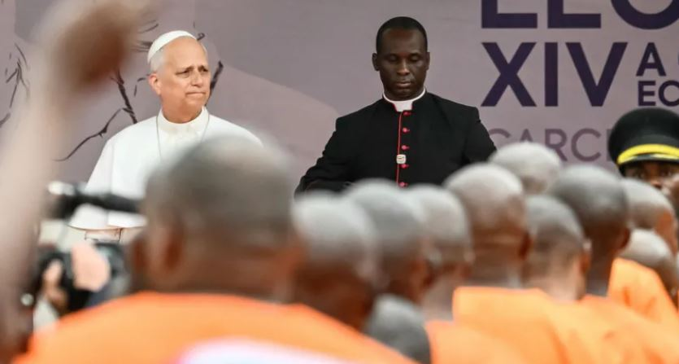
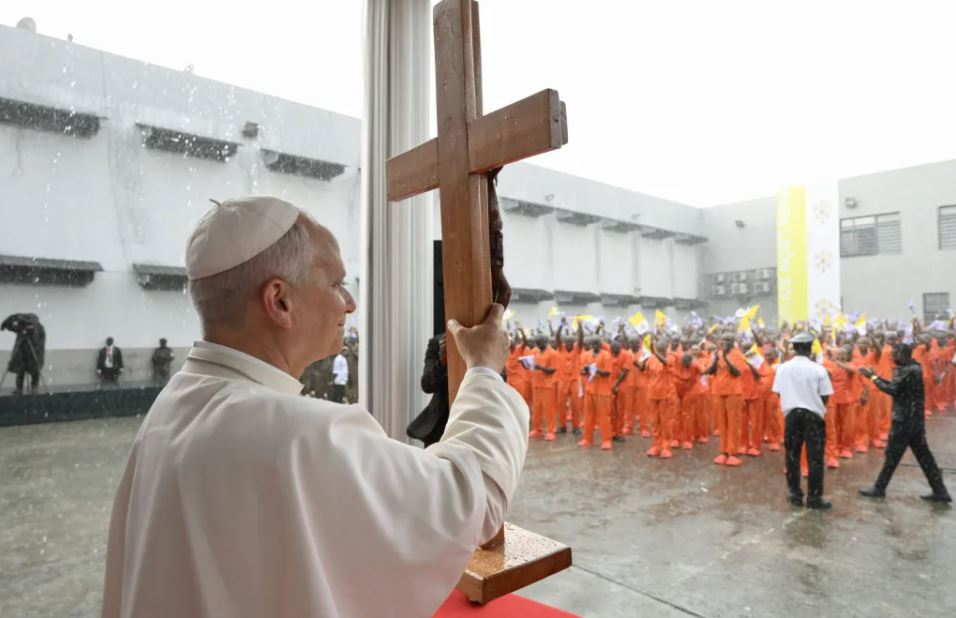

Pope Leo XIV delivered a message of solidarity and hope to inmates at a prison in Equatorial Guinea on Wednesday, telling them they are “not alone” while drawing attention to long-standing concerns over prison conditions and human rights abuses.

The visit took place in the port city of Bata and followed a tradition established by Pope Francis, who frequently met with prisoners during international trips to offer encouragement and support.

Leo’s stop, which came at the conclusion of a four-nation African tour, carried additional significance amid reports that Equatorial Guinea is among several African countries involved in controversial agreements with the administration of Donald Trump. Under these arrangements, the countries have reportedly received funding to accept migrants deported from the United States to destinations other than their countries of origin.

Although none of those migrants are being held at the Bata facility, the visit has renewed scrutiny of Equatorial Guinea’s broader human rights record. Advocacy groups have long criticized the country’s judicial system, citing concerns over lack of independence, arbitrary detentions, and alleged abuses.

Addressing the inmates, Pope Leo XIV emphasized compassion and dignity, stating that they remain valued despite their past actions.

“You are not alone. Your families love you and are waiting for you. Many people outside these walls are praying for you,” he said in Spanish.

He added that even those who feel abandoned should take comfort in faith and community support. “God will never abandon you, and the Church will stand by your side,” he said.

The prisoners, dressed in new orange and beige uniforms, gathered in a central courtyard that appeared recently refurbished. As the pope began speaking, a sudden rainstorm broke out, soaking those present while offering brief relief from the city’s intense heat and humidity.

In his remarks, Leo also addressed authorities, underscoring that justice systems should serve to protect society while recognizing that incarceration should not function solely as punishment.

**African Updates**
